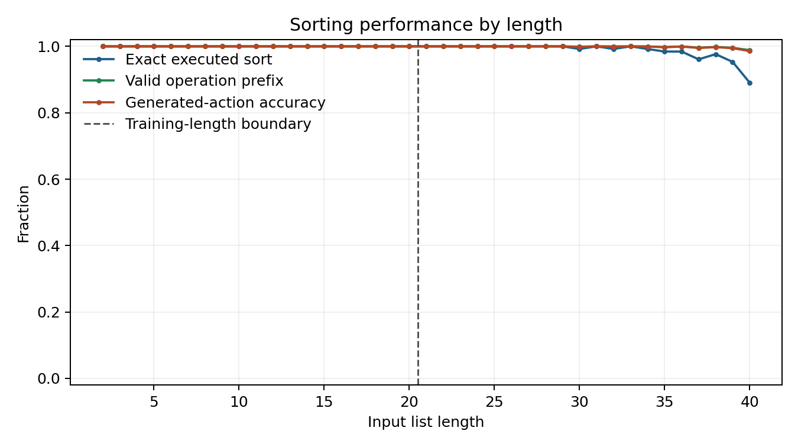

# List Sorting with a Transformer


A small, standalone benchmark for training a decoder-only Transformer to sort
comma-separated symbols. A model can predict the answer directly, generate a
fully textual quicksort trace, or control an executor through relative pointer
or adjacent-pair operations. The default experiment trains on list lengths
2-20 and evaluates every length through 40, making the failure or success of
length extrapolation explicit.

## Task

An example is represented as one causal token sequence:

```text
<bos>8,2,5,2=2,2,5,8<eos>
```

Only tokens after `=` contribute to cross-entropy. Inputs are generated online,
duplicates are allowed, and no finite training set is reused.

Two representation settings use the same token IDs and architecture:

- `numbers`: symbols `0` through `9` receive a learned token embedding plus a
  normalized scalar value feature in `[-1, 1]`.
- `alphabet`: symbols `a` through `j` receive only learned token embeddings.
  Their ordering must therefore be inferred from sorting supervision.

This isolates the effect of exposing ordinal structure while keeping the
sequence task unchanged.

## Pointer-Next Probe

The `pointer_next` task isolates relative retrieval from the sorting
experiments. The input is a random list with a pointer marker before one value,
and the model must output the value immediately after that pointer:

```text
<bos>7,<PTR>4,2=2<eos>
```

Training samples list lengths 2-20 by default and chooses the pointer uniformly
from positions that have a following value. Evaluation reports overall exact
match plus a split between pointer positions seen during training and pointer
positions beyond the training maximum. With the default range, pointer index
18 is the largest seen index, so length-40 examples include genuinely unseen
pointer positions.

## Pointer-Position Vector Probe

The `sort-pointer-position-probe` experiment keeps the causal marked-list
prompt but changes the target from a generated token to an absolute position
vector. The decoder reads:

```text
<bos>7,<PTR>4,2=
```

Fixed sinusoidal position vectors are added to the token embeddings. The final
hidden state at `=` is projected to a vector and trained with MSE to reproduce
the same sinusoidal vector that was added at the `<PTR>` token. With the
repository's prompt format, `<bos>` is token position 0 and valid pointer
offsets are:

```text
pointer list index: 0  1  2  ...
actual token offset: 1  3  5  ...
```

Evaluation decodes the emitted vector by nearest sinusoidal pointer-offset
candidate and reports both exact `argmax_accuracy` and `argmax_token_mae`, the
mean absolute error between the predicted and true token offsets. The model
remains causal because it only reads the prompt up to `=`.

## Quicksort Execution Traces

The `quicksort_trace` task makes the model execute deterministic three-way
quicksort before emitting its answer. It uses the middle element as the pivot
and an explicit LIFO stack rather than hiding recursion inside a partition
step. An abbreviated trace looks like:

```text
<bos>3,1,2<trace>
<CHECK_RANGE> <IDX> <I0> <IDX> <I2> <ACTIVE>
<PUSH> <IDX> <I0> <IDX> <I2>
<POP> <IDX> <I0> <IDX> <I2>
<LOAD_PIVOT> <IDX> <I1> 1
<SET_LT> <IDX> <I0>
<SET_SCAN> <IDX> <I0>
<SET_GT> <IDX> <I2>
<COMPARE> <IDX> <I0> 3 1 <GREATER>
<SWAP> <IDX> <I0> <IDX> <I2>
<DEC_GT> <IDX> <I1>
...
<DONE>
<ANSWER>1,2,3<eos>
```

Every operation has a dedicated vocabulary token. Values and indices also use
different tokens: value `2` and index digit `<I2>` do not share an embedding.
Indices are represented as reusable decimal digits after `<IDX>`, rather than
one embedding per position, so evaluating positions beyond the training length
does not introduce untrained position tokens.

The default hybrid encoding emits every comparison, pointer movement, swap,
range check, stack push, and stack pop. It repeats the complete array after
each finished partition, where that checkpoint can help the model recover its
state without repeating the unchanged array after every operation. Use
`--trace-snapshot-mode swap` to checkpoint after every swap or `none` to remove
array checkpoints.

Trace evaluation reports:

- `exact_match`: the generated final answer is exactly correct;
- `trace_exact_match`: every generated operation matches the deterministic
  execution;
- `full_exact_match`: both the trace and final answer are exact;
- `operation_prefix_fraction`: the fraction of operations completed before
  the first invalid operation.

## Executor-Assisted Pointer Traces

The `pointer_quicksort` task removes numeric position arguments entirely.
Instead, the model emits one dedicated action token at a time while a
deterministic executor owns the array, pointers, range stack, and mutations.
The executor appends one observation after every nonterminal action:

```text
<INIT_RANGE> -> <OK>
<CHECK_RANGE> -> <ACTIVE>
<LOAD_PIVOT_LO> -> 3
<SET_LT_LO> -> <OK>
<SET_SCAN_LO> -> <OK>
<SET_GT_HI> -> <OK>
<CHECK_SCAN_GT> -> <IN_RANGE>
<GET_SCAN> -> 3
<GET_PIVOT> -> 3
<BRANCH_EQUAL> -> <OK>
<MOVE_SCAN_RIGHT> -> <OK>
...
<CHECK_STACK> -> <EMPTY>
<DONE>
```

Only action tokens contribute to cross-entropy. Executor observations,
including fetched values, are supplied as context and masked from the loss.
During free evaluation the model is restricted to the action vocabulary, each
action is executed immediately, and the observation is fed back through the
model's cache before predicting the next action. An action that is invalid for
the current phase terminates that example.

The final answer is the executor's mutated array rather than a second copy the
model must regenerate. Exact success therefore requires a valid `DONE` and a
correctly sorted final state. The canonical program uses three-way quicksort,
chooses the value at `LO` as pivot, pushes the right child before the left
child, and never serializes an absolute position.

## No-Tool Pointer Ablation

The `pointer_quicksort_no_tool` task uses the identical serialized transcript
and vocabulary, but supervises both actions and observations. At evaluation,
the model greedily generates the complete transcript over the full vocabulary
until `<DONE>`. No executor is called and no observation is inserted during
that rollout.

After generation finishes, an offline executor replays the generated actions
to score the final array and checks every generated observation against the
result the action should have produced. This separates successful action
execution from observation hallucination without leaking executor state back
into inference.

Render the exact training transcript for a list with:

```bash
sort-pointer-trace 3,1,2
```

## Adjacent-Pair Traces

The `adjacent_sort` task replaces quicksort's pivot, three pointers, and range
stack with a bubble-sort machine that only exposes the pair under one cursor:

```text
<READ_PAIR> -> 3 1
<SWAP> -> 1 3
<RIGHT> -> 3 2
<SWAP> -> 2 3
<END_PASS> -> <CHANGED>
<RESET> -> 1 2
<KEEP> -> 1 2
<END_PASS> -> <UNCHANGED>
<DONE>
```

`SWAP` and `KEEP` return the resulting local pair. `RIGHT` returns the pair at
the next cursor position. After a changed pass, `RESET` moves the cursor to the
start and excludes the rightmost item, which the completed pass has fixed.
The machine stops after a pass containing no swaps.

As with pointer quicksort, `adjacent_sort` trains only the model's actions and
supplies observations using a live executor. `adjacent_sort_no_tool` instead
trains and generates the identical action-and-observation transcript without
calling the executor during inference. An offline replay then checks every
generated pair, action, and final mutation.

Render a complete adjacent trace with:

```bash
sort-adjacent-trace 3,1,2
```

### Executor-Controlled Advancement

The `adjacent_sort_auto_advance` task removes the remaining position-counting
requirement. After each `KEEP` or `SWAP`, the executor automatically advances
and returns the next pair. At a pass boundary it either returns `CHANGED`
followed by the first pair of the shorter next pass, or `UNCHANGED` when
sorting is complete:

```text
<READ_PAIR> -> <PAIR> <PAIR_3_1>
<SWAP> -> <PAIR> <PAIR_3_2>
<SWAP> -> <CHANGED> <PAIR_1_2>
<KEEP> -> <UNCHANGED> <NONE>
<DONE>
```

Every nonterminal executor response has exactly two tokens, avoiding hidden
padding during batched cached decoding. `PAIR PAIR_3_1` identifies the next
comparison, `CHANGED PAIR_1_2` starts the next shorter pass, and
`UNCHANGED NONE` marks completion. A dedicated token represents each ordered
symbol pair, keeping the comparison in the immediately preceding token and
shortening long traces. The model still decides whether each pair needs
swapping; the executor owns cursor movement, pass boundaries, and resetting.
`adjacent_sort_auto_advance_no_tool` uses the same transcript but requires the
model to generate all pair and boundary observations itself.

Render this protocol with:

```bash
sort-adjacent-trace --auto-advance 3,1,2
```

### Local-Window Tool Ablation

`adjacent_sort_local_window` keeps the original list at the beginning of one
growing autoregressive context, then appends a fixed nine-token window after
each comparison. `PTR` marks the active pair; the other value slots expose its
left neighbor and one-item right lookahead. `ACTIVE_END` hides the completed
suffix, while the transition and pass-status tokens make cursor movement
explicit:

```text
<bos> 3 , 1 , 2 <local_window_trace>
<WINDOW> <INITIAL> <PASS_CLEAN> <LEFT_EDGE> <PTR> 3 1 2 <WINDOW_END>
<SWAP>
<WINDOW> <ADVANCE> <PASS_CHANGED> 1 <PTR> 3 2 <ACTIVE_END> <WINDOW_END>
<SWAP>
<WINDOW> <NEW_PASS> <PASS_CLEAN> <LEFT_EDGE> <PTR> 1 2 <ACTIVE_END> <WINDOW_END>
<KEEP>
<WINDOW> <FINISHED> <PASS_CLEAN> <LEFT_EDGE> <NO_PTR> 1 2 3 <WINDOW_END>
<DONE>
```

The initial window is always part of the prompt. For later windows, each
transition category can independently use the executor or model:

| `--window-tool-events` | Executor-generated windows |
| --- | --- |
| `KEEP,SWAP,RESET,FINISH` | Every post-action window |
| `KEEP,RESET,FINISH` | All except in-pass windows after `SWAP` |
| `RESET,FINISH` | Pass-boundary and terminal windows only |
| `none` | No post-action windows |

The executor always keeps a shadow list for verification. Model-generated and
executor-supplied windows have exactly the same token format and are appended
to the same KV cache. Consequently, assistance can be changed per event
without changing the protocol, and trace length remains quadratic rather than
becoming cubic from repeatedly emitting the complete list.

`--window-pair-encoding atomic` replaces the two active value slots with one
ordered-pair token and a fixed filler while preserving the nine-token window:

```text
<WINDOW> <INITIAL> <PASS_CLEAN> <LEFT_EDGE>
<PTR> <PAIR_3_1> <PAIR_END> 2 <WINDOW_END>
```

This is a controlled comparison with the default `separate` encoding. It
tests whether treating each of the finite ordered pairs as one categorical
lookup is responsible for the stronger length generalization of the compact
auto-advance protocol.

While a pair is active, both `KEEP` and `SWAP` are executable commands. The
executor applies the model's choice and returns the resulting window even when
that choice differs from the canonical bubble-sort action. Such a rollout can
continue, finish with an incorrectly sorted list, or recover later. A fixed
quadratic action budget force-stops policies that repeatedly swap and never
reach `DONE`; these runs report `timed_out = 1`.

See the [metrics reference](docs/metrics.md) for every training and evaluation
metric, its units, and interpretation guidance.

## Model

The default model is a 4-layer, 128-dimensional causal Transformer with SwiGLU
feed-forward blocks. It has no learned absolute position table. Attention
layers alternate between:

1. rotary position embeddings (RoPE),
2. no explicit positional encoding (NoPE),
3. RoPE,
4. NoPE.

The implementation can also run all-RoPE or all-NoPE ablations through
`--position-pattern`. By default RoPE is applied to attention queries and keys
only; `--rotate-values-with-rope` also rotates value vectors in RoPE layers for
an additional positional-attention ablation.

Direct, textual-trace, and no-tool machine generation is unconstrained and
greedy. Executor-assisted generation is greedy but restricted to the relevant
action vocabulary; phase validity is still checked by the executor.
Evaluation measures exact completion, structural validity, partial progress,
and token or action accuracy as appropriate.

For an architecture control, `--architecture lstm` replaces the Transformer
with a 2-layer, hidden-size-256 unidirectional LSTM. Its 0.96M parameters are
close to the Transformer's 1.05M, and all data, losses, and evaluation code stay
unchanged.

## Install

```bash
python -m pip install -e '.[dev]'
pytest
```

## Train

```bash
sort-transformer-train \
  --representation numbers \
  --position-pattern alternating \
  --output-directory artifacts/numbers_alternating_seed7

sort-transformer-train \
  --representation alphabet \
  --position-pattern alternating \
  --output-directory artifacts/alphabet_alternating_seed7

sort-transformer-train \
  --architecture lstm \
  --representation numbers \
  --output-directory artifacts/lstm_numbers_seed7

sort-transformer-train \
  --task pointer_next \
  --representation numbers \
  --eval-examples 512 \
  --eval-batch-size 256 \
  --wandb-project list-sorting-with-transformer \
  --wandb-run-name pointer-next-numbers-seed7 \
  --output-directory artifacts/pointer_next_numbers_seed7

sort-pointer-position-probe \
  --representation numbers \
  --eval-max-length 400 \
  --wandb-project list-sorting-with-transformer \
  --wandb-run-name pointer-position-sinusoidal-mse-seed7 \
  --output-directory artifacts/pointer_position_sinusoidal_mse_seed7

sort-transformer-train \
  --task quicksort_trace \
  --representation numbers \
  --trace-snapshot-mode partition \
  --batch-size 128 \
  --gradient-accumulation-steps 2 \
  --checkpoint-interval 250 \
  --eval-batch-size 32 \
  --wandb-project list-sorting-with-transformer \
  --wandb-run-name quicksort-trace-numbers-seed7 \
  --output-directory artifacts/quicksort_trace_numbers_seed7

sort-transformer-train \
  --task pointer_quicksort \
  --representation numbers \
  --batch-size 128 \
  --gradient-accumulation-steps 2 \
  --eval-batch-size 32 \
  --wandb-project list-sorting-with-transformer \
  --wandb-run-name pointer-quicksort-numbers-seed7 \
  --output-directory artifacts/pointer_quicksort_numbers_seed7

sort-transformer-train \
  --task pointer_quicksort_no_tool \
  --representation numbers \
  --batch-size 128 \
  --gradient-accumulation-steps 2 \
  --eval-batch-size 32 \
  --wandb-project list-sorting-with-transformer \
  --wandb-run-name pointer-quicksort-no-tool-numbers-seed7 \
  --output-directory artifacts/pointer_quicksort_no_tool_numbers_seed7

sort-transformer-train \
  --task adjacent_sort \
  --representation numbers \
  --batch-size 32 \
  --gradient-accumulation-steps 4 \
  --eval-batch-size 16 \
  --wandb-project list-sorting-with-transformer \
  --wandb-run-name adjacent-sort-numbers-seed7 \
  --output-directory artifacts/adjacent_sort_numbers_seed7

sort-transformer-train \
  --task adjacent_sort_no_tool \
  --representation numbers \
  --batch-size 32 \
  --gradient-accumulation-steps 4 \
  --eval-batch-size 16 \
  --wandb-project list-sorting-with-transformer \
  --wandb-run-name adjacent-sort-no-tool-numbers-seed7 \
  --output-directory artifacts/adjacent_sort_no_tool_numbers_seed7

sort-transformer-train \
  --task adjacent_sort_auto_advance \
  --representation numbers \
  --batch-size 128 \
  --gradient-accumulation-steps 2 \
  --eval-batch-size 32 \
  --wandb-project list-sorting-with-transformer \
  --wandb-run-name adjacent-sort-auto-advance-numbers-seed7 \
  --output-directory artifacts/adjacent_sort_auto_advance_numbers_seed7

sort-transformer-train \
  --task adjacent_sort_auto_advance_no_tool \
  --representation numbers \
  --batch-size 128 \
  --gradient-accumulation-steps 2 \
  --eval-batch-size 32 \
  --wandb-project list-sorting-with-transformer \
  --wandb-run-name adjacent-sort-auto-advance-no-tool-numbers-seed7 \
  --output-directory artifacts/adjacent_sort_auto_advance_no_tool_numbers_seed7

sort-transformer-train \
  --task adjacent_sort_local_window \
  --window-tool-events KEEP,SWAP,RESET,FINISH \
  --window-pair-encoding atomic \
  --representation numbers \
  --batch-size 32 \
  --gradient-accumulation-steps 4 \
  --eval-batch-size 16 \
  --wandb-project list-sorting-with-transformer \
  --wandb-run-name adjacent-sort-local-window-all-tool-seed7 \
  --output-directory artifacts/adjacent_sort_local_window_all_tool_seed7

sort-transformer-train \
  --task adjacent_sort_local_window \
  --window-tool-events none \
  --representation numbers \
  --batch-size 32 \
  --gradient-accumulation-steps 4 \
  --eval-batch-size 16 \
  --wandb-project list-sorting-with-transformer \
  --wandb-run-name adjacent-sort-local-window-no-tool-seed7 \
  --output-directory artifacts/adjacent_sort_local_window_no_tool_seed7
```

Install `.[tracking]` to enable W&B. Long trace runs can use gradient
accumulation to preserve the effective batch size while limiting the memory
cost of an unusually long padded trace. Pointer traces are generated as flat
token and mask arrays without per-operation objects. Checkpoints include model,
optimizer, and online-data generator state, and can be resumed with:

```bash
sort-transformer-train \
  ...same model and task arguments... \
  --resume-checkpoint artifacts/quicksort_trace_numbers_seed7/checkpoint.pt
```

Each run writes:

- `checkpoint.pt`: model and optimizer state, ignored by Git;
- `metrics.json`: configuration, training trace, and per-length metrics;
- `training.png`: loss and teacher-forced token accuracy;
- `length_generalization.png`: strict generative performance by length.

Evaluate a checkpoint on another length range with:

```bash
sort-transformer-eval \
  artifacts/numbers_alternating_seed7/checkpoint.pt \
  --lengths 2-60 \
  --output artifacts/numbers_alternating_seed7/eval_2_60.json \
  --plot artifacts/numbers_alternating_seed7/eval_2_60.png
```

## Baseline Results

The initial baseline uses seed 7, 10,000 online-training steps, batch size 256,
and 128 held-out generated examples at every length. The Transformer has 1.05M
parameters and the LSTM has 0.96M.


| Architecture and representation | Exact, lengths 2-20 | Exact, lengths 21-40 | Exact at 23 | Exact at 25 | First zero-exact length |
| --- | ---: | ---: | ---: | ---: | ---: |
| Transformer, numbers + scalar | 100.00% | 22.54% | 98.44% | 56.25% | 27 |
| Transformer, alphabet | 100.00% | 22.73% | 95.31% | 57.03% | 28 |
| LSTM, numbers + scalar | 99.88% | 14.02% | 62.50% | 0.78% | 26 |
| LSTM, alphabet | 99.96% | 12.07% | 46.88% | 0.00% | 25 |

Both Transformers learn the complete in-domain task and remain perfect through
length 22, two positions beyond the training maximum. Neither sustains the
algorithm: accuracy falls rapidly over lengths 23-28 and is zero thereafter.
The LSTMs nearly fit the training domain but extrapolate less far, particularly
in alphabet mode. In this seed, exposing numeric order helps the LSTM but does
not improve the Transformer's average exact extrapolation.


The learning curves separate optimization from extrapolation. LSTM performance
at length 20 improves late in training as the learning rate decays, while its
length-25 accuracy remains near zero. Transformer length-25 accuracy is
non-monotonic even after length 20 is solved, so it should not be inferred from
in-domain loss alone.

The Transformer failure details differ. At length 40, the alphabet Transformer
still emits syntactically valid comma-separated outputs on 94.53% of examples,
but uses the wrong number or multiset of symbols. The numeric Transformer emits
valid syntax on only 0.78%. These are single-seed results, so close aggregate
comparisons should be treated as baseline observations rather than evidence
that representations or architectures are equivalent.

Rebuild the comparison figure with:

```bash
sort-transformer-compare \
  artifacts/numbers_alternating_seed7/metrics.json \
  artifacts/alphabet_alternating_seed7/metrics.json \
  artifacts/lstm_numbers_seed7/metrics.json \
  artifacts/lstm_alphabet_seed7/metrics.json \
  --output artifacts/representation_comparison.png \
  --dynamics-output artifacts/learning_dynamics.png
```

## Pointer-Trace Results

The matched pointer experiments use seed 7, 10,000 updates, batch size 128
with two-step gradient accumulation, and the same 1.06M-parameter Transformer.



| Method | Exact, lengths 2-20 | Exact, lengths 21-40 | Trace exact, lengths 21-40 | Wall time |
| --- | ---: | ---: | ---: | ---: |
| Direct prediction | **100.00%** | 22.54% | n/a | **2.5 min** |
| Numeric-index trace | 99.10% | 0.94% | 0.00% | 118.0 min |
| Executor-assisted pointer trace | **100.00%** | **98.63%** | **98.63%** | **67.4 min** |
| No-tool pointer trace | 97.12% | 5.20% | 5.20% | 69.9 min |

The executor-assisted model is exact through length 25, then reaches 99.22%,
98.44%, and 89.06% exact execution at lengths 30, 35, and 40 respectively.
These figures use the final independent per-length sweep rather than the
smaller evaluation samples logged during training.
Without executor observations, exact accuracy falls from 77.34% at length 20
to 65.62% at length 21 and reaches zero at length 25. Generated actions and
observations deteriorate together, consistent with failure to maintain the
machine's mutable array, pointers, and stack rather than a single bad action.
Direct prediction is much faster because it emits only the answer, so wall
time should not be interpreted as a compute-matched efficiency comparison.

## Literature Context

Sorting is simple algorithmically but remains a demanding length-generalization
test for learned sequence models.

- [Thinking Like Transformers](https://proceedings.mlr.press/v139/weiss21a.html)
  expresses sorting in RASP and shows why bounded-vocabulary sorting can be
  implemented through token counting. Its compiled model is intentionally
  structured, unlike the learned baseline here.
- [Improving Length-Generalization in Transformers via Task
  Hinting](https://arxiv.org/abs/2310.00726) reports that ordinary Transformers
  trained on sorting sequences of length at most 20 have near-zero exact
  accuracy at length 100. Auxiliary successor/counting objectives substantially
  improve that extrapolation, showing that the training signal matters.
- [The Impact of Positional Encoding on Length Generalization in
  Transformers](https://proceedings.neurips.cc/paper_files/paper/2023/hash/4e85362c02172c0c6567ce593122d31c-Abstract-Conference.html)
  finds that positional-encoding choice can dominate extrapolation behavior,
  with NoPE outperforming several explicit schemes on its reasoning tasks. The
  alternating RoPE/NoPE stack here is a direct, testable hybrid rather than an
  assumption that either choice is universally best.
- [Neural Execution Engines](https://proceedings.neurips.cc/paper/2020/hash/c8b9abffb45bf79a630fb613dcd23449-Abstract.html)
  finds that vanilla Transformers can fit sorting examples yet fail on longer
  lists, and explores execution-oriented masking as a remedy.
- [CLRS-Text](https://arxiv.org/abs/2406.04229) serializes intermediate
  execution states and final outputs for the 30 CLRS algorithms, including
  quicksort. Its weak extrapolation results also make clear that supplying a
  trace does not by itself guarantee length generalization.
- [Show Your Work](https://arxiv.org/abs/2112.00114) trains language models to
  emit intermediate scratchpad computations before their final answers. The
  quicksort task here uses a fully deterministic, mechanically verifiable
  scratchpad rather than an unconstrained rationale.
- [Exploring Length Generalization in Large Language
  Models](https://proceedings.neurips.cc/paper_files/paper/2022/hash/fb7451e43f9c1c35b774bcfad7a5714b-Abstract-Conference.html)
  similarly shows that standard sequence models often need intermediate
  computation structure to extrapolate beyond training lengths.
- [Learning to Execute](https://arxiv.org/abs/1410.4615) shows that LSTMs can
  learn character-level program execution, but reports that curriculum design
  was critical. It also distinguishes teacher-forced accuracy from free
  generation; this repository uses uniform training lengths and scores fully
  generated outputs, making the recurrent baseline deliberately strict.

The first goal of this repository is a clean baseline, not a claimed solution.
The number/alphabet comparison and exact per-length curves establish whether
the model learns sorting, merely exploits exposed numeric order, or discovers a
rule that continues beyond its training horizon.
