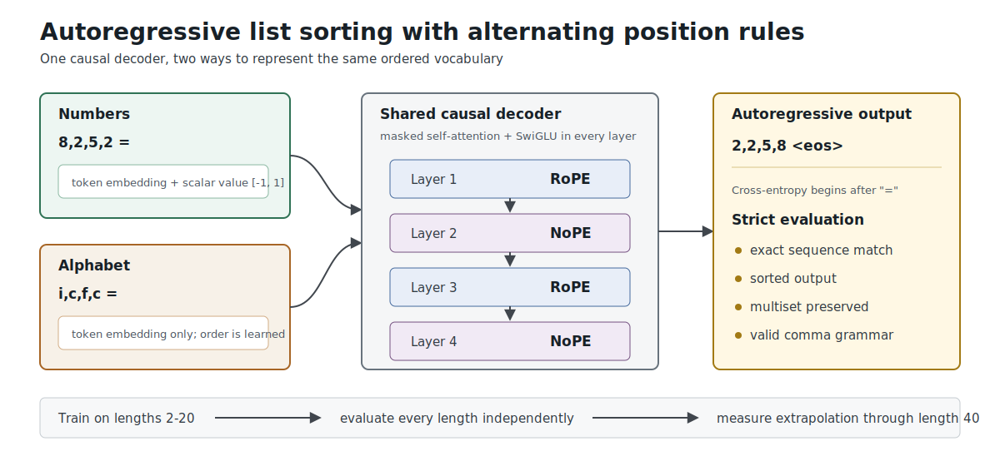
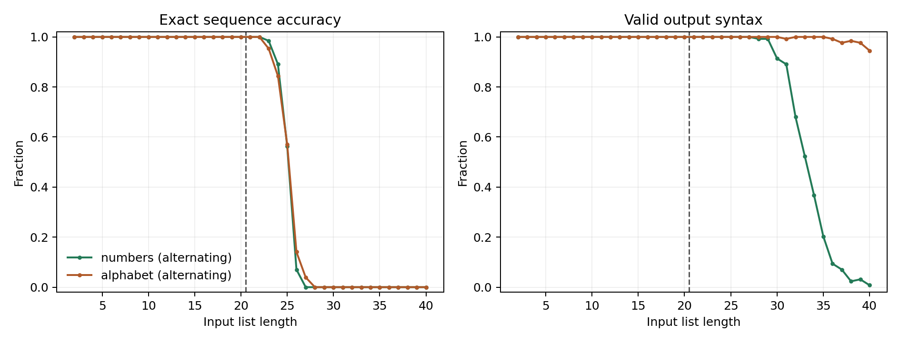
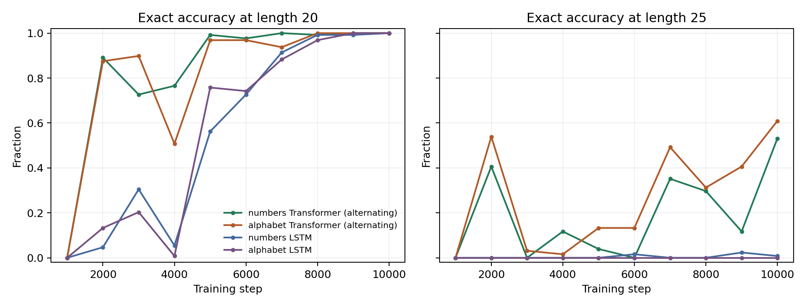

# List Sorting with a Transformer



A small, standalone benchmark for training a decoder-only Transformer to sort
comma-separated symbols, either by predicting the answer directly or by
generating an instruction-level quicksort execution trace first. The default
experiment trains on list lengths 2-20 and evaluates every length through 40,
making the failure or success of length extrapolation explicit.

## Task

An example is represented as one causal token sequence:

```text
<bos>8,2,5,2=2,2,5,8<eos>
```

Only tokens after `=` contribute to cross-entropy. Inputs are generated online,
duplicates are allowed, and no finite training set is reused.

Two representation settings use the same token IDs and architecture:

- `numbers`: symbols `0` through `9` receive a learned token embedding plus a
  normalized scalar value feature in `[-1, 1]`.
- `alphabet`: symbols `a` through `j` receive only learned token embeddings.
  Their ordering must therefore be inferred from sorting supervision.

This isolates the effect of exposing ordinal structure while keeping the
sequence task unchanged.

## Quicksort Execution Traces

The `quicksort_trace` task makes the model execute deterministic three-way
quicksort before emitting its answer. It uses the middle element as the pivot
and an explicit LIFO stack rather than hiding recursion inside a partition
step. An abbreviated trace looks like:

```text
<bos>3,1,2<trace>
<CHECK_RANGE> <IDX> <I0> <IDX> <I2> <ACTIVE>
<PUSH> <IDX> <I0> <IDX> <I2>
<POP> <IDX> <I0> <IDX> <I2>
<LOAD_PIVOT> <IDX> <I1> 1
<SET_LT> <IDX> <I0>
<SET_SCAN> <IDX> <I0>
<SET_GT> <IDX> <I2>
<COMPARE> <IDX> <I0> 3 1 <GREATER>
<SWAP> <IDX> <I0> <IDX> <I2>
<DEC_GT> <IDX> <I1>
...
<DONE>
<ANSWER>1,2,3<eos>
```

Every operation has a dedicated vocabulary token. Values and indices also use
different tokens: value `2` and index digit `<I2>` do not share an embedding.
Indices are represented as reusable decimal digits after `<IDX>`, rather than
one embedding per position, so evaluating positions beyond the training length
does not introduce untrained position tokens.

The default hybrid encoding emits every comparison, pointer movement, swap,
range check, stack push, and stack pop. It repeats the complete array after
each finished partition, where that checkpoint can help the model recover its
state without repeating the unchanged array after every operation. Use
`--trace-snapshot-mode swap` to checkpoint after every swap or `none` to remove
array checkpoints.

Trace evaluation reports:

- `exact_match`: the generated final answer is exactly correct;
- `trace_exact_match`: every generated operation matches the deterministic
  execution;
- `full_exact_match`: both the trace and final answer are exact;
- `operation_prefix_fraction`: the fraction of operations completed before
  the first invalid operation.

See the [metrics reference](docs/metrics.md) for every training and evaluation
metric, its units, and interpretation guidance.

## Model

The default model is a 4-layer, 128-dimensional causal Transformer with SwiGLU
feed-forward blocks. It has no learned absolute position table. Attention
layers alternate between:

1. rotary position embeddings (RoPE),
2. no explicit positional encoding (NoPE),
3. RoPE,
4. NoPE.

The implementation can also run all-RoPE or all-NoPE ablations through
`--position-pattern`.

Generation is unconstrained and greedy. Evaluation does not assume valid model
output: it separately measures exact match, comma syntax, output length,
monotonic order, multiset preservation, and target-token accuracy.

For an architecture control, `--architecture lstm` replaces the Transformer
with a 2-layer, hidden-size-256 unidirectional LSTM. Its 0.96M parameters are
close to the Transformer's 1.05M, and all data, losses, and evaluation code stay
unchanged.

## Install

```bash
python -m pip install -e '.[dev]'
pytest
```

## Train

```bash
sort-transformer-train \
  --representation numbers \
  --position-pattern alternating \
  --output-directory artifacts/numbers_alternating_seed7

sort-transformer-train \
  --representation alphabet \
  --position-pattern alternating \
  --output-directory artifacts/alphabet_alternating_seed7

sort-transformer-train \
  --architecture lstm \
  --representation numbers \
  --output-directory artifacts/lstm_numbers_seed7

sort-transformer-train \
  --task quicksort_trace \
  --representation numbers \
  --trace-snapshot-mode partition \
  --batch-size 128 \
  --gradient-accumulation-steps 2 \
  --checkpoint-interval 250 \
  --eval-batch-size 32 \
  --wandb-project list-sorting-with-transformer \
  --wandb-run-name quicksort-trace-numbers-seed7 \
  --output-directory artifacts/quicksort_trace_numbers_seed7
```

Install `.[tracking]` to enable W&B. Long trace runs can use gradient
accumulation to preserve the effective batch size while limiting the memory
cost of an unusually long padded trace. Checkpoints include model, optimizer,
and online-data generator state, and can be resumed with:

```bash
sort-transformer-train \
  ...same model and task arguments... \
  --resume-checkpoint artifacts/quicksort_trace_numbers_seed7/checkpoint.pt
```

Each run writes:

- `checkpoint.pt`: model and optimizer state, ignored by Git;
- `metrics.json`: configuration, training trace, and per-length metrics;
- `training.png`: loss and teacher-forced token accuracy;
- `length_generalization.png`: strict generative performance by length.

Evaluate a checkpoint on another length range with:

```bash
sort-transformer-eval \
  artifacts/numbers_alternating_seed7/checkpoint.pt \
  --lengths 2-60 \
  --output artifacts/numbers_alternating_seed7/eval_2_60.json \
  --plot artifacts/numbers_alternating_seed7/eval_2_60.png
```

## Baseline Results

The initial baseline uses seed 7, 10,000 online-training steps, batch size 256,
and 128 held-out generated examples at every length. The Transformer has 1.05M
parameters and the LSTM has 0.96M.



| Architecture and representation | Exact, lengths 2-20 | Exact, lengths 21-40 | Exact at 23 | Exact at 25 | First zero-exact length |
| --- | ---: | ---: | ---: | ---: | ---: |
| Transformer, numbers + scalar | 100.00% | 22.54% | 98.44% | 56.25% | 27 |
| Transformer, alphabet | 100.00% | 22.73% | 95.31% | 57.03% | 28 |
| LSTM, numbers + scalar | 99.88% | 14.02% | 62.50% | 0.78% | 26 |
| LSTM, alphabet | 99.96% | 12.07% | 46.88% | 0.00% | 25 |

Both Transformers learn the complete in-domain task and remain perfect through
length 22, two positions beyond the training maximum. Neither sustains the
algorithm: accuracy falls rapidly over lengths 23-28 and is zero thereafter.
The LSTMs nearly fit the training domain but extrapolate less far, particularly
in alphabet mode. In this seed, exposing numeric order helps the LSTM but does
not improve the Transformer's average exact extrapolation.



The learning curves separate optimization from extrapolation. LSTM performance
at length 20 improves late in training as the learning rate decays, while its
length-25 accuracy remains near zero. Transformer length-25 accuracy is
non-monotonic even after length 20 is solved, so it should not be inferred from
in-domain loss alone.

The Transformer failure details differ. At length 40, the alphabet Transformer
still emits syntactically valid comma-separated outputs on 94.53% of examples,
but uses the wrong number or multiset of symbols. The numeric Transformer emits
valid syntax on only 0.78%. These are single-seed results, so close aggregate
comparisons should be treated as baseline observations rather than evidence
that representations or architectures are equivalent.

Rebuild the comparison figure with:

```bash
sort-transformer-compare \
  artifacts/numbers_alternating_seed7/metrics.json \
  artifacts/alphabet_alternating_seed7/metrics.json \
  artifacts/lstm_numbers_seed7/metrics.json \
  artifacts/lstm_alphabet_seed7/metrics.json \
  --output artifacts/representation_comparison.png \
  --dynamics-output artifacts/learning_dynamics.png
```

## Literature Context

Sorting is simple algorithmically but remains a demanding length-generalization
test for learned sequence models.

- [Thinking Like Transformers](https://proceedings.mlr.press/v139/weiss21a.html)
  expresses sorting in RASP and shows why bounded-vocabulary sorting can be
  implemented through token counting. Its compiled model is intentionally
  structured, unlike the learned baseline here.
- [Improving Length-Generalization in Transformers via Task
  Hinting](https://arxiv.org/abs/2310.00726) reports that ordinary Transformers
  trained on sorting sequences of length at most 20 have near-zero exact
  accuracy at length 100. Auxiliary successor/counting objectives substantially
  improve that extrapolation, showing that the training signal matters.
- [The Impact of Positional Encoding on Length Generalization in
  Transformers](https://proceedings.neurips.cc/paper_files/paper/2023/hash/4e85362c02172c0c6567ce593122d31c-Abstract-Conference.html)
  finds that positional-encoding choice can dominate extrapolation behavior,
  with NoPE outperforming several explicit schemes on its reasoning tasks. The
  alternating RoPE/NoPE stack here is a direct, testable hybrid rather than an
  assumption that either choice is universally best.
- [Neural Execution Engines](https://proceedings.neurips.cc/paper/2020/hash/c8b9abffb45bf79a630fb613dcd23449-Abstract.html)
  finds that vanilla Transformers can fit sorting examples yet fail on longer
  lists, and explores execution-oriented masking as a remedy.
- [CLRS-Text](https://arxiv.org/abs/2406.04229) serializes intermediate
  execution states and final outputs for the 30 CLRS algorithms, including
  quicksort. Its weak extrapolation results also make clear that supplying a
  trace does not by itself guarantee length generalization.
- [Show Your Work](https://arxiv.org/abs/2112.00114) trains language models to
  emit intermediate scratchpad computations before their final answers. The
  quicksort task here uses a fully deterministic, mechanically verifiable
  scratchpad rather than an unconstrained rationale.
- [Exploring Length Generalization in Large Language
  Models](https://proceedings.neurips.cc/paper_files/paper/2022/hash/fb7451e43f9c1c35b774bcfad7a5714b-Abstract-Conference.html)
  similarly shows that standard sequence models often need intermediate
  computation structure to extrapolate beyond training lengths.
- [Learning to Execute](https://arxiv.org/abs/1410.4615) shows that LSTMs can
  learn character-level program execution, but reports that curriculum design
  was critical. It also distinguishes teacher-forced accuracy from free
  generation; this repository uses uniform training lengths and scores fully
  generated outputs, making the recurrent baseline deliberately strict.

The first goal of this repository is a clean baseline, not a claimed solution.
The number/alphabet comparison and exact per-length curves establish whether
the model learns sorting, merely exploits exposed numeric order, or discovers a
rule that continues beyond its training horizon.
