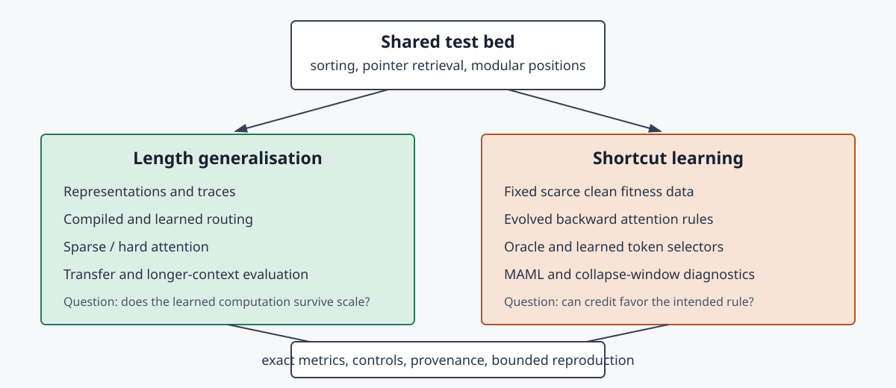

# Length Generalisation and Shortcut Learning



This repository studies two related questions:

1. **Length generalisation:** when does a sequence model trained on short
   examples discover a rule that continues to work at much longer lengths?
2. **Shortcut learning:** can training-time credit assignment be changed so a
   model learns the intended rule even when an easier shortcut is present?

The test bed grew from list sorting into pointer retrieval, explicit
position-routing pipelines, compiled circuits, sparse and hard attention,
evolutionary optimization, learned backward rules, and meta-learning. The
repository records positive, negative, and inconclusive results. A result is
not called confirmed merely because one W&B curve looked promising.

## Start Here

- [Experiment index](docs/experiment-index.md): status, configuration,
  evidence, and reproduction route for every experiment family.
- [Length-generalisation track](docs/length-generalisation.md): tasks,
  findings, limitations, and open questions.
- [Shortcut-learning track](docs/shortcut-learning.md): shortcut protocol,
  fixed-fitness invariant, methods, and results.
- [Core sequence-task notebook](docs/core-sequence-tasks.md): the original
  sorting, pointer, trace, and modular-pipeline details.
- [Metrics reference](docs/metrics.md): exact meanings of training and
  evaluation metrics.
- [Adding an experiment](docs/adding-experiments.md): required structure and
  provenance.
- [Source layout](src/list_sorting_transformer/README.md): implementation
  ownership and its relationship to experiment families.
- [Archive map](docs/archive.md): superseded and abandoned directions that
  remain useful as negative evidence.

Status labels used throughout:

| Status | Meaning |
| --- | --- |
| **Confirmed** | Supported by matched controls or repeated evaluations with committed evidence. |
| **Preliminary** | A real measured result, but usually only one seed or one narrow task. |
| **Negative** | The tested method did not improve the stated target under the recorded setup. |
| **Inconclusive** | Optimization, collapse, or confounding prevents a scientific conclusion. |
| **Archived** | Retained for provenance but no longer a recommended active direction. |

## Headline Findings

These statements are deliberately narrower than the hypotheses that motivated
the experiments.

| Finding | Status | Evidence |
| --- | --- | --- |
| A compiled two-layer routing prefix improved length-400 accuracy from 56.6% to 95.4% on three-way comparison and from 8.1% to 55.5% on associative recall, averaged over three seeds. It did not help the unrelated Dyck-2 task. | Confirmed | [RASP transfer report](docs/rasp_transfer_report.md#endpoint-results), [aggregate JSON](experiments/rasp_transfer/results/summary.json) |
| The same compiled routing blocks did not improve byte language modelling. At the 256-byte training context, random initialization reached 3.026 BPC versus 3.095 for compiled-middle initialization over three paired seeds; random was also better at every tested context through 2,048 bytes. | Negative | [Language-model report](docs/language_model_transfer_report.md#results), [aggregate JSON](experiments/language_model_transfer/results/summary.json) |
| A single-seed EGGROLL run learned a two-layer Transformer with one active top-1 attention head per layer. At generation 10,000 it reached 99.6% at length 400 and 95.3% at length 5,000 after training only through length 20. | Preliminary | [Hard-attention report](experiments/hard_attention_eggroll/README.md#checkpoint-length-sweep), [checkpoint sweep CSV](experiments/hard_attention_eggroll/results/eggroll_checkpoint_length_sweep.csv) |
| On the simpler pointer-next task, dense softmax matched sparse entmax. With eight heads split between ALiBi and NoPE, a single seed reached 100% at the sampled length-2,000 evaluation; all-ALiBi and all-NoPE controls failed at long lengths. Head interventions identify a local-then-global circuit: layer-1 ALiBi heads mark the target and layer-2 NoPE heads retrieve it from the final separator. | Preliminary | [Sparse-attention ablation and mechanism](experiments/sparse_attention_adam/README.md#measured-alibinope-circuit), [mechanism JSON](experiments/sparse_attention_adam/results/alibi_nope_mechanism.json) |
| With the same mixed ALiBi/NoPE model, direct KEEP/SWAP prediction retained 92.2% accuracy at length 5,000. Emitting the two compared values first reduced exact trace accuracy to 14.1%; the action remained correct whenever both values were retrieved correctly. | Preliminary | [KEEP/SWAP comparison](experiments/sparse_attention_adam/README.md#keepswap-extension), [comparison JSON](experiments/sparse_attention_adam/results/pointer_compare_summary.json) |
| A fixed evolved backward rule reached 93.8% mean worst-mode shortcut accuracy across 20 fresh replications at horizon 320, versus 4.5% for ordinary backpropagation. This establishes transfer of that learned rule within the random-position shortcut task, not across unrelated tasks. | Confirmed | [Replication summary](experiments/learned_backward_shortcuts/results/random_elite_g49_h320_replications_summary.json), [shortcut track](docs/shortcut-learning.md#evolved-backward-rule) |
| Oracle reversal of attention-score gradients can remove the random-position shortcut: two seeds reached at least 99.97% masked and incorrect-hint accuracy on fresh 20,000-example evaluations. Learning the token selector itself did not reproduce the oracle result. | Confirmed mechanism; learned policy negative | [Oracle summary](experiments/token_gradient_selector/results/random_oracle_optimization_summary.json), [selector log](experiments/token_gradient_selector/PROGRESS.md) |
| Learned backward rules and MAML variants did not yet improve length-400 pointer-next generalisation reliably. Several runs improved length 50 while remaining near chance or unstable at length 400. | Negative or inconclusive | [Learned-backward log](experiments/learned_backward_length_generalization/PROGRESS.md), [MAML log](experiments/maml_length_generalization/PROGRESS.md) |

The mixed ALiBi/NoPE interpretation is now supported by exact attention tracing
and head-output interventions on the successful checkpoint. This identifies
the layerwise circuit in one model and seed; it does not establish that every
mixed-head model learns the same algorithm.

## Repository Layout

```text
src/list_sorting_transformer/
  core/                         shared tasks, models, data, and evaluation
  length_generalisation/        pointer pipelines and length methods
  shortcut_learning/            learned credit and shortcut methods
  transfer/                     compiled-circuit downstream studies
experiments/                    launchers, progress logs, and committed evidence
experiments/registry.json       machine-readable experiment inventory
docs/                           track narratives, reports, metrics, and archive map
artifacts/                      selected lightweight historical evidence
scripts/                        artifact validation and bounded smoke entry points
tests/                          unit, parity, and experiment-contract tests
```

Raw checkpoints, local W&B state, caches, and large run directories are not
part of the research artifact. Selected JSON, JSONL, CSV, and figures are
committed only when they support a documented claim.

## Installation

```bash
python -m pip install -e '.[dev]'
```

The historical `sort-*` command names remain stable even though the repository
now covers more than sorting.

## Bounded Reproduction

Validate the registry, evidence paths, documentation links, and critical TODO
policy:

```bash
python scripts/validate_research_artifact.py
```

Run the full unit suite:

```bash
PYTHONPATH=src python -m pytest -q
```

Run one bounded GPU smoke from each research track:

```bash
scripts/smoke_length.sh
scripts/smoke_shortcut.sh
```

Both scripts acquire one GPU through
`/store/store5/software/simple-gpu-schedule/with-gpu`, write only to
`.scratch/research-artifact-smoke/`, disable W&B, and perform two training
updates or generations. They validate executable contracts, not the headline
scientific results.

Long research launchers are documented in the
[experiment index](docs/experiment-index.md). Review their configured budgets
before running them.

## Research Discipline

- Training examples may be generated online, but evaluation data and seeds must
  be explicit.
- Shortcut-containing forward-training data is resampled and effectively
  unlimited. The clean fitness set used to evolve backward rules is deliberately
  small and fixed across generations. Fresh clean examples are evaluation-only.
- Exact accuracy, teacher-forced accuracy, and prediction diversity are distinct
  measurements. A collapsed predictor is not evidence of algorithm learning.
- Lengths above the training range are reporting data unless an experiment
  explicitly defines them as a fitness or meta-training distribution.
- Single-seed findings remain preliminary regardless of their accuracy.
- New experiments must be registered before their results are presented as part
  of the artifact, including the source packages they use.

## Scope

This is an experimental research artifact, not a claim that length
generalisation or shortcut learning has been solved. The strongest current
results are task-specific demonstrations: compiled routing transfers when the
new task reuses its primitives, a sparse hard-attention model can extrapolate
far beyond its training lengths, and modified attention credit can prevent a
known shortcut. General learned credit assignment across tasks remains open.
