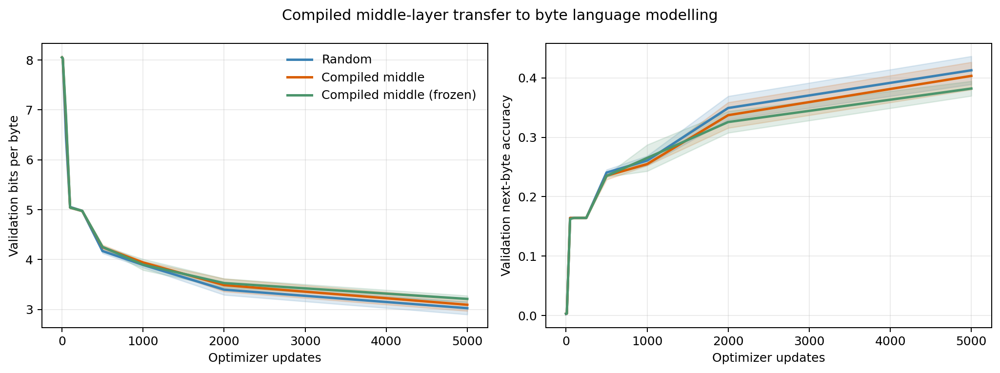
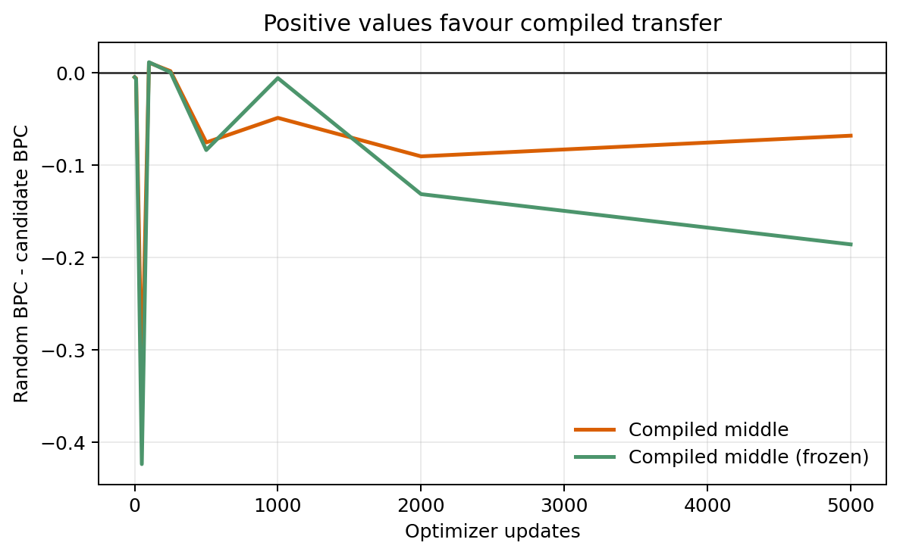
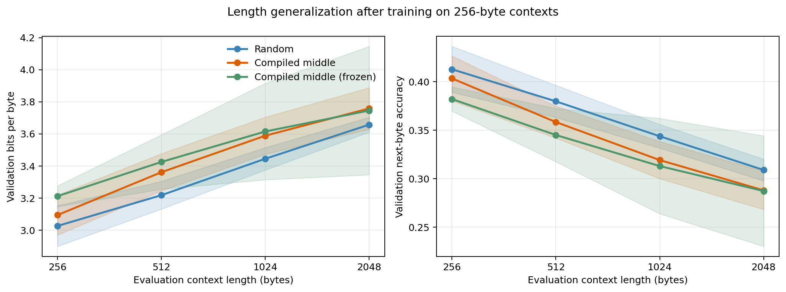

# Compiled Middle-Layer Transfer to Language Modelling

## Executive summary

This experiment asks whether the exact two-layer routing circuit from the
compiled pointer comparator is a better initialization than random weights for
language modelling.

We trained a six-layer, 1.63M-parameter causal Transformer as a byte-level
language model on text read directly from The Pile at
`/store/store4/data/thepile/00.jsonl`. The transfer model places the two
compiled blocks in layers 3-4:

```text
Random:          byte input -> R -> R -> R  -> R  -> R -> R -> byte logits
Compiled middle: byte input -> R -> R -> C1 -> C2 -> R -> R -> byte logits
Frozen compiled: byte input -> R -> R -> C1 -> C2 -> R -> R -> byte logits
                                               C1 and C2 frozen
```

For a given seed, every parameter outside layers 3-4 starts identically in the
three conditions. All models see identical training batches and optimizer
settings. The compiled blocks are fine-tuned in one condition and held exactly
fixed in the new frozen condition.

The compiled initialization did **not** improve language modelling:

| Initialization | Validation BPC | Byte perplexity | Next-byte accuracy |
| --- | ---: | ---: | ---: |
| Random | **3.026 +/- 0.127** | **8.169 +/- 0.734** | **41.28% +/- 2.37** |
| Compiled middle | 3.095 +/- 0.125 | 8.563 +/- 0.726 | 40.33% +/- 2.32 |
| Compiled middle, frozen | 3.212 +/- 0.065 | 9.273 +/- 0.421 | 38.21% +/- 1.24 |

Values are means and sample standard deviations over seeds 7, 17, and 29 at
5,000 optimizer updates. Lower bits per byte (BPC) and perplexity are better;
higher accuracy is better. Random initialization finishes better than the
trainable compiled model for every paired seed. Freezing worsens the mean
paired difference from `+0.068 +/- 0.081` to `+0.186 +/- 0.165 BPC`.

This is a useful boundary on the positive transfer observed in the
[puzzle-task benchmark](rasp_transfer_report.md): a routing circuit helps tasks
that reuse locate-and-retrieve operations, but it is not a generally superior
language-model initialization in this setup.

Evaluation without further training at 512, 1,024, and 2,048 bytes also finds
no length-generalization advantage. All three models degrade beyond the
256-byte training context, and random initialization has better mean loss and
accuracy than both compiled variants at every tested length.



## Experimental question

The previous transfer benchmark put the two useful compiled blocks at the
start of a four-layer model. The strongest transfer occurred when the
downstream task reused their routing behavior.

Here the two blocks are moved into the middle of a deeper network. Random
layers before them can, in principle, transform byte representations into the
coordinate system expected by the circuit, while random layers after them can
convert its output into language-model features. This tests a stronger claim:

> Can an exact algorithmic routing module serve as a useful internal prior for
> ordinary next-token prediction?

The matched random control tests the same architecture and optimization budget
without that prior. The frozen ablation tests whether preserving the exact
source circuit, rather than allowing language-model gradients to erode it,
changes the outcome.

## Data

The benchmark reads the existing Pile JSONL file:

```text
/store/store4/data/thepile/00.jsonl
```

The source is opened read-only. No file under `/store/store4` is created,
rewritten, or deleted.

Documents are split deterministically:

- document indices divisible by 20 are assigned to validation;
- all other document indices are assigned to training;
- streams are truncated to 32,000,000 training bytes and 4,000,000 validation
  bytes;
- each document is UTF-8 encoded and separated by two newline bytes.

The resulting immutable inputs are:

| Split | Documents used | Bytes | SHA-256 |
| --- | ---: | ---: | --- |
| Train | 4,954 | 32,000,000 | `b51c1b120938a38f6e323dc63a7a87c51d2d9ed88e1b517844ecde97d308f264` |
| Validation | 815 | 4,000,000 | `35a765a9bbdb53c142bcdb0dc5a8bb1e71ae64cff3a0d495df274d7df154f199` |

Raw UTF-8 bytes are the tokens, giving a fixed vocabulary of 256 and avoiding
tokenizer training, external downloads, or vocabulary mismatches between
runs. Validation bytes are sourced from documents disjoint from training;
each bounded stream may truncate its final document at the byte budget.

## Model and initialization

All conditions use:

| Setting | Value |
| --- | ---: |
| Transformer layers | 6 |
| Model width | 128 |
| Attention heads | 4 |
| SwiGLU multiplier | 4 |
| Total parameters | 1,625,960 |
| Trainable parameters | 1,625,344 normally; 1,100,032 when frozen |
| Context length | 256 bytes |
| Dropout | 0 |

The input residual stream is split into 64 byte-content dimensions and 64
position dimensions. All conditions receive the same fixed modular Fourier
position representation using moduli `(2, 3, 5, 7, 11, 13, 17, 19)`. Its
period is 9,699,690 positions, so addresses do not repeat within the 256-byte
context.

### Random

All learned parameters use the project's normal Gaussian initialization.

### Compiled middle

The target model is first created with exactly the same seeded random
initialization as the control. Target layers 3-4 are then replaced:

- target layer 3 receives source compiled block 1, which locates the pointer
  and copies its modular address;
- target layer 4 receives source compiled block 2, which shifts that address
  and retrieves values.

The source uses the gentler transfer configuration from the earlier benchmark:
pointer-selection logit 20, address-score scale 5, and pointer scratch scale 1.

The source token embedding is not copied because the source vocabulary contains
pointer-puzzle symbols while this model consumes arbitrary bytes. The
position-coordinate system is shared. This isolates transfer of the two
compiled Transformer blocks.

### Compiled middle, frozen

This condition begins with exactly the same parameter values as compiled
middle, but every parameter in target layers 3-4 has
`requires_grad=False`. AdamW therefore updates only the byte embedding, outer
four Transformer layers, final normalization, and language-model head. The
frozen blocks contain 525,312 parameters and remain bitwise unchanged
throughout training.

## Training

Each condition uses the same settings:

| Setting | Value |
| --- | ---: |
| Seeds | 7, 17, 29 |
| Optimizer updates | 5,000 |
| Batch size | 64 |
| Bytes per sequence | 256 |
| Training bytes processed per run | 81,920,000 |
| Optimizer | AdamW |
| Peak learning rate | `3e-4` |
| Warmup | 100 updates |
| Final learning rate | `3e-5` |
| Weight decay | 0.01 |
| Gradient clipping | 1.0 |
| Precision | BF16 |

The training stream is sampled with replacement. Evaluation uses 20 fixed
batches per seed, or 327,680 validation target bytes at every checkpoint. The
same seed produces the same training and evaluation windows in both
initialization conditions. Freezing reduces backward compute but does not
change the number of examples, target bytes, or optimizer updates.

## Results

### Final paired results

| Seed | Random BPC | Compiled BPC | Frozen BPC | Frozen - random |
| ---: | ---: | ---: | ---: | ---: |
| 7 | **3.172** | 3.196 | 3.172 | +0.001 |
| 17 | **2.937** | 2.955 | 3.177 | +0.240 |
| 29 | **2.971** | 3.133 | 3.287 | +0.316 |
| Mean | **3.026** | 3.095 | 3.212 | +0.186 |

All three BPC differences favor random initialization. The effect is small for
seeds 7 and 17 and much larger for seed 29, so the mean should not be read as a
precise population estimate from only three seeds. The paired BPC differences
have sample standard deviation 0.081.

Freezing does not protect useful language-model behavior. It is effectively
tied with random for seed 7 but substantially worse for seeds 17 and 29. Its
mean next-byte accuracy is 38.21%, compared with 40.33% for trainable compiled
and 41.28% for random. Allowing the circuit to adapt recovers 0.118 BPC and
2.13 accuracy points relative to freezing.

### Learning curve

| Update | Random BPC | Compiled BPC | Frozen BPC |
| ---: | ---: | ---: | ---: |
| 0 | **8.049** | 8.054 | 8.054 |
| 10 | **8.028** | 8.034 | 8.035 |
| 50 | **6.445** | 6.780 | 6.869 |
| 100 | 5.054 | 5.043 | **5.043** |
| 250 | 4.977 | **4.976** | 4.977 |
| 500 | **4.172** | 4.247 | 4.255 |
| 1,000 | **3.894** | 3.942 | 3.899 |
| 2,000 | **3.398** | 3.488 | 3.529 |
| 5,000 | **3.026** | 3.095 | 3.212 |

There is a narrow interval around updates 100-250 where the compiled mean is
ahead by at most 0.011 BPC. It does not persist. The control is better from
update 500 onward. The frozen model briefly tracks the trainable conditions but
falls furthest behind by the endpoint.



Throughput is effectively matched: random averages 0.801M training bytes/s and
compiled-middle averages 0.789M bytes/s at the endpoint, a 1.5% difference.
The result is therefore not explained by one condition receiving materially
more optimizer updates or data. Frozen compiled is faster at 0.850M bytes/s
because no backward pass is performed through layers 3-4, but that compute
saving does not improve its loss.

### Length generalization

The final checkpoints are evaluated without additional training at context
lengths 256, 512, 1,024, and 2,048. Training used only 256-byte contexts.
Evaluation batch size is reduced as context grows:

| Context | Batch size | Evaluated target bytes |
| ---: | ---: | ---: |
| 256 | 64 | 327,680 |
| 512 | 32 | 327,680 |
| 1,024 | 16 | 327,680 |
| 2,048 | 8 | 327,680 |

This holds evaluation-token count constant instead of giving longer contexts
more validation data.

| Context | Random BPC | Compiled BPC | Frozen BPC |
| ---: | ---: | ---: | ---: |
| 256 | **3.026 +/- 0.127** | 3.095 +/- 0.125 | 3.212 +/- 0.065 |
| 512 | **3.218 +/- 0.086** | 3.361 +/- 0.116 | 3.425 +/- 0.169 |
| 1,024 | **3.445 +/- 0.070** | 3.589 +/- 0.115 | 3.615 +/- 0.301 |
| 2,048 | **3.658 +/- 0.046** | 3.759 +/- 0.129 | 3.746 +/- 0.400 |

| Context | Random accuracy | Compiled accuracy | Frozen accuracy |
| ---: | ---: | ---: | ---: |
| 256 | **41.28% +/- 2.37** | 40.33% +/- 2.32 | 38.21% +/- 1.24 |
| 512 | **37.97% +/- 1.66** | 35.83% +/- 1.65 | 34.50% +/- 2.75 |
| 1,024 | **34.37% +/- 1.22** | 31.92% +/- 1.91 | 31.30% +/- 4.92 |
| 2,048 | **30.90% +/- 1.12** | 28.80% +/- 1.97 | 28.72% +/- 5.70 |

All three models fail to preserve their in-domain performance. From 256 to
2,048 bytes, random degrades by 0.631 BPC and 10.38 accuracy points;
trainable compiled degrades by 0.664 BPC and 11.54 points; frozen compiled
degrades by 0.534 BPC and 9.48 points.

The compiled disadvantage grows from 0.068 BPC at the training length to
0.143-0.144 at lengths 512-1,024, then narrows to 0.101 at 2,048. There is no
evidence that the source circuit confers greater length extrapolation.

Frozen compiled has a smaller mean increase from its own 256-byte baseline,
but this is not an absolute-performance win: it starts 0.186 BPC behind random
and remains 0.088-0.207 BPC behind at every longer length. Its BPC standard
deviation grows from 0.065 at length 256 to 0.400 at length 2,048. Seed 7
degrades sharply to 4.207 BPC, while seeds 17 and 29 end at 3.501 and 3.529.
The flatter mean is therefore driven by heterogeneous seed behavior, not a
stable length-generalizing circuit.

At 2,048 bytes, frozen compiled is 0.013 BPC better than trainable compiled on
average, but 0.075 accuracy points worse and much more variable. Neither
compiled condition approaches random's aggregate result.



The rerun needed to create checkpoints exactly reproduces the original
length-256 aggregate metrics for the two original initializations. This
provides a direct reproducibility check before interpreting the new
longer-context evaluations.

## Why transfer did not help

The evidence supports three related observations, but does not fully
distinguish their relative importance.

### 1. The source algorithm is poorly aligned with byte prediction

The compiled blocks implement a very specific operation: identify a designated
marker, copy its modular address, shift that address by fixed offsets, and
retrieve values. Raw language modelling has no designated pointer marker and
requires a broad mixture of local statistics, induction, syntax, and semantic
prediction.

Random outer layers could theoretically translate language features into the
compiled coordinate system, but doing so may be harder than learning ordinary
attention features directly. This agrees with the earlier benchmark: compiled
transfer was strong for retrieval-aligned tasks and absent for stack-like
Dyck-2.

### 2. Exact compilation creates an optimization handicap

The compiler zeros every unused path. At initialization:

| Middle-layer component | Random nonzero weights | Compiled nonzero weights |
| --- | ---: | ---: |
| Attention | 131,072 / 131,072 | 336 / 131,072 |
| SwiGLU | 393,216 / 393,216 | 0 / 393,216 |

Both matrices in each compiled SwiGLU path are zero. Under backpropagation,
this is a dead initialization: the output matrix sees zero hidden activations,
and the input matrix sees zero signal through the output matrix. AdamW weight
decay also leaves an exact zero at zero. Consequently, 393,216 parameters, or
24.2% of the nominal model, cannot be recruited during this run.

The compiled middle blocks drift only `0.137 +/- 0.013` relative to their
initial norm, compared with `0.499 +/- 0.052` for random middle blocks. Some of
that difference is expected from the compiled blocks' larger initial norm, but
it is also consistent with the sparse circuit being difficult to repurpose.

The negative result therefore applies to transplanting the **exact compiled
blocks**, not to every possible algorithm-informed initialization.

### 3. Freezing confirms that adaptation is useful, but insufficient

The frozen blocks have exactly zero parameter drift. If circuit erosion were
the main reason for failure, preserving the source circuit should have improved
the result. Instead, freezing worsens endpoint BPC from 3.095 to 3.212 and
accuracy from 40.33% to 38.21%.

The outer four layers can partially learn around the fixed transformation, but
they cannot remove or repurpose it. Fine-tuning the compiled blocks is
therefore beneficial relative to freezing, yet still insufficient to match a
fully random network.

## Conclusions

1. Placing the exact pointer-routing circuit in the middle of a six-layer
   language model does not improve validation loss, accuracy, or learning speed
   over matched random initialization.
2. Random initialization finishes better in all three paired seeds, with a
   mean advantage of 0.068 BPC and 0.94 percentage points of next-byte
   accuracy.
3. Positive transfer from the earlier benchmark does not extend automatically
   to unrelated language modelling.
4. Exact sparse compilation is a poor fine-tuning substrate when it zeroes
   both sides of otherwise useful residual branches.
5. The compiled circuit does not improve length generalization: all three
   models degrade beyond 256 bytes, with random initialization better on
   average at every tested context length.
6. Freezing the circuit makes in-domain language modelling worse and produces
   highly seed-dependent long-context behavior. Preventing circuit erosion
   does not rescue transfer.

## Limitations and next experiment

- Only three seeds, one 1.63M-parameter model, one byte-level corpus slice, and
  5,000 updates were tested.
- The model uses fixed modular positions to preserve the compiler's coordinate
  system; this is not a standard language-model positional setup.
- The byte-level task tests generic sequence modelling but not modern
  subword-token language modelling.
- The experiment deliberately copies whole exact blocks, so task mismatch and
  dead capacity are confounded.
- Freezing also reduces trainable capacity by 525,312 parameters, so it tests
  preservation of the exact circuit rather than a parameter-count-matched
  control.
- Longer-context scores average all positions in the sequence. They therefore
  mix positions within the 256-byte training range with increasingly many
  unseen positions rather than isolating each position band.

The next cleanest follow-up is a three-way ablation:

1. fully random;
2. exact compiled middle blocks, as tested here;
3. compiled middle attention with normally initialized SwiGLUs.

The third condition would preserve the routing prior while restoring the
393,216 dead feed-forward parameters. A further option is to blend compiled
weights with a small random residual rather than inserting exact zeros.

## Reproduction

Run the nine experiment cells through the cooperative GPU scheduler:

```bash
bash experiments/language_model_transfer/run_matrix.sh
```

Regenerate the aggregate JSON and plots:

```bash
PYTHONPATH=src python -m list_sorting_transformer.language_model_transfer \
  summarize \
  --input-root artifacts/language_model_transfer \
  --output-directory experiments/language_model_transfer/results
```

Re-evaluate one saved checkpoint without training:

```bash
PYTHONPATH=src python -m list_sorting_transformer.language_model_transfer \
  evaluate-checkpoint \
  --checkpoint artifacts/language_model_transfer/random_seed7/checkpoint.pt \
  --lengths 256,512,1024,2048 \
  --output artifacts/language_model_transfer/random_seed7/length_eval.json
```

The committed aggregate is
[`experiments/language_model_transfer/results/summary.json`](../experiments/language_model_transfer/results/summary.json).
Raw per-run logs and metrics remain uncommitted under the local `artifacts/`
directory.
