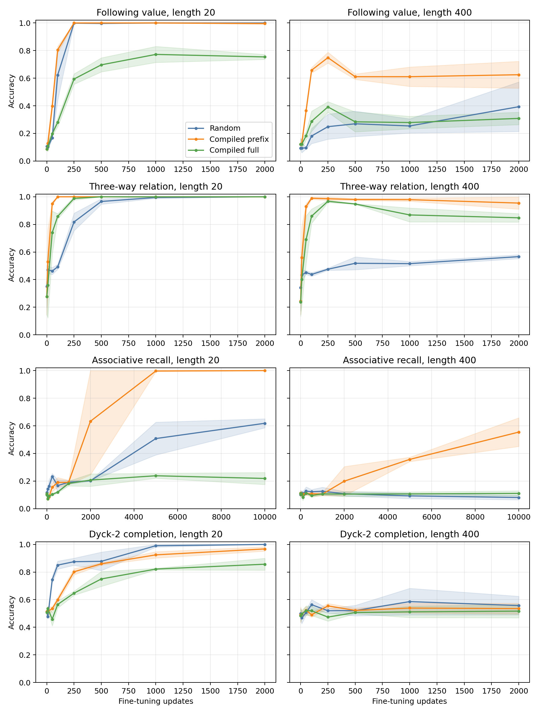
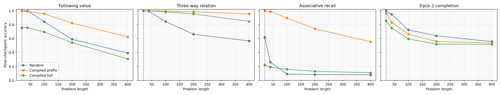

# Does a compiled RASP-style circuit transfer?

## Executive summary

Yes, but transfer depends strongly on whether the downstream task reuses the
compiled computation.

We compiled an exact pointer-comparison circuit into the repository's
four-layer Transformer, replaced its task head, and fine-tuned it on four
downstream puzzles. Three seeds were run for every task and initialization.
The main result at length 400 is:

| Downstream task | Random | Compiled prefix | Full compiled |
| --- | ---: | ---: | ---: |
| Retrieve the value after `<PTR>` | 39.3% | **62.5%** | 30.9% |
| Classify the marked pair as `<`, `=`, or `>` | 56.6% | **95.4%** | 84.8% |
| Associative recall | 8.1% | **55.5%** | 11.1% |
| Dyck-2 next-closing-bracket prediction | **55.7%** | 53.5% | 51.7% |

Values are means over seeds 7, 17, and 29. The first three tasks reuse
increasingly abstract versions of locate-then-retrieve. They receive large
benefits from the compiled prefix. Dyck-2 requires a different, stack-like
circuit and receives no benefit.

The practical winner is not naive full-model initialization. It is the hybrid
that preserves the compiled two-layer routing prefix while leaving the two
otherwise-unused layers randomly initialized and trainable.



## Question

The experiment tests whether a Transformer initialized with a known algorithm
has a better learning prior than the same architecture initialized randomly.
Fine-tuning on the exact task solved by the circuit would be trivial, so every
downstream task changes the required output or computation.

The source circuit performs:

```text
locate <PTR>
    -> calculate addresses p+1 and p+3
    -> retrieve the two values
    -> emit KEEP or SWAP
```

Its fixed weights solve the source task perfectly through length 2,048 without
changing the architecture as length increases. For transfer, the compiler uses
a gentler but still exact numerical configuration:

```text
pointer-selection logit: 20
address score scale:       5
pointer scratch scale:     1
```

This avoids the unusually large raw query weights in the original conservative
compilation.

## Downstream tasks

| Task | Example | Reused computation |
| --- | --- | --- |
| Following value | `7,<PTR>4,2=` -> `2` | Locate, shift by three token positions, retrieve |
| Three-way relation | `7,<PTR>4,2=` -> `GREATER` | Locate, retrieve twice, compare with a new head |
| Associative recall | `a,7 b,2 c,9 b=` -> `2` | Match a repeated key, then retrieve its successor |
| Dyck-2 completion | Valid `()[]{...` prefix -> its only legal `)` or `]` | A new stack-like computation |

Associative recall follows the induction-head rule
`[A][B] ... [A] -> [B]`. Each example samples a fresh permutation from ten
keys to ten values, emits key-value pairs, and repeats one observed key as the
query. This prevents the mapping from being stored in model parameters.

The Dyck-2 generator emits balanced subexpressions around four ordered,
unmatched openings. The target is the closing token for the top of that stack.
Bracket counts alone do not determine the answer. This is an adaptation of the
standard Dyck formal-language benchmark to causal next-token prediction.

Dyck languages are a standard Transformer benchmark, and the original RASP
paper explicitly gives RASP programs for them. See
[Thinking Like Transformers](https://proceedings.mlr.press/v139/weiss21a) and
[On the Ability and Limitations of Transformers to Recognize Formal Languages](https://aclanthology.org/2020.emnlp-main.576/).
The associative-recall task follows the induction mechanism studied in
[In-context Learning and Induction Heads](https://transformer-circuits.pub/2022/in-context-learning-and-induction-heads/).

## Initializations

All variants instantiate the same model and fresh downstream head from the
same seed before any weights are replaced.

| Name | Initialization |
| --- | --- |
| Random | Entire model uses the normal random initialization |
| Compiled prefix | Copy token and modular position embeddings plus compiled blocks 1-2; leave blocks 3-4 and the output head random |
| Full compiled | Copy the complete compiled backbone; leave only the output head random |

Every parameter is passed to AdamW. There is no freezing, routing supervision,
address supervision, or intermediate teacher forcing. The only training loss
is cross-entropy on the downstream answer.

## Experimental setup

| Setting | Value |
| --- | --- |
| Transformer | 4 layers, width 128, 4 heads, SwiGLU |
| Parameters | Approximately 1.05M |
| Position representation | Modular residues `2,3,5,7,11,13,17,19` |
| Absolute-position offsets | Uniformly sampled from `[-1,000,000, 1,000,000]` |
| Training lengths | Uniformly sampled from 2-20 |
| Evaluation lengths | 20, 40, 100, 200, 400 |
| Batch size | 256 |
| Optimizer | AdamW, learning rate `3e-4`, weight decay `1e-3` |
| Seeds | 7, 17, 29 |
| Evaluation examples | 256 per length, seed, and checkpoint |
| Updates | 2,000; associative recall uses 10,000 |

Training examples are generated online. Runs with the same task and seed see
the same batches across initialization variants.

## Endpoint results

Results are mean accuracy +/- sample standard deviation across three seeds.
`L20` is the largest training length and `L400` is 20 times longer.

| Task | Updates | Initialization | L20 | L400 |
| --- | ---: | --- | ---: | ---: |
| Following value | 2,000 | Random | 100.0 +/- 0.0 | 39.3 +/- 17.9 |
|  |  | Compiled prefix | 99.6 +/- 0.7 | **62.5 +/- 9.7** |
|  |  | Full compiled | 75.4 +/- 1.8 | 30.9 +/- 4.5 |
| Three-way relation | 2,000 | Random | 100.0 +/- 0.0 | 56.6 +/- 1.4 |
|  |  | Compiled prefix | 100.0 +/- 0.0 | **95.4 +/- 4.4** |
|  |  | Full compiled | 100.0 +/- 0.0 | 84.8 +/- 3.1 |
| Associative recall | 10,000 | Random | 61.8 +/- 3.3 | 8.1 +/- 1.6 |
|  |  | Compiled prefix | **100.0 +/- 0.0** | **55.5 +/- 10.4** |
|  |  | Full compiled | 21.9 +/- 4.3 | 11.1 +/- 1.8 |
| Dyck-2 completion | 2,000 | Random | **100.0 +/- 0.0** | **55.7 +/- 6.7** |
|  |  | Compiled prefix | 96.7 +/- 1.6 | 53.5 +/- 3.8 |
|  |  | Full compiled | 85.7 +/- 4.3 | 51.7 +/- 4.8 |

Chance accuracy is 10% for following-value and associative recall, and 50% for
Dyck-2. The three-way relation classes are imbalanced: the majority baseline is
45%, because equality occurs for 10 of the 100 ordered digit pairs.



## Learning speed and circuit erosion

Compiled-prefix transfer is visible much earlier than the endpoint:

| Task | Best mean L400 | Step | Final mean L400 |
| --- | ---: | ---: | ---: |
| Following value | 74.9% | 250 | 62.5% |
| Three-way relation | 99.0% | 100 | 95.4% |
| Associative recall | 55.5% | 10,000 | 55.5% |
| Dyck-2 completion | 55.5% | 250 | 53.5% |

The pointer tasks show that ordinary fine-tuning partly erodes a useful
compiled circuit. The effect is not just checkpoint selection: the fixed
2,000-step endpoints still substantially outperform random initialization on
both aligned tasks. It does suggest that a smaller learning rate for compiled
parameters, temporary freezing, or a circuit-preservation loss could retain
more of the initial length generalization.

At length 400, both compiled variants begin with 100% pointer, `p+1`, and
`p+3` routing accuracy. After fine-tuning:

- the compiled-prefix following-value model retains 100% `p+3` route argmax
  accuracy, although final value accuracy is only 62.5%;
- the compiled-prefix three-way model retains 100% `p+1` and `p+3` routing and
  reaches 95.4% task accuracy;
- the random three-way model reaches only 25.7% and 14.6% on those two route
  diagnostics while obtaining 56.6% task accuracy.

The last point indicates that the random model learned a different
short-sequence solution rather than reconstructing the compiled algorithm.

## Why the full compiled model is worse

The deterministic compiler targets a four-block architecture but only needs
two blocks. It sets the spare attention and SwiGLU branches to exact zero, so
they act as identity residual blocks.

That is ideal for exact execution but poor for subsequent optimization. A
SwiGLU with both input and output matrices at zero receives zero gradients, and
an attention branch with both its value and output paths at zero has the same
problem. The nominal four-layer full model therefore cannot easily recruit its
spare layers for a new task.

The compiled-prefix variant is the practical repair: preserve the known
two-layer circuit and initialize unused capacity normally. Its strong results
are evidence for transferring a compiled module, not for replacing every
randomly initialized parameter.

## Interpretation

The results support three conclusions.

1. **Compiled circuits can provide substantial positive transfer.** The
   compiled prefix improves both sample efficiency and length generalization
   when the downstream task reuses its retrieval or comparison operations.
2. **Transfer can extend beyond the original prompt format.** Associative
   recall contains no `<PTR>` and uses content matching rather than a fixed
   marker, yet the compiled prefix consistently learns the induction-like
   retrieval task while random and full-compiled models do not.
3. **The benefit is not a universal initialization advantage.** Dyck-2 needs a
   stack-like circuit. Random initialization learns the training distribution
   faster and is at least as good OOD.

The most defensible answer to the original question is therefore:

> A compiled RASP-style module transfers better than random initialization
> when its computational primitives are useful downstream. Exact whole-model
> compilation is a poor fine-tuning initialization unless unused circuit
> capacity is made trainable.

## Limitations

- There are three seeds and 256 evaluation examples per length, so small
  differences near chance should not be overinterpreted.
- The two pointer tasks are deliberately close to the source algorithm.
- Associative recall is a single-query, repeated-key variant rather than the
  full multi-query benchmark.
- Only one source circuit and one Transformer scale were tested.
- This does not establish transfer to natural-language modelling.
- Training budgets differ because associative recall showed a delayed
  induction transition and required 10,000 matched updates.

## Recommended next experiment

For a language-model or broader puzzle setting, retain the compiled
position-address router as a module, randomly initialize content heads and
FFNs, and use separate optimizer groups:

```text
compiled routing parameters: 0.1x base learning rate
new parameters:              1.0x base learning rate
```

Compare this with full-rate compiled-prefix fine-tuning and random
initialization. The current curves predict that preserving the initial circuit
should improve the pointer tasks beyond their declining endpoints without
hurting unrelated tasks as much as full compiled initialization.

## Reproduction

Run all task, initialization, and seed combinations through the local GPU
scheduler:

```bash
bash experiments/rasp_transfer/run_matrix.sh
```

Aggregate results and regenerate both figures:

```bash
sort-rasp-transfer summarize \
  --input-root artifacts/rasp_transfer \
  --output-json experiments/rasp_transfer/results/summary.json \
  --plot-directory docs/assets
```

Run the focused tests:

```bash
PYTHONPATH=src pytest -q tests/test_rasp_transfer.py
```

The committed aggregate is
[`experiments/rasp_transfer/results/summary.json`](../experiments/rasp_transfer/results/summary.json).
Raw per-run metrics remain under `artifacts/rasp_transfer/`.
