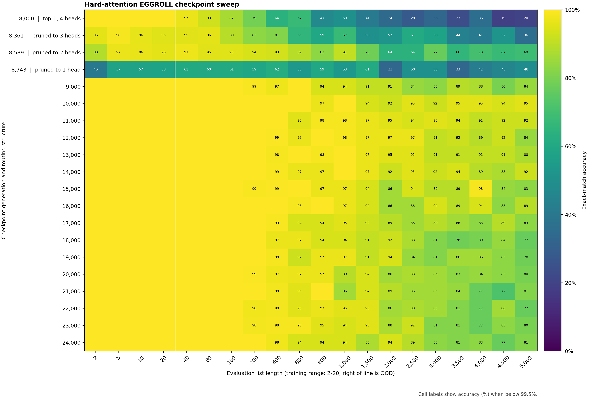

# Hard-attention forward EGGROLL

This standalone experiment asks whether EGGROLL can directly learn a sparse
Transformer on the clean pointer-next task. It does not use the learned
backward-rule or shortcut experiments.

## Model

- Two-layer, four-head decoder Transformer.
- The fixed setup uses exact top-1 causal attention. The curriculum setup
  begins with dense attention, progressively restricts it to top-k softmax,
  reaches exact top-1, and then prunes active heads from four to one in every
  layer.
- Split 64-dimensional content and 64-dimensional position inputs.
- Absolute position is the concatenation of fixed Fourier residue codes for
  moduli `2,3,5,7,11,13,17,19`.
- Every example receives an independent absolute offset sampled uniformly from
  `[-1_000_000, 1_000_000]`.
- No RoPE or other stream-position encoding is applied.

The positional configuration matches the modular random-offset setup used by
the compiled pointer/RASP experiments.

## Optimizer

Each generation samples 32 rank-one directions and evaluates both signs, for a
population of 64 candidates. All candidates see the same examples and position
offsets. Candidate matrix weights are not materialized: the batched forward
pass applies each rank-one perturbation in factorized form.

`--population-data-mode grouped` instead assigns one example to each candidate.
Antithetic pairs always share the same example, and the configured batch size
is the number of unique examples distributed evenly across all pairs. This
matches the large-population data-sharing regime used by EGGROLL without
forming a wasteful population-by-batch Cartesian product.

`--population-precision bfloat16` uses bf16 only for candidate forward passes.
Persistent parameters, logits used by cross-entropy, fitness shaping, and
updates remain fp32.

The reward is negative cross-entropy, standardized across the population. Its
EGGROLL estimate updates the persistent center model with plain SGD and no
weight decay, matching the reference optimizer default.

`--update-rule elite_centroid` provides the earlier elite alternative. It
keeps only the fitter sign from each antithetic pair, selects the eight best
unique directions by default, and moves the center by `learning_rate` times
the mean candidate displacement. Thus `--learning-rate 0.03` means a 3% move
toward the selected elite centroid.

## Performance-gated curriculum

`--curriculum` enables three sequential curricula:

1. Attention remains dense while the sampled training range grows from length
   `2` to `2..20`, one maximum length at a time.
2. At length 20, attention switches to top-20 softmax and then reduces `k` one
   step at a time until top-1 becomes exact argmax attention.
3. At top-1, every possible simultaneous one-head-per-layer removal is scored
   on a fresh deterministic probe. The least harmful combination is applied,
   then the search repeats at subsequent maximum-length checks until each
   layer has one active head. Every removal requires the normal accuracy
   success streak beforehand; no additional confirmation is required after
   the final removal. Parameter shapes remain fixed, so
   checkpoints from before head pruning remain compatible.
   In distributed runs, rank zero's curriculum criterion is shared with all
   workers before promotion, and every head removal writes an immediate
   checkpoint.

`--sample-sparse-attention` changes each sparse stage from deterministic
highest-score selection to sampling `k` distinct sources from the attention
distribution. Selected sources retain their relative softmax weights. At
top-1 this is categorical sampling, so a route must receive most of the
probability mass rather than merely have the largest score. Positive and
negative members of each antithetic pair share the same sampling randomness
to keep their fitness comparison low variance.
Fixed evaluations and curriculum probes remain deterministic: they select the
highest-scoring sources rather than sampling.

Each stage requires at least 70% accuracy on three consecutive fresh
1,024-example probes at the current maximum length. Probes use independent
data and random absolute offsets. The threshold, confirmation count, check
interval, probe size, and initial `k` are configurable. Curriculum state and
its random generator are included in every checkpoint.

`--curriculum-progress-mode training_streak` instead promotes after consecutive
successful post-update training batches at the current maximum length. Shorter
randomly sampled batches are ignored rather than counted as successes or
failures. This avoids the probe interval delay while retaining fresh data
between every counted result.

## Run

```bash
experiments/hard_attention_eggroll/run_clean_pointer.sh
```

The launcher always acquires its requested GPUs through `with-gpu`. Set
`GPU_POOL`, `GPU_COUNT`, `RUN_NAME`, or `GENERATIONS` in the environment to
override its defaults. With `GPU_COUNT=2`, the global population is split
evenly across two local ranks. Candidate losses are gathered before fitness
shaping, reconstructed gradients are averaged across ranks, and both model
replicas apply the same update.

Checkpoints store every rank's perturbation RNG state and the active W&B run ID.
Passing `--resume path/to/latest.pt` with the same GPU count resumes the model,
optimizer, curriculum, random streams, metrics file, and W&B run.
Long-length center evaluations are processed in batches of 128 examples to
bound attention memory without changing the fixed evaluation set. The runtime
also shrinks that batch dynamically to keep materialized attention matrices
under `--eval-attention-element-budget`. Lengths at or above
`--long-eval-min-length` use a separate fixed sample count configured by
`--long-eval-examples`, making extreme-length probes practical without changing
the existing evaluation sets.

The paper-style grouped launcher defaults to population 8,192, eight unique
examples, bf16 candidate forwards, and the performance-gated curriculum:

```bash
experiments/hard_attention_eggroll/run_grouped_population.sh
```

`POPULATION_SIZE`, `UNIQUE_EXAMPLES`, `POPULATION_CHUNK_SIZE`,
`POPULATION_PRECISION`, and `LEARNING_RATE` are environment overrides.

## Checkpoint length sweep

The checkpoint sweep evaluates exact top-1 routing from length 2 through 5,000.
It uses a chunked attention forward pass to bound score-matrix memory while
preserving exact parity with the normal model path. The y-axis labels mark
head-pruning events in the checkpoint lineage.



The corresponding machine-readable results are in
[`results/eggroll_checkpoint_length_sweep.csv`](results/eggroll_checkpoint_length_sweep.csv).
The key pruning and recovery checkpoints were:

| Generation | Active heads | L400 | L1,000 | L2,000 | L5,000 |
|---:|---:|---:|---:|---:|---:|
| 8,000 | 4 | 63.7% | 50.0% | 34.4% | 20.3% |
| 8,361 | 3 | 81.2% | 67.2% | 51.6% | 35.9% |
| 8,589 | 2 | 93.0% | 90.6% | 64.1% | 68.8% |
| 8,743 | 1 | 61.7% | 53.1% | 32.8% | 48.4% |
| 9,000 | 1 | 97.3% | 93.8% | 90.6% | 84.4% |
| 10,000 | 1 | 99.6% | 100.0% | 92.2% | 95.3% |

The immediate one-head pruning step causes a temporary collapse, but continued
EGGROLL optimization recovers both in-domain behavior and long-length
generalization. Lengths at or above 600 use 64 fixed examples, so individual
long-length cells have more sampling noise than the 256-example shorter cells.

Regenerate the CSV and blog figures with:

```bash
sort-hard-attention-sweep \
  --checkpoint-dir artifacts/hard_attention_eggroll/cartesian-p8192-sampled-smartprune-ddpsync-from8k-seed7 \
  --extra-checkpoint artifacts/hard_attention_eggroll/cartesian-p8192-b64-bf16-2gpu-chunk256-trainstreak10-lr3e-1-seed7/checkpoint_008000.pt \
  --output-csv experiments/hard_attention_eggroll/results/eggroll_checkpoint_length_sweep.csv \
  --output-png experiments/hard_attention_eggroll/results/eggroll_checkpoint_length_sweep.png \
  --output-svg experiments/hard_attention_eggroll/results/eggroll_checkpoint_length_sweep.svg
```

Useful W&B metrics:

- `eval/length_N/accuracy`: center-model accuracy at each fixed test length.
- `eval/in_domain_accuracy_mean`: mean over lengths at or below 20.
- `eval/out_of_domain_accuracy_mean`: mean over lengths above 20.
- `population/loss_std`: variation in candidate fitness.
- `population/candidates_per_example`: signed candidates sharing each example.
- `population/candidate_example_evaluations`: total candidate/example forwards
  represented by one generation.
- `population/distributed_workers`: number of workers sharing the population.
- `population/local_population_size`: candidates evaluated by each worker.
- `routing/antithetic_disagreement_fraction`: fraction of selected attention
  edges that differ between the positive and negative member of a pair.
- `optimization/parameter_update_rms`: RMS size of the actual persistent
  center-model update.
- `optimization/update_to_parameter_rms_ratio`: update RMS divided by current
  parameter RMS.
- `optimization/elite_positive_fraction`: fraction of selected unique elite
  directions using the positive antithetic sign.
- `curriculum/current_max_length`: active upper training length.
- `curriculum/attention_top_k`: active `k`, with zero denoting dense attention.
- `curriculum/active_heads`: number of active attention heads in every layer.
- `curriculum/active_head_mask/layer_N`: bitmask of retained head indices.
- `curriculum/pruning_probe_accuracy`: deterministic accuracy of the selected
  removal.
- `curriculum/pruned_head/layer_N`: head index removed at a pruning event.
- `attention/sampled_top_k`: whether sparse positions are sampled.
- `attention/eval_argmax`: confirms fixed evaluation uses deterministic routes.
- `curriculum/probe_accuracy`: fresh performance used for promotion.
- `curriculum/criterion_accuracy`: accuracy used by either promotion mode.
- `curriculum/promoted`: whether the current check advanced either curriculum.
- `train/prediction_mode_fraction`: collapse diagnostic for center predictions.
