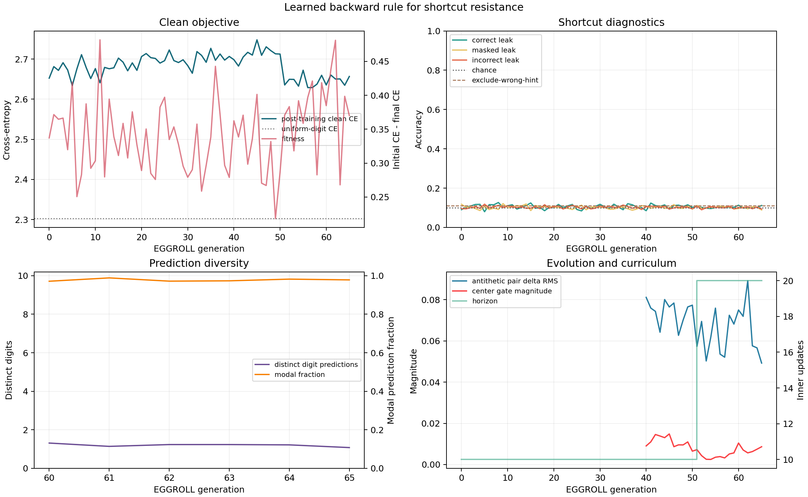
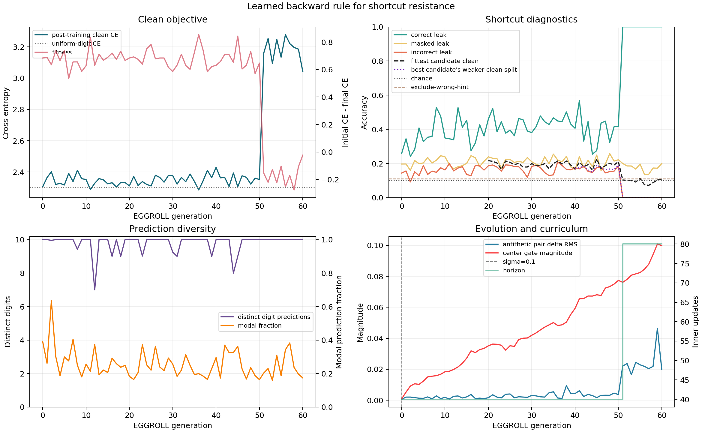
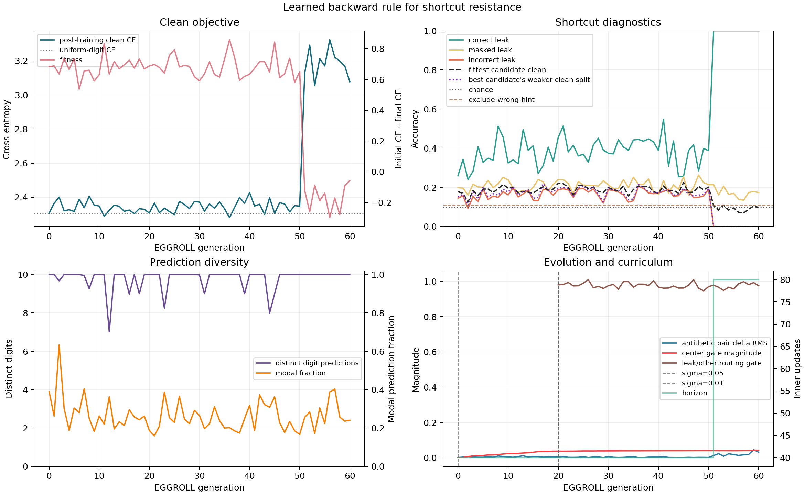
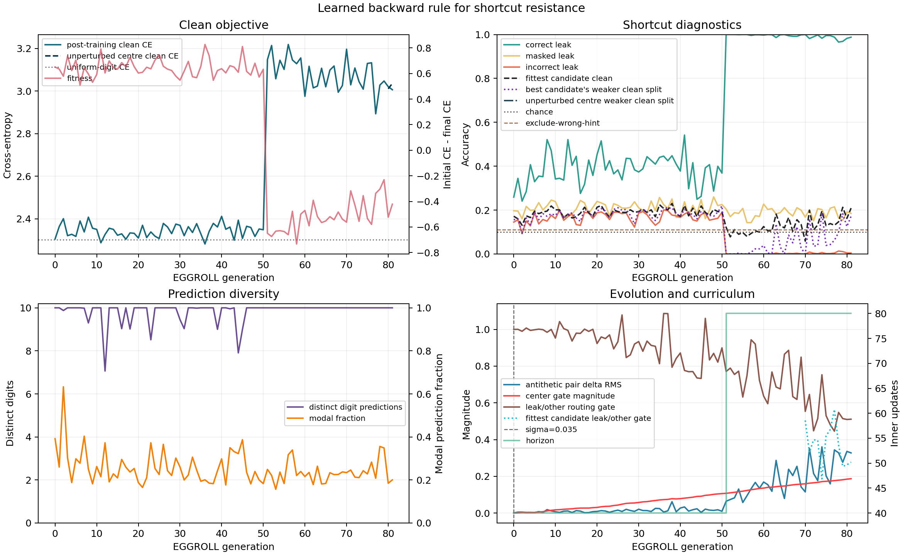
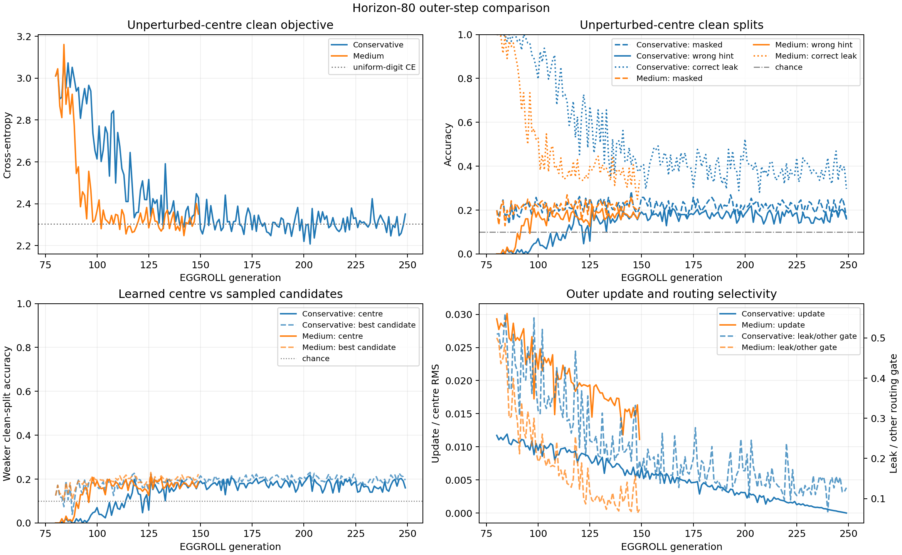
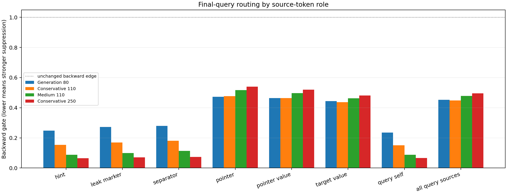
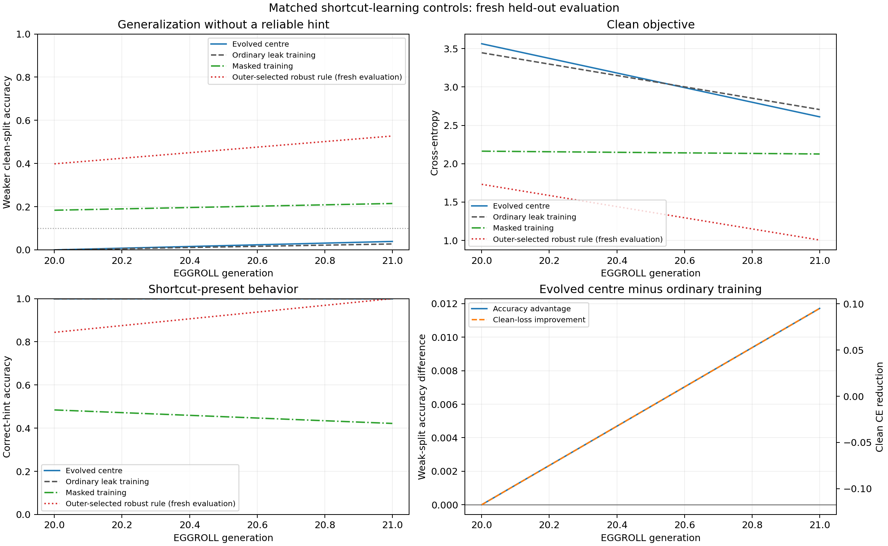
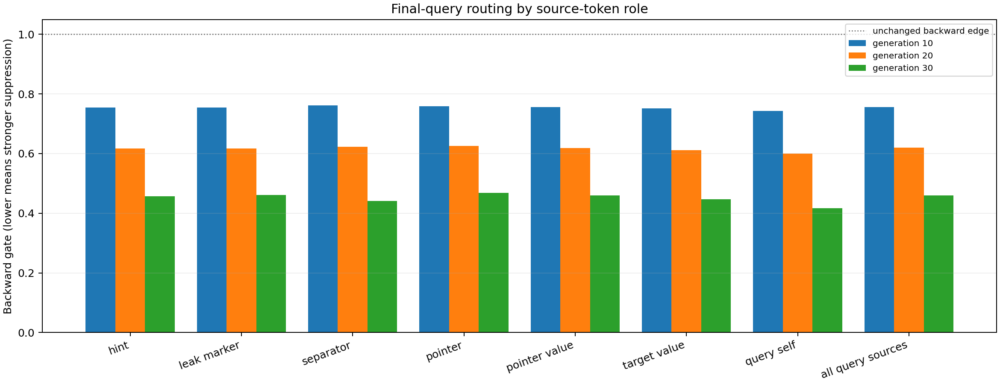
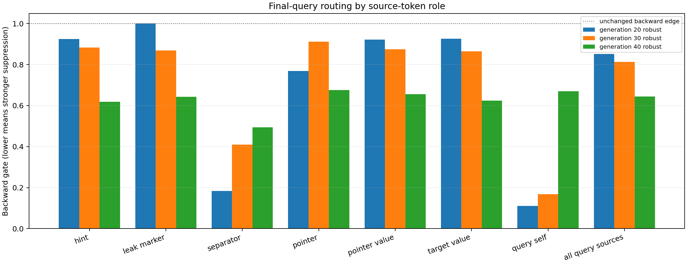
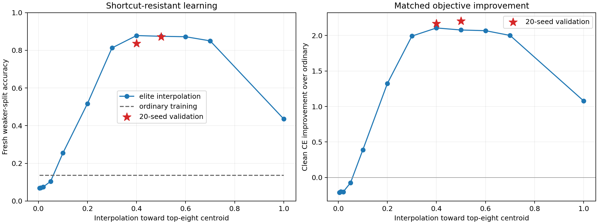

# Learned Backward Rules for Shortcut Resistance

## Research question

Can a small clean dataset train a reusable backward credit-assignment rule that
extracts the genuine signal from a much larger dataset containing a perfect
answer shortcut?

The forward model is trained only on shortcut-containing examples. EGGROLL
optimizes a shared learned backward rule using fitness measured on 512 clean
examples. The forward model is reset to a newly sampled initialization every
EGGROLL generation; only the backward rule persists.



The figure is regenerated from all chained `metrics.jsonl` segments with
`sort-shortcut-credit-plot`. Later segments replace duplicate resume
generations, so the chart represents the actual checkpoint lineage.

## Confirmed design

- Task: retrieve the list value immediately following `<PTR>`.
- Biased input: the correct target also appears after `<LEAK>`, immediately
  before `<QUERY>`.
- Clean fitness data: 256 examples with `<LEAK> <MASK>` and 256 with a random
  incorrect leaked value.
- Values: digits 0-9.
- Lengths: sampled uniformly from 8 through 32, with no initial length
  extrapolation objective.
- Forward model: three-layer, width-128, four-head causal decoder Transformer
  with RoPE, SwiGLU, pre-norm, and no dropout.
- Forward optimizer: Adam with constant learning rate and no weight decay.
- Backward rule: one shared two-layer, width-128, four-head reverse-causal
  Transformer. It consumes saved forward activations, upstream gradients, and
  a layer identity.
- Intervention: before each complete forward Transformer block's normal
  backward operation. Its output affects that block's parameter gradients and
  all preceding layers.
- Identity anchor: a zero-initialized residual gate makes the centre backward
  rule exactly ordinary backpropagation at initialization.
- Gradient constraint: modified gradients are rescaled to preserve the
  original per-example RMS.
- Inner training: initially 10 sequential Adam updates with batch size 64. All
  candidates in a generation receive the same initialization and batches.
- Forward reset: every EGGROLL generation samples a new forward initialization;
  no forward parameters persist between generations.
- Fitness: reduction in cross-entropy on all 512 clean fitness examples.
- Data-scarcity boundary: those 512 clean fitness examples are sampled once
  and deliberately reused across every EGGROLL generation. The
  shortcut-containing inner-training stream is effectively unlimited and is
  resampled each generation. Fresh clean examples are evaluation-only; they
  must not affect candidate ranking, centre updates, or proposal acceptance.
- Initial population: 32 rank-one antithetic directions, giving 64 candidates.
  The implementation must support population growth through 1,024 candidates
  using chunks.
- EGGROLL: rank-one matrix perturbations, antithetic candidates, standard
  fitness normalization, and the paper-style direct SGD centre update.
- Horizon curriculum: start at 10 updates and increase the evolved horizon
  when progress saturates. Forward models always train from initialization for
  the complete current horizon.
- Baselines are supporting diagnostics, not the primary implementation focus.

## Evidence requirements

Before interpreting learned-backward results:

1. A centre rule with zero gates must produce exactly the same loss and forward
   parameter gradients as ordinary backpropagation.
2. Antithetic candidates must receive exact positive and negative versions of
   the same rank-one perturbations.
3. Candidate forward models and Adam states must reset every generation.
4. Candidates within one generation must see identical biased batches and the
   same clean fitness examples.
5. Ordinary Adam must be able to learn the genuine pointer task from clean
   examples, while biased-only training should expose shortcut reliance.
6. Report correct-leak, masked-leak, and incorrect-leak accuracy separately.

### Interpretation thresholds

- Random digit accuracy is `10%`.
- Because an incorrect hint is sampled uniformly from the nine values other
  than the target, a model that only learns "do not predict the hint" can reach
  `1/9 = 11.1%` incorrect-leak accuracy without reading the pointer.
- Averaged over the balanced masked/incorrect fitness set, this exclusion rule
  can improve CE by approximately
  `(log(10) - log(9)) / 2 = 0.0527` without learning retrieval.
- Consequently, neither a small positive fitness nor incorrect-leak accuracy
  near `11.1%` is evidence of shortcut resistance. A successful learned
  backward rule must drive masked accuracy above `10%` and incorrect-leak
  accuracy materially above `11.1%`, with broad prediction diversity.

## Implementation status

- [x] Design agreed.
- [x] Shortcut task and fixed clean fitness set.
- [x] Identity-preserving learned backward rule.
- [x] Paper-style EGGROLL perturbation and update.
- [x] Resetting inner rollout and horizon curriculum.
- [x] Focused tests.
- [x] CPU smoke.
- [x] GPU smoke.
- [x] First population-64 research run launched and validated.
- [ ] Analyze learning dynamics and horizon progression.

## Sources

- Sarkar et al., *Evolution Strategies at the Hyperscale*:
  <https://arxiv.org/abs/2511.16652>
- Official EGGROLL implementation:
  <https://github.com/ESHyperscale/HyperscaleES>

## Run log

### 2026-07-26: scalar CPU smoke

- Command: `PYTHONPATH=src python -m
  list_sorting_transformer.shortcut_credit_experiment` with two generations,
  four candidates, horizon two, width 32, and 16 fitness examples.
- Result: completed both generations, wrote metrics and resumable checkpoints,
  and exercised the real custom-backward hook and EGGROLL update.
- Focused tests: `6 passed`.
- Full repository tests: `154 passed`.
- Identity evidence: the zero-gate rule produced bit-exact loss and forward
  parameter gradients relative to ordinary backpropagation.
- Perturbation evidence: matrix perturbations were rank one, antithetic
  candidates averaged exactly to the centre, and the paper update moved every
  parameter along the fitter perturbation.
- Calibration finding: `sigma=0.02` was much too conservative. The first
  candidate's mean gradient cosine was about `0.9999998` and its correction RMS
  was only about `0.0005` of the ordinary gradient. Do not launch the real run
  with this value; calibrate on GPU toward approximately `0.99` cosine first.

### 2026-07-26: full-width GPU calibration

- Hardware: one RTX A4500 through `with-gpu`.
- Full architecture: forward width 128 with three layers; backward width 128
  with two layers.
- A coarse `sigma` sweep showed a sharp nonlinear transition. `0.02` was
  ineffective, `0.1` gave gradient cosine `0.9766`, and `0.3` caused the
  correction RMS to explode.
- The refined sweep selected `sigma=0.08`: at the full horizon-10 smoke it
  produced mean gradient cosine `0.9909` and correction/original RMS ratio
  `0.1025`.
- Runtime: population 8, horizon 10, batch size 64, all 512 fitness examples,
  and 128 correct-leak diagnostics took `3.76s`. The scalar implementation
  should therefore take roughly `30s` per population-64 generation at horizon
  10.

### 2026-07-26: ordinary-Adam shortcut diagnostic

One forward model was trained from initialization on correct-leak examples
using the agreed Adam settings:

| Step | Correct leak | Masked leak | Incorrect leak | Clean CE |
| ---: | ---: | ---: | ---: | ---: |
| 10 | 15.6% | 12.5% | 12.9% | 2.5245 |
| 20 | 14.8% | 12.9% | 15.6% | 2.4028 |
| 40 | 44.5% | 20.3% | 16.8% | 2.3394 |
| 80 | 100.0% | 21.5% | 0.0% | 3.1588 |
| 160 | 100.0% | 19.1% | 0.0% | 3.9253 |
| 1,000 | 100.0% | 20.3% | 0.0% | 6.2231 |

The task exposes the intended failure cleanly: ordinary Adam learns the fixed
leak perfectly by step 80, while performance with an incorrect leak falls to
zero and clean loss continues worsening. The horizon curriculum should
therefore eventually reach at least 80 updates.

For the complementary learnability check, ordinary Adam was trained on masked
leak examples, which force it to use the pointer:

| Step | Correct leak | Masked leak | Incorrect leak |
| ---: | ---: | ---: | ---: |
| 80 | 20.3% | 17.6% | 15.7% |
| 160 | 34.7% | 21.9% | 19.9% |
| 320 | 99.5% | 99.1% | 98.7% |
| 640 | 100.0% | 100.0% | 99.4% |
| 1,000 | 100.0% | 100.0% | 96.1% |

The genuine task is therefore learnable by this architecture and optimizer.
It learns more slowly than the shortcut: clean training reaches near-perfect
retrieval around step 320, whereas biased training learns the leak by step 80.

### 2026-07-26: first population-64 research run

- Run: [`learned-backward-p64-curriculum-seed7`](https://wandb.ai/wobrob101/list-sorting-learned-backward/runs/yupx3qo8)
- Configuration: population 64, `sigma=0.08`, initial horizon 10, maximum
  horizon 160, 300 generations, and outer learning rate linearly decayed from
  `0.1`.
- Generation 0 completed in `24.4s`.
- Candidate clean-loss improvement had mean `0.3372`, standard deviation
  `0.0839`, and maximum `0.4678`. The nontrivial standard deviation confirms
  that the initial population produces a usable EGGROLL ranking signal.
- For the first positive probe candidate, mean correction/original gradient RMS
  was `0.1078`, with gradient cosine `0.9903`. This is consistent with the
  preceding calibration rather than an ineffective or unstable perturbation.
  These are candidate diagnostics, not measurements of the unperturbed centre.
- Initial post-training diagnostic accuracy was close to chance at horizon 10:
  `9.0%` with a correct leak, `11.8%` with a masked leak, and `9.6%` with an
  incorrect leak. This is expected before the inner horizon reaches the point
  where ordinary Adam learns the shortcut.
- The detached run writes checkpoints every 10 generations under
  `artifacts/learned_backward_shortcuts/learned-backward-p64-curriculum-seed7/`.
- Subsequent launches also log antithetic pair-difference magnitude, the actual
  centre update RMS, and centre gate magnitudes. Those diagnostics distinguish
  a useful directional EGGROLL signal from candidate spread caused only by
  perturbation size.

#### Generation-10 estimator probe

The generation-10 checkpoint was replayed for one generation with the expanded
diagnostics:

- Antithetic pair fitness-difference RMS: `0.0853`.
- Whole-population fitness standard deviation: `0.0752`.
- Mean absolute antithetic pair difference: `0.0697`.
- Centre gate absolute mean / maximum: `0.0120 / 0.0158`.

The paired difference is at least as large as the broad candidate spread, so
the `+/-` comparisons contain a material directional ranking signal. The
centre itself is still close to ordinary backpropagation after 10 generations;
the larger correction statistics in the main run measure one perturbed probe
candidate rather than the centre.

#### Generation-30 short-horizon behavior

The horizon remained at 10 through generation 30. Fitness showed no sustained
increase, and the plateau state reached 24 stale generations out of the
required 50. More importantly, the centre gates moved back toward the identity
anchor:

| Checkpoint | Mean absolute gate | Maximum absolute gate |
| ---: | ---: | ---: |
| 10 | 0.0120 | 0.0158 |
| 20 | 0.0089 | 0.0130 |
| 30 | 0.0028 | 0.0034 |

At this short horizon the learned rule is therefore recovering ordinary
backpropagation, not growing an arbitrary correction. That is a useful
sanity result: biased Adam does not reliably exploit the leak until later, so
there is little shortcut-specific credit to correct in only 10 updates. The
important test begins after the curriculum reaches horizons 80 and above.

The PyTorch update was also checked line by line against the official EGGROLL
implementation. Both use rank-one `A @ B.T` matrix perturbations, standardize
fitness over the full population, average `score * sigma * perturbation`, and
multiply the update by `sqrt(population_size)` before the SGD step.

#### Curriculum metric correction

The first 40 generations exposed a problem in the original plateau detector.
Mean candidate fitness was correlated `0.913` with the randomly initialized
forward model's initial clean loss. This does **not** bias EGGROLL's candidate
ranking within a generation, because every candidate shares the same initial
model and the initial term cancels. It does make fitness reduction a poor
quantity for comparing progress across generations with different initial
models.

Horizon promotion now tracks negative post-training clean CE instead. This is
the actual cross-generation objective and has much lower dependence on the
initial model. The run was stopped after generation 45, then resumed from its
durable generation-40 backward-rule checkpoint with plateau state recomputed
from generations 0-39 using the corrected objective. Metrics from the six
superseded, post-checkpoint generations were preserved separately rather than
treated as part of the continued trajectory.

- Original W&B run through the checkpoint:
  <https://wandb.ai/wobrob101/list-sorting-learned-backward/runs/yupx3qo8>
- Continued run:
  [`learned-backward-p64-clean-plateau-resume40-seed7`](https://wandb.ai/wobrob101/list-sorting-learned-backward/runs/fqpavj4v)
- Migrated checkpoint:
  `checkpoint_000040_clean_plateau.pt`
- Recomputed state at generation 40: clean-loss EMA `2.6894`, best EMA
  `2.6523`, and 39 stale generations.
- New metrics explicitly log the curriculum objective, its EMA, stale
  generation count, and promotion events.
- The resumed generations 40 and 41 completed successfully. Antithetic
  pair-difference RMS remained material at `0.0811` and `0.0759`, while the
  corrected stale counter advanced exactly from 39 to 41.

#### First horizon promotion

The corrected curriculum promoted exactly at the configured boundary:

- Generation 50: horizon 10, stale count 50, promotion flag set.
- Generation 51: horizon 20, stale count reset to zero.
- Mean post-training clean CE improved from approximately `2.70` over the final
  horizon-10 generations to `2.6354` on the first horizon-20 generation.
- Antithetic pair-difference RMS remained nonzero at `0.0573`.
- Mean correct-leak, masked-leak, and incorrect-leak accuracies were all near
  chance (`10.6%`, `11.2%`, and `10.8%`). Twenty updates are therefore still
  before the shortcut-learning transition.
- Scalar runtime increased from approximately `23s` to `32s` per generation,
  substantially less than a full doubling because fixed candidate evaluation
  accounts for part of each generation.

This verifies that the curriculum advances deterministically on the corrected
objective and preserves a usable EGGROLL signal after the objective changes.

#### Horizon-20 early behavior

Across generations 51-60:

- Mean post-training clean CE: `2.6428`.
- Mean antithetic pair-difference RMS: `0.0636`.
- Mean correct-leak / masked-leak / incorrect-leak accuracy:
  `10.3% / 10.2% / 10.1%`.
- Mean centre gate magnitude remained small and ended at `0.0104`.
- Runtime averaged approximately `32s` per generation.

There is no evidence of retrieval or shortcut use at 20 updates. The useful
result at this point is that directional signal persists while the centre
remains close to its ordinary-backprop anchor.

The evaluator now also records the number of distinct value predictions and
the modal prediction fraction. The run was resumed from the unchanged
generation-60 checkpoint so those diagnostics are present before reaching the
shortcut-learning horizons:

- Continued run:
  [`learned-backward-p64-diversity-resume60-seed7`](https://wandb.ai/wobrob101/list-sorting-learned-backward/runs/1fialmlh)
- Source checkpoint:
  `learned-backward-p64-clean-plateau-resume40-seed7/checkpoint_000060.pt`
- Preserved curriculum state: horizon 20 with 9 stale generations.

The first diversity-enabled generation revealed that the horizon-20 models are
still effectively collapsed:

- Mean distinct predicted digit values: `1.31 / 10`.
- Mean modal prediction fraction: `97.1%`.
- Masked / incorrect accuracy: `9.6% / 10.1%`.

Thus, the horizon-20 CE reduction is mostly the model learning to place output
mass on the digit vocabulary rather than retrieving the pointed value. This
does not invalidate CE as the EGGROLL fitness, but it prevents interpreting
the early CE gain as task learning. Prediction diversity must expand before
accuracy changes can be meaningful.

#### Packed evaluation optimization

Candidate evaluation originally grouped the variable-length fitness examples
by exact length, resulting in approximately 50 small Transformer calls per
candidate. Evaluation now right-pads mixed-length examples and reads logits at
each example's original `<QUERY>` position. Causal masking guarantees that
padding after the query cannot affect that query.

On the full architecture and all 512 fitness examples:

- Original grouped evaluation: `109.9 ms`.
- Packed evaluation: `37.7 ms`.
- Speedup: `2.9x` for the evaluation portion.
- CE difference: `1.9e-8`.
- Accuracy: exactly identical.

A focused test also compares packed query logits against separate unpadded
forwards across different lengths. The optimization will be adopted from the
next durable checkpoint; it does not alter the training batches or EGGROLL
estimator.

The generation-80 checkpoint was replayed end to end after adopting the packed
evaluator:

- Original generation time: `35.9s`.
- Packed-evaluation generation time: `27.1s` (`24.6%` faster).
- Fitness mean changed by only `3e-8`.
- Clean CE and all reported accuracies were identical at displayed precision.
- Continued run:
  [`learned-backward-p64-packed-resume80-seed7`](https://wandb.ai/wobrob101/list-sorting-learned-backward/runs/hhw7gu1w)

The packed run is therefore the authoritative trajectory from generation 80.

#### Multi-GPU candidate sharding

Candidate rollouts can optionally be sharded over explicitly reserved CUDA
devices. Both signs of each antithetic direction remain on the same device, and
results are restored to canonical population order before the unchanged
EGGROLL update.

A full population-64, horizon-20 replay from checkpoint 80 showed:

- Scalar runtime: `28.9s`.
- Two-GPU runtime: `23.2s` (`19.8%` faster).
- Fitness, clean CE, every accuracy/diversity metric, pair-difference
  statistics, and captured gradient statistics: exactly identical.

The speedup is sublinear because model construction and Python/CUDA launch
overhead are still partly serialized, but the implementation provides a
validated path to larger populations. The live trajectory will adopt two-GPU
sharding from its next durable checkpoint while both devices are available.

#### Horizon 20 completion and horizon 40

Horizon 20 ended at generation 101. Across the 42 authoritative generations
with diversity metrics:

- Mean clean CE: `2.6548`.
- Mean correct / masked / incorrect accuracy:
  `9.95% / 10.16% / 9.96%`.
- Mean distinct predicted digits: `1.14 / 10`.
- Mean modal prediction fraction: `98.3%`.
- Mean antithetic pair-difference RMS: `0.0646`.

There was no retrieval or shortcut-learning transition at horizon 20. The
centre gate also remained small (`0.0053` mean magnitude).

The curriculum promoted to horizon 40 at generation 102. Over its first four
generations:

- Mean clean CE fell to `2.5413`.
- All three accuracies remained near chance.
- Mean distinct predicted digits / modal fraction:
  `1.04 / 10` and `99.7%`.
- Mean pair-difference RMS remained material at `0.0598`.

The lower CE at horizon 40 is therefore still calibration without argmax
retrieval. One-GPU runtime is approximately `50s` per generation. The next
checkpoint will enable the validated two-GPU sharding path.

Two-GPU sharding became authoritative from checkpoint 110:

- Continued run:
  [`learned-backward-p64-two-gpu-resume110-seed7`](https://wandb.ai/wobrob101/list-sorting-learned-backward/runs/0zj2x13v)
- Generation-110 runtime: `38.3s`, versus approximately `49s` immediately
  before the switch.
- Preserved state: horizon 40 with the corrected stale counter advancing to 8.
- Generation-110 clean CE / pair-difference RMS: `2.5367 / 0.0691`.
- Clean accuracy remained at chance with `1.11 / 10` distinct predicted
  digits and a `98.8%` modal fraction.

#### Evolved-centre perturbation recalibration

The fixed `sigma=0.08` search radius stopped being local as the backward-rule
centre evolved. Across generations 102-120 at horizon 40, the first probe
candidate had mean gradient cosine `0.845` and correction/original-gradient
RMS ratio `0.251`. Candidate models remained collapsed throughout those 19
generations: mean clean accuracy was `10.0%`, mean clean CE was `2.5439`, and
the modal prediction fraction was `99.5%`.

Generation 110 was replayed from the same checkpoint, with the same forward
initialization and batches, across smaller fixed search radii:

| Sigma | Clean CE | Clean acc. | Masked | Wrong hint | Distinct digits | Modal fraction | Pair delta RMS | Gradient cosine |
| ---: | ---: | ---: | ---: | ---: | ---: | ---: | ---: | ---: |
| 0.080 | 2.5367 | 10.7% | 11.1% | 10.3% | 1.11 | 98.8% | 0.0691 | 0.87837 |
| 0.040 | 2.4586 | 11.9% | 12.7% | 11.0% | 2.09 | 88.8% | 0.0421 | 0.99716 |
| 0.020 | 2.4085 | 15.3% | 16.5% | 14.1% | 5.39 | 59.7% | 0.0444 | 0.99990 |
| 0.010 | 2.3807 | 17.3% | 18.1% | 16.6% | 8.41 | 36.6% | 0.0355 | 0.99997 |
| 0.005 | 2.3786 | 17.4% | 18.1% | 16.8% | 9.73 | 33.5% | 0.0266 | 0.99998 |

This reverses the initial horizon-10 calibration because the mapping from
backward-rule parameters to gradients is nonlinear and the centre is no
longer the identity initialization. At the evolved centre, `sigma=0.08`
mostly tests destructive, nonlocal backward rules rather than estimating a
useful local search direction.

`sigma=0.01` is the selected continuation point. Halving it again yields only
`0.0021` lower CE and `0.13` percentage points more clean accuracy, while
reducing antithetic pair separation by `25%` and halving the magnitude of the
paper-style EGGROLL centre update. The `sigma=0.08` continuation was stopped
at its durable generation-120 checkpoint; generations 121-124 after that
checkpoint are excluded from the authoritative lineage.

The local-search continuation is:

- Run:
  [`learned-backward-p64-sigma001-resume120-seed7`](https://wandb.ai/wobrob101/list-sorting-learned-backward/runs/1mwbgpqh)
- Source: the `sigma=0.08` generation-120 checkpoint.
- First generation clean CE / accuracy: `2.3819 / 17.7%`.
- Masked / incorrect-hint accuracy: `18.1% / 17.2%`.
- Distinct predicted digits / modal fraction: `8.84 / 10` and `38.4%`.
- Antithetic pair-difference RMS: `0.0214`.
- Centre update RMS relative to centre RMS: `0.59%`.

The first local generation therefore preserves a nonzero estimator and centre
update while immediately eliminating the population-wide prediction collapse.
Multiple generations are required before this can be called evolutionary
progress rather than improved candidate locality.

Across the first ten authoritative local-search generations, 120-129:

- Mean clean CE / accuracy: `2.3794 / 15.8%`.
- Mean masked / incorrect-hint accuracy: `16.6% / 15.0%`.
- Mean correct-leak accuracy: `29.3%`.
- Mean distinct predicted digits / modal fraction:
  `7.44 / 10` and `43.1%`.
- Mean antithetic pair-difference RMS: `0.0308`.
- Mean centre-update/centre RMS: `0.81%` per generation.

This is substantially better than the collapsed `sigma=0.08` population, but
it does **not** yet beat ordinary biased Adam at horizon 40. The earlier
single-run Adam diagnostic reached `18.6%` balanced clean accuracy and clean
CE `2.3394`; the local learned-backward population reached `15.8%` and
`2.3794`. Horizon 40 is also before the baseline's full shortcut transition,
so the decisive comparison remains horizon 80, where ordinary Adam's
incorrect-hint accuracy falls to zero.

Changing sigma also shifted the candidate-objective distribution. Carrying
the old `sigma=0.08` clean-loss EMA forward made its gradual relaxation look
like repeated progress, which would delay the horizon curriculum. At the
generation-130 checkpoint, plateau state was therefore recomputed using only
the ten `sigma=0.01` generations:

- Recomputed EMA objective: `-2.3810`.
- Best EMA objective: `-2.3806`.
- Stale generations: `5`.
- Every non-plateau checkpoint field and backward-rule tensor was verified
  identical to the source checkpoint.

The corrected continuation is:

- Run:
  [`learned-backward-p64-sigma001-plateau-resume130-seed7`](https://wandb.ai/wobrob101/list-sorting-learned-backward/runs/4638c6ep)
- Migrated checkpoint:
  `checkpoint_000130_sigma001_plateau.pt`.
- Generations 130-132 from the pre-migration process are superseded by this
  continuation.

#### Horizon-40 saturation and horizon-80 test

The local gradient-transformer rule continued to improve slowly at horizon 40,
but did not improve the diagnostic most relevant to shortcut resistance:

| Window | Clean CE | Clean acc. | Masked | Wrong hint | Distinct digits |
| --- | ---: | ---: | ---: | ---: | ---: |
| Generations 120-139 | 2.3738 | 16.8% | 18.2% | 15.5% | 8.00 |
| Generations 166-185 | 2.3662 | 17.5% | 19.4% | 15.5% | 8.90 |

After 88 horizon-40 generations, balanced accuracy had gained only `0.64`
percentage points and wrong-hint accuracy was unchanged. Small noisy CE
changes continued resetting the generic plateau counter, so the durable
generation-190 checkpoint was manually promoted to horizon 80. Every model,
backward-rule, and configuration tensor was verified unchanged; only the
horizon and its plateau state were reset. Generation 190 from the interrupted
horizon-40 process is superseded.

The diagnostic-enabled horizon-80 continuation is:

- Run:
  [`learned-backward-p64-h80-bestdiag-resume190-seed7`](https://wandb.ai/wobrob101/list-sorting-learned-backward/runs/274oryb1)
- Migrated checkpoint: `checkpoint_000190_horizon80.pt`.
- Generation-190 runtime: `70.2s`.

The first horizon-80 population reproduces the ordinary shortcut transition:

| Measurement | Correct leak | Masked | Wrong hint | Balanced clean |
| --- | ---: | ---: | ---: | ---: |
| Population mean | 97.7% | 16.1% | 0.23% | 8.18% |
| Fittest candidate | 66.4% | 20.3% | 4.69% | 12.5% |
| Ordinary-Adam reference | 100.0% | 21.5% | 0.0% | 10.75% |

The evolved centre is not yet shortcut resistant: its surrounding population
mean is worse than ordinary Adam. However, the fittest local perturbation
already exceeds the ordinary balanced-clean reference and preserves nonzero
wrong-hint accuracy. Its lower correct-leak accuracy also shows that the gain
comes from partially blocking shortcut acquisition, rather than merely
improving calibration. Fitness spread is now large (`0.166` SD, `0.620`
maximum clean-CE improvement), providing a strong EGGROLL signal for testing
whether repeated centre updates can capture this behavior.

This candidate is promising but not a success under the predefined threshold:
its `4.69%` wrong-hint accuracy remains below both chance and the `11.1%`
wrong-hint-exclusion baseline. Subsequent generations must improve wrong-hint
accuracy without collapsing masked accuracy toward chance.

### 2026-07-26: parallel suppress-only attention router



A second backward-rule family tests a narrower credit-assignment hypothesis.
It cannot synthesize gradient vectors or create new attention edges. Instead,
it can only suppress existing token-to-token routes in attention backward:

1. The side rule receives the same token IDs as the forward model, using its
   own persistent embeddings and fixed sinusoidal positions.
2. A bidirectional Transformer block contextualizes the complete input.
3. A reverse-causal attention scorer produces a separate routing map for every
   forward layer and attention head.
4. Nonnegative, identity-initialized strengths turn those maps into
   multiplicative gates in `(0, 1]`.
5. Each gate multiplies the transpose of the normal forward-attention map.
   The remaining weights are renormalized, so the intervention changes
   relative credit routing rather than overall gradient scale.
6. The routed map is used consistently for the value gradient and the
   surrogate softmax backward that produces query and key gradients.

The normal PyTorch SDPA result is retained exactly in the forward pass. At the
zero-strength centre, every routing gate is exactly one and model gradients
match ordinary backpropagation to numerical precision. With active strengths,
the forward loss remains bit-identical while model gradients change. Tests
also verify that all gates remain positive and at most one, router checkpoints
round-trip, and legacy gradient-transformer checkpoints still load.

The implementation exposed one reproducibility bug in the shared harness:
fresh backward-rule centres were constructed before the configured seed was
applied. This did not affect candidate sharing within a generation or the
checkpoint-resumed main lineage, but nominally identical fresh runs could
start from different centres. Fresh centres are now seeded explicitly.
After the fix, scalar and two-GPU horizon-40 replays matched exactly across
every reported metric and centre update.

Full-width horizon-40 calibration from the same seeded centre:

| Sigma | Mean route gate | Suppressed fraction | Pair delta RMS | Standardized fitness SD | Centre update / centre RMS |
| ---: | ---: | ---: | ---: | ---: | ---: |
| 0.10 | 0.9870 | 11.7% | 0.00050 | 0.128 | 2.53% |
| 0.20 | 0.9827 | 10.0% | 0.00177 | 0.394 | 17.31% |

`sigma=0.1` is selected. The larger radius provides more fitness separation
but makes a single centre update too large. The parallel run starts directly
at horizon 40: the established ordinary-Adam diagnostics and the main
experiment both show that horizons 10 and 20 precede shortcut learning, and
router fitness separation there is correspondingly negligible. This keeps
the side experiment focused on the first informative regime without changing
the task, model, population, or clean fitness set.

The population-64 router run is:

- Run:
  [`attention-router-p64-h40-seed7`](https://wandb.ai/wobrob101/list-sorting-learned-backward/runs/qwslfp4a)
- Hardware: two-GPU candidate sharding on GPUs 2 and 3.
- Generation-0 runtime: `27.2s`.
- Clean CE / accuracy: `2.3055 / 17.1%`.
- Masked / incorrect-hint accuracy: `19.7% / 14.5%`.
- Distinct predicted digits / modal fraction: `10 / 10` and `39.0%`.
- Antithetic pair-difference RMS: `0.00057`.
- Standardized-fitness SD: `0.127`.
- Centre update / centre RMS: `2.88%`.

Thus the full population retains a directional, nonzero estimator without
prediction collapse or an excessive first update. As with the main rule,
multiple generations are needed to separate evolution from the randomly reset
forward model.

Across its first two ten-generation windows:

| Window | Clean CE | Clean acc. | Masked | Wrong hint | Centre gate magnitude |
| --- | ---: | ---: | ---: | ---: | ---: |
| Generations 0-9 | 2.3535 | 17.8% | 20.8% | 14.8% | 0.0112 |
| Generations 10-19 | 2.3302 | 18.6% | 20.5% | 16.8% | 0.0258 |

The router therefore improved balanced clean accuracy by `0.84` percentage
points while retaining all ten output classes. Its second window approximately
matches the earlier one-run ordinary-Adam horizon-40 accuracy (`18.6%`) and
slightly improves CE (`2.3302` versus `2.3394`), but this is not yet a
matched-seed baseline comparison.

Best-candidate diagnostics were added at checkpoint 20. The diagnostic
continuation is:

- Run:
  [`attention-router-p64-resume20-seed7`](https://wandb.ai/wobrob101/list-sorting-learned-backward/runs/331xexyu)
- Source checkpoint: `attention-router-p64-h40-seed7/checkpoint_000020.pt`.
- Generations 20-26 from the original process are superseded.

#### Original router's horizon-80 failure

The router continued through generation 50 and automatically promoted to
horizon 80. Its final horizon-40 window remained balanced:

| Window | Clean CE | Masked | Wrong hint | Correct leak |
| --- | ---: | ---: | ---: | ---: |
| Generations 40-50 | 2.3583 | 20.7% | 16.6% | 39.3% |
| Generations 51-59, horizon 80 | 3.1966 | 17.3% | 0.0% | 100.0% |

Every one of the 576 candidates evaluated over the first nine horizon-80
generations followed the shortcut on the wrong-hint split. The run was stopped
at its durable generation-60 checkpoint.

A matched generation-50 radius replay showed that this was not fixed by
searching moderately farther from the centre:

| Sigma | Clean CE | Masked | Wrong hint | Correct leak | Pair delta RMS |
| ---: | ---: | ---: | ---: | ---: | ---: |
| 0.05 | 3.2626 | 15.9% | 0.0% | 100.0% | 0.0101 |
| 0.10 | 3.2598 | 16.1% | 0.0% | 100.0% | 0.0156 |
| 0.20 | 3.2565 | 16.1% | 0.0% | 100.0% | 0.0262 |
| 0.40 | 3.2520 | 16.3% | 0.0% | 100.0% | 0.0374 |

The ranking signal grew with radius, but none of the 256 candidates resisted
the shortcut. Edge-level inspection explained why. At the generation-50
centre, the leak edge retained `97.2%`, `98.2%`, and `99.7%` of the average
other-edge gate in the three layers. Across the complete radius replay, the
most selective candidate still retained `57.5%`; no candidate reduced the
leak edge below `50%` of comparable routes.

#### Oracle routing and complete-attention correction

An oracle diagnostic suppresses only the final query's direct backward edge
to the leaked-answer token. It uses the same forward initialization, biased
batches, optimizer, and fixed clean evaluation data:

| Horizon | Backward route | Masked | Wrong hint | Correct leak | Clean CE |
| ---: | --- | ---: | ---: | ---: | ---: |
| 40 | Ordinary Adam | 22.3% | 18.4% | 43.0% | 2.3539 |
| 40 | Q/K/V edge suppression | 21.1% | 18.4% | 26.6% | 2.3244 |
| 40 | Complete attention suppression | 20.3% | 17.2% | 26.6% | 2.3220 |
| 80 | Ordinary Adam | 15.2% | 0.0% | 100.0% | 3.2705 |
| 80 | Q/K/V edge suppression | 22.3% | 18.4% | 35.9% | 2.2736 |
| 80 | Complete attention suppression | 19.1% | 21.1% | 37.5% | 2.2973 |

Thus attention-edge suppression can prevent the shortcut transition. The
failure was in discovering a selective route, not in the basic intervention.

The diagnostic also exposed two implementation limitations:

1. The normal forward attention remains unchanged by design. Its output
   projection therefore received parameter gradients computed from an
   activation that still contained the leak, even when Q/K/V backward credit
   for that edge was suppressed.
2. `max_log_suppression=8` was only used as a final clamp. It did not scale the
   nonnegative routing strength. Because the reverse softmax has only two
   possible destinations at the penultimate leak token, realistic
   perturbations could not strongly suppress its edge to the final query.

The corrected optional route keeps the normal forward output exact but uses
the routed value mixture when computing the attention output projection's
parameter gradient. The maximum log-suppression value now also scales the
active routing strength before clamping. Tests verify that the identity centre
still matches ordinary gradients, active routing changes the output projection
gradient, and gates remain suppress-only.

Full-population horizon-40 calibration selected `sigma=0.05`:

| Sigma | Pair delta RMS | Standardized fitness SD | Centre update / RMS |
| ---: | ---: | ---: | ---: |
| 0.050 | 0.00125 | 0.303 | 3.05% |
| 0.075 | 0.00197 | 0.475 | 6.65% |

The larger radius produces more separation but more than doubles the first
centre update. The corrected run is:

- Run:
  [`attention-router-complete-p64-h40-seed7`](https://wandb.ai/wobrob101/list-sorting-learned-backward/runs/onxqe0tf)
- Configuration: population 64, horizon 40, `sigma=0.05`, complete-attention
  routing, and two-GPU candidate sharding.
- Additional diagnostics report the leak-edge gate relative to the other
  final-query gates, so broad suppression is not mistaken for selective
  shortcut blocking.

Its first two windows were:

| Window | Clean CE | Masked | Wrong hint | Correct leak | Robust min split |
| --- | ---: | ---: | ---: | ---: | ---: |
| Generations 0-9 | 2.3520 | 20.8% | 14.8% | 35.2% | 16.1% |
| Generations 10-19 | 2.3266 | 20.4% | 16.7% | 36.0% | 17.8% |

This is balanced horizon-40 behavior, and the second window improves clean CE
and wrong-hint accuracy. The original leak-relative gate metric came from the
first perturbed candidate, however, so its apparent change from `0.992` to
`0.964` does not prove that the centre became selective. A post-update
unperturbed-centre routing diagnostic was added at checkpoint 20. It measured
a leak/other gate ratio of `0.977`: the centre had learned a real but still
modest preference amid broad suppression.

The fixed `sigma=0.05` again became nonlocal as the router centre evolved.
A matched generation-20 replay gave:

| Sigma | Pair delta RMS | Standardized fitness SD | Centre update / RMS |
| ---: | ---: | ---: | ---: |
| 0.050 | 0.00779 | 0.867 | 8.75% |
| 0.025 | 0.00571 | 0.745 | 4.32% |
| 0.010 | 0.00317 | 0.466 | 1.27% |

`sigma=0.01` retains a clear directional estimator while restoring a local
centre update. The checkpoint-20 continuation is:

- Run:
  [`attention-router-complete-p64-sigma001-centerdiag-resume20-seed7`](https://wandb.ai/wobrob101/list-sorting-learned-backward/runs/vk98n352)
- Source:
  `attention-router-complete-p64-h40-seed7/checkpoint_000020.pt`.
- The one-generation centre-diagnostic and radius-probe branches are excluded
  from the authoritative lineage.



### 2026-07-26: robust fitness continuation

The unrestricted gradient-transformer rule's first two horizon-80
ten-generation windows were:

| Window | Clean CE | Masked | Wrong hint | Correct leak | Robust min split |
| --- | ---: | ---: | ---: | ---: | ---: |
| Generations 200-209 | 2.8838 | 17.4% | 1.7% | 85.9% | 10.0% |
| Generations 210-219 | 2.5741 | 12.3% | 7.5% | 38.3% | 11.1% |

The mean-CE objective reduced shortcut confidence but also drove masked
accuracy toward chance. This is calibration, not stable pointer retrieval.
Some individual candidates had both masked and wrong-hint accuracy above
chance, but they were not consistently selected by mean CE.

The harness now supports a `worst_mode_ce` objective. Candidate fitness is the
reduction in the worse of masked and incorrect-hint CE, and the plateau
objective uses that same quantity. This prevents an improvement on one clean
split from hiding regression on the other. A first attempt from checkpoint
220 was stopped after two generations because its local population was already
collapsed (`1.28` and `1.45 / 10` distinct predicted digits). The controlled
continuation therefore starts from the pre-collapse generation-190
horizon-80 checkpoint; its result will be compared against the existing
mean-CE lineage from the same centre.

- Run:
  [`learned-backward-p64-h80-worstce-resume190-seed7`](https://wandb.ai/wobrob101/list-sorting-learned-backward/runs/cnn6e8jz)
- Source:
  `learned-backward-p64-sigma001-plateau-resume130-seed7/checkpoint_000190_horizon80.pt`.

Across the matched generations 190-199:

| Objective | Clean CE | Masked | Wrong hint | Correct leak | Distinct digits |
| --- | ---: | ---: | ---: | ---: | ---: |
| Mean clean CE | 2.9751 | 17.4% | 0.87% | 92.7% | 9.55 |
| Worst-split CE | 2.9673 | 17.2% | 0.93% | 92.1% | 9.55 |

The alternative ranking objective made no material difference. The population
did not contain sufficiently shortcut-resistant local directions for either
objective to select, so this branch was stopped at its generation-200
checkpoint.

### 2026-07-26: one shared backward suppression map

The intended constrained router uses one input-conditioned suppression map
and applies that same map to every head in every forward layer. It does not
change forward attention: the ordinary shortcut-containing forward pass and
loss remain exact, while only the backward attention routes are suppressed.
Forward suppression is therefore out of scope because it would change the
training data path rather than the learned credit-assignment rule.

The implementation now supports both architectures:

- Shared map, the default for new routing experiments: one query/key map and
  one suppression strength expanded across all three layers and four heads.
- Independent maps, retained as the existing control and for loading old
  checkpoints.

The suppression strength is projected to the nonnegative domain after each
EGGROLL update. This matters more in the shared model because it has one scalar
strength: a negative centre is functionally identical to zero under the
suppress-only `ReLU`, leaving evolution in a flat inactive region.

Fresh full-population calibration gave:

| Horizon | Sigma | Pair delta RMS | Standardized fitness SD | Centre update / RMS | Masked | Wrong hint |
| ---: | ---: | ---: | ---: | ---: | ---: | ---: |
| 40 | 0.020 | 0.00018 | 0.040 | 0.17% | 19.7% | 14.5% |
| 40 | 0.035 | 0.00074 | 0.162 | 1.19% | 19.7% | 14.5% |
| 40 | 0.050 | 0.00174 | 0.362 | 3.77% | 19.7% | 14.6% |
| 80 | 0.010 | 0.00124 | 0.261 | 0.55% | 16.4% | 0.0% |
| 80 | 0.050 | 0.05145 | 0.996 | 11.06% | 17.0% | 0.0% |

The `sigma=0.05` horizon-40 row predates projection and moved its sole
suppression strength negative, making the updated centre inactive. The
projected `sigma=0.035` probe is local while retaining measurable ranking
signal. A first continuation at outer learning rate `0.1` was stopped after
generation 2: once the suppression strength became positive, centre updates
jumped to `5-6%` and robust wrong-hint accuracy fell from `15.6%` to `9.4%`.
The replacement keeps the informative candidate radius but reduces the centre
step fivefold:

- Run:
  [`attention-router-shared-p64-s0035-outer002-worstce-seed7`](https://wandb.ai/wobrob101/list-sorting-learned-backward/runs/j92lh3gd)
- Configuration: population 64, horizon 40, complete attention-gradient
  routing, one shared map, `sigma=0.035`, outer learning rate `0.02`, and
  worst-split CE fitness.
- GPUs 2-3 run this lineage while the independent-map control continues on
  GPUs 0-1.

The first matched window shows no shared-map advantage:

| Router, generations 0-9 | Clean CE | Masked | Wrong hint | Correct leak | Robust min split |
| --- | ---: | ---: | ---: | ---: | ---: |
| Independent maps | 2.3520 | 20.78% | 14.85% | 35.19% | 16.13% |
| One shared map | 2.3530 | 20.69% | 14.80% | 35.64% | 15.94% |

The shared centre remained stable but learned broad rather than selective
suppression: its mean unperturbed leak/other gate ratio was `0.998`, with
`1.0` meaning no preference. A second ten-generation window will test whether
selectivity appears after the shared suppression strength becomes active.

The second window improved while retaining all ten output classes:

| Shared-map window | Clean CE | Masked | Wrong hint | Correct leak | Robust min split | Centre leak ratio |
| --- | ---: | ---: | ---: | ---: | ---: | ---: |
| Generations 0-9 | 2.3530 | 20.69% | 14.80% | 35.64% | 15.94% | 0.998 |
| Generations 10-19 | 2.3296 | 20.44% | 16.70% | 37.73% | 17.85% | 0.988 |
| Generations 20-29 | 2.3405 | 21.87% | 17.43% | 41.15% | 18.91% | 0.934 |
| Generations 30-39 | 2.3462 | 21.42% | 17.36% | 42.09% | 19.14% | 0.919 |
| Generations 40-49 | 2.3522 | 20.75% | 16.89% | 36.30% | 18.16% | 0.824 |

Population-level routing diagnostics were added and replayed from the
generation-20 checkpoint. They average each candidate's leak-edge gate
relative to its other final-query gates over all inner steps, then compare
selectivity (`1 - relative gate`) with candidate fitness:

| Replay generation | Best ratio in population | Candidates below 0.9 | Fitness/selectivity correlation | Fittest candidate ratio |
| ---: | ---: | ---: | ---: | ---: |
| 20 | 0.834 | 4.69% | +0.736 | 0.834 |
| 21 | 0.818 | 6.25% | +0.738 | 0.845 |

This separates two hypotheses. Selective candidates do exist in a population
of 64, and lower leak ratios are strongly associated with better worst-split
CE fitness. The remaining issue is whether repeated low-step EGGROLL updates
can accumulate this signal into the centre, especially after moving to the
harder horizon-80 problem. Directly selecting the candidate with the best
sampled minimum accuracy is less reliable: its ratios were `1.041` and
`1.003`, consistent with noisy accuracy estimates.

A matched checkpoint-40 replay compared the exact P64 direction subset with a
larger P256 population:

| Population | Best ratio found | Candidates below 0.9 | Fitness/selectivity correlation | Fittest candidate ratio | Generation time |
| ---: | ---: | ---: | ---: | ---: | ---: |
| 64 | 0.677 | 46.88% | +0.339 | 1.018 | 31.7 s |
| 256 | 0.489 | 46.88% | +0.469 | 0.489 | 106.7 s |

The evolved centre now makes selective perturbations common even at P64.
Increasing the population improves the estimator and finds a much stronger
fittest candidate, but costs `3.4x` more wall time. P64 remains the affordable
choice for a long horizon-80 trajectory; P256 will be used for a shorter
matched comparison from the same horizon-80 checkpoint.

The independent-map control completed two horizon-80 windows before being
stopped at its durable generation-70 checkpoint:

| Independent-map horizon-80 window | Clean CE | Masked | Wrong hint | Correct leak | Robust min split |
| --- | ---: | ---: | ---: | ---: | ---: |
| Generations 51-60 | 3.1847 | 17.15% | 0.0% | 100% | 0.0% |
| Generations 61-70 | 3.1466 | 18.70% | 0.0% | 100% | 0.0% |

This is not evidence that horizon 80 is intrinsically hopeless; it establishes
that the independent router had not escaped the shortcut after 20 generations
there. The shared router will receive a substantially longer horizon-80 phase
before it is assessed.

A population replay from the independent generation-70 checkpoint clarifies
why simply extending that particular run was unlikely to help:

| Horizon-80 independent population diagnostic | Value |
| --- | ---: |
| Candidate leak-ratio range | 0.953-0.979 |
| Candidate fraction below 0.9 | 0.0% |
| Fitness/selectivity correlation | +0.027 |
| Fittest candidate leak ratio | 0.961 |

Unlike the shared router at horizon 40, this local independent-map population
contains no strongly selective candidate and fitness is effectively unrelated
to the small selectivity differences that remain. The corresponding shared-map
diagnostic must be measured after its horizon transition; it should not be
inferred from this failed independent centre.

Generation 50 triggered the shared router's transition to horizon 80.
Checkpoint 50 preserves the completed horizon-40 centre. The horizon-80 phase
will be run for substantially longer than the 20-generation independent
control before success or failure is judged.

The first horizon-80 window remains shortcut-dominated, but the following
partial window begins to expose useful candidates:

| Shared-map horizon-80 window | Clean CE | Masked | Wrong hint | Correct leak | Robust candidate min | Centre leak ratio |
| --- | ---: | ---: | ---: | ---: | ---: | ---: |
| Generations 51-60 | 3.1292 | 18.14% | 0.018% | 99.90% | 0.98% | 0.769 |
| Generations 61-69 | 3.0578 | 19.60% | 0.156% | 99.56% | 5.16% | 0.731 |

Here the ordinary columns are population means, whereas `Robust candidate
min` selects the best minimum of masked and wrong-hint accuracy in each
generation. Individual fittest candidates reached:

| Generation | Masked | Wrong hint | Centre leak ratio |
| ---: | ---: | ---: | ---: |
| 63 | 22.66% | 13.67% | 0.686 |
| 66 | 24.61% | 8.59% | 0.886 |
| 68 | 23.44% | 7.81% | 0.619 |

This is candidate evidence, not yet centre performance, but repeated
wrong-hint success shows that horizon-80 escape directions are available.

A matched checkpoint-60 population replay gave:

| Population | Best ratio | Candidates below 0.9 | Fitness/selectivity correlation | Best masked / wrong / correct-leak | Time |
| ---: | ---: | ---: | ---: | ---: | ---: |
| 64 | 0.402 | 78.12% | +0.369 | 21.09% / 3.91% / 83.59% | 50 s |
| 256 | 0.396 | 77.73% | +0.308 | 21.09% / 3.91% / 83.59% | 212 s |

The additional 192 candidates neither improve the best trained model nor the
fitness/selectivity relationship. P256 is therefore not worth its `4.2x`
cost at this centre. The authoritative long continuation uses P64, records
population diagnostics every generation, and is capped at horizon 80 so it
cannot promote prematurely:

- Run:
  [`attention-router-shared-h80-long-p64-popdiag-resume70-seed7`](https://wandb.ai/wobrob101/list-sorting-learned-backward/runs/1dzqg8f6)
- Source:
  `attention-router-shared-p64-s0035-outer002-worstce-seed7/checkpoint_000070.pt`.
- Configuration: generations 70-249, horizon fixed at 80, population 64,
  `sigma=0.035`, outer learning rate schedule starting near `0.0144`, and
  worst-split CE fitness.



The continuation's first two generations demonstrate why candidate-level
diagnostics matter. Generation 70 had no wrong-hint success despite `85.94%`
of candidates having a leak ratio below `0.9`. At generation 71, the fittest
candidate reached `23.83%` masked and `16.02%` wrong-hint accuracy with a
`0.330` leak ratio and `63.28%` correct-leak accuracy. Population-mean
wrong-hint accuracy rose to `0.88%`. The centre itself still requires repeated
updates before these candidate gains can be considered learned.

#### Unperturbed-centre evaluation

The harness previously measured the centre's routing map but only trained
perturbed candidates. It now also trains one forward model with the exact
unperturbed centre rule on the same inner batches and evaluates it on the same
fitness batches. These `center_rule/*` metrics add only one trajectory per
generation and answer whether EGGROLL has actually accumulated the candidate
behavior.

The diagnostic-enabled continuation is:

- Run:
  [`attention-router-shared-h80-center-eval-resume80-seed7`](https://wandb.ai/wobrob101/list-sorting-learned-backward/runs/059lhje5)
- Source:
  `attention-router-shared-h80-long-p64-popdiag-resume70-seed7/checkpoint_000080.pt`.
- The backward parameters, horizon, population, radius, and outer learning-rate
  schedule are unchanged; only the additional centre evaluation is new.

At generation 80:

| Rule | Masked | Wrong hint | Correct leak | Minimum clean split |
| --- | ---: | ---: | ---: | ---: |
| Unperturbed centre | 19.92% | 0.0% | 100% | 0.0% |
| Fittest candidate | 20.31% | 12.11% | 56.25% | 12.11% |
| Best robust candidate | 25.39% | 12.50% | 67.19% | 12.50% |

Thus the local population contains useful horizon-80 rules, but the learned
centre has not yet incorporated them. Sustained centre-rule accuracy, rather
than isolated candidate accuracy or routing selectivity alone, is now the
success criterion.

A matched medium-step branch tests whether the conservative centre update is
the bottleneck:

- Run:
  [`attention-router-shared-h80-outer005-center-eval-resume80-seed7`](https://wandb.ai/wobrob101/list-sorting-learned-backward/runs/5irws448)
- It starts from the same checkpoint 80 and changes only configured outer
  learning rate from `0.02` to `0.05`. At generation 80 this corresponds to
  an actual linearly decayed rate of approximately `0.034`, versus `0.0136`
  in the conservative branch.
- Both branches retain P64, `sigma=0.035`, fixed horizon 80, identical
  generation seeds, and unperturbed-centre evaluation.

This branch will be stopped at a matched durable checkpoint if its centre
updates become nonlocal or if it does not convert candidate gains into centre
accuracy.

Across the matched generations 80-89:

| Centre-step branch | Clean CE | Masked | Wrong hint | Correct leak | Minimum clean split | Fittest candidate wrong | Centre update / RMS |
| --- | ---: | ---: | ---: | ---: | ---: | ---: | ---: |
| Conservative (`0.02`) | 2.9980 | 19.26% | 0.51% | 99.30% | 0.51% | 12.07% | 1.12% |
| Medium (`0.05`) | 2.9252 | 19.38% | 1.17% | 95.70% | 1.17% | 14.14% | 2.80% |

Both centres preserve all ten output classes. The medium branch converts more
of the candidate signal into centre wrong-hint accuracy, lowers clean CE, and
does not reduce masked accuracy. Its updates remain moderate rather than
obviously nonlocal. However, centre wrong-hint accuracy is still low and
varies by generation (`0-3.12%`), so both branches continue through a second
matched window before one is selected.

The second matched window shows a larger separation:

| Generations 90-99 | Clean CE | Masked | Wrong hint | Correct leak | Minimum clean split | Fittest candidate wrong | Robust candidate min | Centre update / RMS |
| --- | ---: | ---: | ---: | ---: | ---: | ---: | ---: | ---: |
| Conservative (`0.02`) | 2.8716 | 20.86% | 2.11% | 94.30% | 2.11% | 16.80% | 16.99% | 1.03% |
| Medium (`0.05`) | 2.4387 | 22.03% | 13.79% | 64.92% | 13.79% | 17.46% | 18.83% | 2.45% |

The two populations expose similarly strong candidates, but the medium outer
step moves the unperturbed centre much closer to them. Its shortcut-free
accuracy rises above chance without sacrificing masked accuracy, clean CE
falls, and all ten output values remain represented. The accompanying decline
in correct-leak accuracy is expected if the backward rule is genuinely
suppressing the shortcut rather than fitting both modes independently.

This is the first clear evidence that the evolved rule itself, rather than
only isolated perturbations, is learning shortcut-resistant credit assignment.
It is still early: horizon 80 only began at generation 51, and the diagnostic
centre trajectories began at generation 80. Both branches therefore continued
through a long matched comparison rather than being selected from this early
window. The conservative branch remained a delayed-learning control and was
not rejected solely because it needed more generations at its smaller update
size.

The third matched window confirms that the separation is sustained:

| Generations 100-109 | Clean CE | Masked | Wrong hint | Correct leak | Minimum clean split | Robust candidate min | Centre leak ratio | Centre update / RMS |
| --- | ---: | ---: | ---: | ---: | ---: | ---: | ---: | ---: |
| Conservative (`0.02`) | 2.6853 | 20.70% | 5.55% | 85.23% | 5.55% | 16.95% | 0.363 | 0.96% |
| Medium (`0.05`) | 2.3375 | 21.56% | 17.30% | 44.30% | 17.23% | 19.38% | 0.202 | 2.20% |

The medium centre now nearly reaches its sampled candidates: its average
weaker-split accuracy is only `2.11` percentage points below the robust
candidate average. The conservative centre is improving too, from `2.11%` to
`5.55%` wrong-hint accuracy between the last two windows, but remains
`11.40` points below its candidate average. This supports the delayed-learning
hypothesis while still showing that `0.05` transfers the available signal much
more efficiently.

The medium branch produced nine rather than ten distinct value predictions in
one of these ten evaluations, then immediately returned to ten. Its average
modal prediction fraction remains `27.1%`, so this is not currently a
persistent output-collapse failure. Correct-leak accuracy continues to fall as
the routing map suppresses the shortcut.

The roughly `20%` shortcut-free accuracy is not evidence that this learned
router has stalled below the available horizon-80 solution. The earlier
hand-coded oracle diagnostic reached `22.3% / 18.4%` masked/wrong-hint accuracy
when routing Q/K/V gradients and `19.1% / 21.1%` when also routing the output
projection. The learned medium centre's `21.56% / 17.30%` is already close to
that oracle range. Clean-only Adam also required about 320 inner updates to
reach near-perfect retrieval; at 80 updates it achieved only
`17.6% / 15.7%`. This suppress-only backward-rule family can prevent the
shortcut transition, but it cannot create arbitrary new credit directions.
The next capacity test should therefore preserve the learned centre and
increase the inner horizon after its horizon-80 behavior is shown to be
stable.

The fourth window shows the conservative centre continuing to catch up:

| Generations 110-119 | Clean CE | Masked | Wrong hint | Correct leak | Minimum clean split | Robust candidate min | Centre leak ratio | Centre update / RMS |
| --- | ---: | ---: | ---: | ---: | ---: | ---: | ---: | ---: |
| Conservative (`0.02`) | 2.5164 | 21.37% | 11.41% | 68.28% | 11.41% | 18.75% | 0.340 | 0.92% |
| Medium (`0.05`) | 2.2997 | 22.15% | 17.46% | 37.81% | 17.46% | 20.78% | 0.165 | 2.04% |

Conservative wrong-hint accuracy has now risen monotonically across the four
matched windows: `0.51%`, `2.11%`, `5.55%`, then `11.41%`. This confirms that
the smaller outer step was delayed rather than inert. The medium branch is
instead stabilizing near the horizon-80 oracle range. Its centre remains
`3.32` percentage points below its robust sampled candidates on the weaker
split, while the conservative gap is `7.34` points. Both branches remain
useful: medium tests the attainable horizon-80 solution, and conservative
tests whether a slower trajectory eventually reaches similar selectivity with
less loss of correct-leak performance.

The fifth window narrows the gap:

| Generations 120-129 | Clean CE | Masked | Wrong hint | Correct leak | Minimum clean split | Robust candidate min | Centre leak ratio | Distinct predictions |
| --- | ---: | ---: | ---: | ---: | ---: | ---: | ---: | ---: |
| Conservative (`0.02`) | 2.4271 | 22.42% | 12.89% | 58.75% | 12.89% | 18.36% | 0.264 | 9.9 |
| Medium (`0.05`) | 2.3314 | 21.33% | 16.60% | 37.73% | 16.45% | 18.91% | 0.119 | 9.6 |

Medium no longer improves monotonically: its weaker-split mean falls from
`17.46%` to `16.45%`, while conservative rises from `11.41%` to `12.89%`.
The medium map is now very selective, but four individual evaluations use only
nine output values and its modal prediction fraction rises to `31.2%`.
The final two evaluations in the window return to all ten values, so this is
an intermittent stability warning rather than sustained collapse.
Conservative has one nine-value evaluation and retains substantially more
correct-leak performance. Continuing both branches remains informative:
medium tests whether aggressive suppression destabilizes, while conservative
tests whether slower updates reach the same oracle range more cleanly.

By generations 130-139, both branches are in the horizon-80 oracle range:

| Generations 130-139 | Clean CE | Masked | Wrong hint | Correct leak | Minimum clean split | Robust candidate min | Centre leak ratio | Distinct predictions |
| --- | ---: | ---: | ---: | ---: | ---: | ---: | ---: | ---: |
| Conservative (`0.02`) | 2.3800 | 22.62% | 15.27% | 49.30% | 15.27% | 18.71% | 0.222 | 10.0 |
| Medium (`0.05`) | 2.3090 | 21.84% | 17.89% | 37.73% | 17.81% | 20.04% | 0.089 | 9.8 |

The weaker-split difference has narrowed to `2.54` percentage points.
Conservative has improved in every window since generations 80-89 and now uses
all ten output values throughout the window. Medium remains more selective and
closer to its sampled-candidate ceiling, but its advantage is primarily speed:
the two trajectories are approaching the same suppressive horizon-80
solution. Both were continued into one more matched window to test whether
conservative retained better correct-leak and diversity behavior after
convergence.

The generations 140-149 window is effectively tied:

| Generations 140-149 | Clean CE | Masked | Wrong hint | Correct leak | Minimum clean split | Robust candidate min | Centre leak ratio | Distinct predictions |
| --- | ---: | ---: | ---: | ---: | ---: | ---: | ---: | ---: |
| Conservative (`0.02`) | 2.3522 | 21.84% | 17.34% | 43.91% | 17.34% | 19.45% | 0.236 | 9.8 |
| Medium (`0.05`) | 2.3162 | 21.76% | 17.54% | 33.91% | 17.38% | 20.62% | 0.103 | 9.7 |

The weaker-split difference is only `0.04` percentage points. Medium reaches
the solution faster, but no longer provides a material accuracy advantage.
Conservative retains ten points more correct-leak accuracy and marginally
better prediction diversity. The medium run was therefore stopped cleanly
after generation 149 and its durable `checkpoint_000150.pt` was preserved,
releasing GPUs 0-1 for the semantic follow-up. The conservative run completed
generation 249 and saved its durable `checkpoint_000250.pt`.

In the final generations 240--249, the conservative centre averages `21.33%`
masked, `18.13%` wrong-hint, `38.05%` correct-hint, and `17.81%` weaker-split
accuracy. Its mean clean CE is `2.292`, and the hint-edge gate has fallen to
`0.129` relative to other query sources. The final individual row is noisier
(`16.02%` weaker split), so checkpoint quality is assessed below over fresh
replications rather than from that one row.



#### Learned routing structure

The shared routing map was inspected directly on 256 fixed-seed, length-20
prompts. The table reports the absolute backward gate from each source role to
the final `<QUERY>` token; `1.0` would leave that edge unchanged and lower
values mean stronger suppression:

| Checkpoint | Hint | `<LEAK>` | Separator | Pointer | Pointer value | Target value | Query self | All query sources |
| --- | ---: | ---: | ---: | ---: | ---: | ---: | ---: | ---: |
| Generation 80 | 0.247 | 0.272 | 0.280 | 0.473 | 0.465 | 0.443 | 0.235 | 0.453 |
| Conservative generation 110 | 0.153 | 0.170 | 0.180 | 0.477 | 0.464 | 0.437 | 0.150 | 0.448 |
| Medium generation 110 | 0.087 | 0.100 | 0.114 | 0.516 | 0.497 | 0.463 | 0.088 | 0.479 |
| Conservative generation 250 | 0.064 | 0.070 | 0.074 | 0.540 | 0.519 | 0.481 | 0.066 | 0.495 |



The medium branch has not achieved its result by shrinking every backward
route. Relative to generation 80, it suppresses the answer hint by another
`65%` while slightly increasing the gates to the pointer, pointer value, true
target value, and the average query source. It also suppresses the nearby
`<LEAK>`, separator, and query-self routes. The learned rule is therefore a
broader positional anti-recency filter around the output query, not an exact
copy of the hand-coded single-edge oracle.

Replacing the correct hint with `<MASK>` or an incorrect value changes each
reported medium-checkpoint gate by at most `0.006`. Thus the router is not
recognizing a particular answer digit. A stricter position-matched comparison
also shows that it is not materially recognizing the useful token roles:

| Medium generation 110 | Gate at role | Mean gate at same absolute positions | Ratio |
| --- | ---: | ---: | ---: |
| Pointer | 0.534 | 0.529 | 1.009 |
| Pointer value | 0.512 | 0.509 | 1.006 |
| Target value | 0.466 | 0.463 | 1.007 |

The apparent preservation of pointer-related roles in the preceding bar chart
is almost entirely explained by where those roles occur. The learned rule is
best described as a positional anti-recency profile: preserve early list
positions and suppress the suffix near the output query. This is sufficient
for the present fixed-layout shortcut. That is a meaningful learned-credit
result in its own right: EGGROLL discovered which training-time backward route
to suppress, prevented the shortcut transition, and enabled learning of the
actual pointer function from data that still contained the leaked answer. The
rule does not need a semantic explanation of the leak to improve the forward
learner. An input-conditioned semantic router would be more general, but is a
follow-up rather than a requirement for calling the fixed-layout experiment a
success.

That conclusion is now confirmed by 20 fresh checkpoint-250 replications with
matched forward initializations, training examples, and evaluation examples:

| 20-replication mean | Evolved centre | Ordinary training | Masked training |
| --- | ---: | ---: | ---: |
| Weaker-split accuracy | 17.15% | 0.0% | 16.39% |
| Correct-hint accuracy | 39.30% | 100.0% | 27.46% |
| Clean CE | 2.326 | 3.206 | 2.264 |

The evolved centre beats ordinary training on both weaker-split accuracy and
clean CE in all 20 replications. Its mean accuracy slightly exceeds direct
masked training, although masked training retains a modest CE advantage.
This is strong evidence that the learned training-only backward rule enables
the real pointer function to be learned from shortcut-containing data. It
also supports treating early broad or nonuniform routing as a possible
intermediate phase rather than requiring immediate convergence to a clean
selective mask. Behavioral advantage and routing structure should be tracked
separately over time; the final fixed-position rule became clearly selective
only later.

Replication artifacts:
[`raw JSONL`](results/fixed_checkpoint250_replications.jsonl) and
[`summary`](results/fixed_checkpoint250_replications_summary.json).

The same diagnostic at other lengths exposes a current generalization limit:

| List length | Hint | Pointer | Target value | All query sources | Hint / pointer |
| ---: | ---: | ---: | ---: | ---: | ---: |
| 8 | 0.142 | 0.767 | 0.765 | 0.675 | 0.185 |
| 20 | 0.087 | 0.516 | 0.463 | 0.479 | 0.169 |
| 32 | 0.095 | 0.328 | 0.281 | 0.298 | 0.290 |
| 64 | 0.065 | 0.028 | 0.023 | 0.035 | 2.321 |
| 128 | 0.098 | 0.071 | 0.074 | 0.073 | 1.380 |

Within the training range of lengths 8-32, the hint is preferentially
suppressed relative to the useful list positions. At unseen length 64 the map
instead suppresses almost every route, and the pointer is suppressed more than
the hint. These gate measurements are not forward-task accuracies, but they
show that the current routing network has not learned length-extrapolating
selectivity. A later length-generalization experiment should test normalized
relative-position inputs or explicitly train the router on a wider length
range; it should not assume that a longer inner horizon alone fixes this.

#### Randomized leak-placement control

The fixed suffix makes positional anti-recency a valid and successful
solution. A controlled `random_list` follow-up asks whether learned credit
assignment can also discover a content-dependent rule when position alone is
insufficient. It inserts the two-token `<LEAK>, hint` pair after a uniformly
sampled list value in every example:

```text
<BOS> ... <PTR> value ... value <LEAK> hint ... value <SEP> <QUERY>
```

The total sequence length is unchanged and the correct target remains the
value following `<PTR>`. The leak position varies independently across
examples. Suppressing one fixed suffix region can no longer reliably remove
the hint without also removing useful list positions; the router must identify
the token following `<LEAK>`.

This is an opt-in `--leak-placement random_list` setting. The default remains
`suffix`, so existing checkpoints, seeds, and active runs are unchanged. The
data generator, balanced masked/incorrect fitness set, correct-leak
evaluation, checkpoint config, and dynamic hand-coded oracle all support the
new placement. A one-generation end-to-end CPU smoke completed successfully.

Before launching EGGROLL on this harder control, ordinary Adam and the dynamic
oracle must be measured at several inner horizons. That diagnostic must first
show that ordinary Adam learns the randomly located hint and that suppressing
the marker-following edge prevents the shortcut. Otherwise a failed outer
search would be uninterpretable.

The preliminary same-seed CPU diagnostic establishes a delayed but clean
shortcut transition:

| Horizon | Ordinary correct hint | Ordinary masked | Ordinary wrong hint | Clean CE |
| ---: | ---: | ---: | ---: | ---: |
| 40 | 42.97% | 17.58% | 19.14% | 2.3413 |
| 80 | 42.97% | 25.00% | 21.09% | 2.2673 |
| 160 | 100.0% | 19.53% | 0.0% | 3.6322 |

Randomizing the leak location delays shortcut acquisition from horizon 80 to
horizon 160, but does not remove it. This makes fixed horizon 160 the first
meaningful EGGROLL setting for the semantic control.

The initial dynamic oracle suppressed only the final query's direct edge to
the hint. At horizon 160 it retained `99.2%` correct-hint accuracy and reached
`31.25% / 41.02%` masked/wrong-hint accuracy. The hint can therefore propagate
indirectly through later tokens. A stronger oracle suppresses every backward
attention edge whose source is the token following `<LEAK>`:

| Horizon-160 training rule | Correct hint | Masked | Wrong hint | Clean accuracy | Clean CE |
| --- | ---: | ---: | ---: | ---: | ---: |
| Ordinary correct-hint Adam | 100.0% | 19.53% | 0.0% | 9.77% | 3.6322 |
| Ordinary masked-hint Adam | 87.50% | 80.86% | 76.17% | 78.52% | 1.2708 |
| Hint-source oracle, Q/K/V only | 89.06% | 76.95% | 77.34% | 77.15% | 0.9958 |
| Hint-source oracle, including output projection | 57.03% | 27.73% | 25.78% | 26.76% | 2.1173 |

The Q/K/V-only oracle nearly reproduces learning from clean masked-hint data
despite training exclusively on examples containing the correct shortcut. Its
lower clean CE is not accompanied by output collapse: all ten values are used.
Routing the output-projection parameter gradient is substantially worse on
this task and should be disabled in the semantic EGGROLL run.

Two additional CPU seeds reveal substantial forward-training variance:

| Seed | Ordinary correct-hint training | Masked-hint training | Q/K/V hint-source oracle | Complete-attention oracle |
| ---: | ---: | ---: | ---: | ---: |
| 7 | 9.77% | 78.52% | 77.15% | 26.76% |
| 8 | 88.67% | 79.69% | 91.80% | 20.70% |
| 9 | 8.01% | 20.90% | 25.20% | 18.75% |
| Mean | 35.48% | 59.70% | 64.71% | 22.07% |
| Sample standard deviation | 46.07 | 33.61 | 35.00 | 4.18 |

These cells report balanced masked/incorrect clean accuracy. Ordinary Adam
learns the true task as well as the shortcut on seed 8, but collapses to the
shortcut on seeds 7 and 9. Even direct masked-hint training varies sharply,
so one initialization cannot define the benchmark. The Q/K/V oracle is within
`1.37` points of masked training on seed 7 and exceeds it on seeds 8 and 9.
Its three-seed masked and wrong-hint means are `64.97%` and `64.45%`; all three
seeds use all ten output values.

The existing EGGROLL harness already samples a fresh forward initialization
per generation and shares it across every antithetic candidate, which targets
the expectation over this variance without corrupting within-generation
comparisons. The first semantic run should retain that protocol. Averaging
multiple forward initializations inside each generation is a possible
variance-reduction follow-up, but would multiply the already substantial
horizon-160 cost and is not required for the first search.

All three seeds were then rerun on GPUs 0-1. Every reported accuracy, output
count, and modal fraction matched the CPU result exactly; clean CE differed
only at floating-point precision. The prerequisite is therefore replicated.
The first semantic search starts from a fresh shared router at fixed horizon
160, uses Q/K/V routing only, optimizes worst-mode clean CE, and retains the
matched masked-training and hand-coded oracle controls.

The first P64 calibration at the fixed-suffix radius `sigma=0.035` found a
useful candidate (`87.9%` masked, `16.8%` wrong hint, and `100%` correct hint),
but no direct semantic routing:

- minimum all-hint-source gate ratio: `0.994`;
- fittest-candidate all-hint-source ratio: `1.002`;
- all-hint-source selectivity/fitness correlation: `-0.064`.

The candidate's gain therefore came from a broader backward-routing change,
not preferentially masking every route sourced from the hint. This is still a
valid candidate behavior under the task objective, but the radius is too small
to expose the oracle-like semantic rule directly.

A matched P32 radius sweep used the same forward initialization, inner data,
fitness data, and perturbation directions:

| Sigma | Best masked / wrong / correct | Robust min | Minimum hint-source ratio | Hint-source selectivity/fitness correlation | Centre move at outer LR 0.05 |
| ---: | ---: | ---: | ---: | ---: | ---: |
| 0.07 | 22.3% / 15.6% / 57.8% | 15.6% | 0.972 | +0.797 | 7.4% |
| 0.14 | 22.7% / 23.4% / 49.2% | 22.7% | 0.938 | +0.776 | 15.3% |
| 0.21 | 94.9% / 60.9% / 100.0% | 60.9% | 0.954 | +0.552 | 22.8% |
| 0.28 | 93.0% / 46.5% / 100.0% | 46.5% | 0.941 | +0.512 | 31.1% |

`sigma=0.21` gives the best candidate by a large margin. Its own
all-hint-source ratio is `0.986`, so its behavior is again broader than the
hand-coded semantic oracle, but semantic selectivity is positively associated
with fitness across the population. `sigma=0.28` degrades the robust result.

Search radius and centre step are decoupled in the long run. Retaining outer
learning rate `0.05` would move the centre by `22.8%` RMS in one generation,
which is too aggressive. Scaling it to `0.007` predicts an initial move near
`3.2%` while retaining the useful `sigma=0.21` candidate distribution.

The initial semantic run was:

- Run:
  [`attention-router-random-list-h160-p64-s021-outer0007-seed7`](https://wandb.ai/wobrob101/list-sorting-learned-backward/runs/nd17tkbi)
- Configuration: fresh shared router, P64, fixed horizon 160,
  `sigma=0.21`, outer learning rate linearly decayed from `0.007`, Q/K/V
  routing only, random-list leak placement, and worst-mode CE fitness.
- Runtime calibration: approximately 105 seconds per generation on two
  RTX A4500 GPUs.

Generation 0 confirms that the P64 search and centre step are calibrated:

| Rule at generation 0 | Masked | Wrong hint | Correct hint | Weaker clean split | Distinct values |
| --- | ---: | ---: | ---: | ---: | ---: |
| Unperturbed pre-update centre | 27.34% | 0.0% | 100.0% | 0.0% | 10 |
| Fittest/robust candidate | 98.05% | 86.72% | 100.0% | 86.72% | 10 |

The candidate's clean accuracy is `92.38%`, substantially above both the
three-seed masked-training and hand-coded-oracle means. Its all-hint-source
gate ratio is `0.968`, and population hint-source selectivity correlates
`+0.629` with fitness. Thus modest semantic selectivity is useful, although
the candidate's near-perfect behavior must involve broader routing changes as
well.

The actual first centre move is `3.11%` RMS, close to the predicted `3.2%`.
This row is candidate evidence only: centre evaluation precedes the current
generation's EGGROLL update. Subsequent generations must show the
unperturbed-centre trajectory acquiring the behavior.

The run was deliberately stopped after generation 1, rather than treated as
a failed result. At generation 1 the centre reached `47.66%` masked,
`3.91%` wrong-hint, and `100%` correct-hint accuracy, while the best candidate
reached `98.05%`, `94.53%`, and `100%`. However, each generation uses a new
forward initialization, so those centre rows cannot be compared fairly
without same-generation controls.

The harness now trains two additional forward trajectories from the exact same
initial weights and examples in every generation:

- ordinary Adam training with the correct leak present;
- ordinary Adam training with that same leak replaced by `<MASK>`.

The lists, pointer locations, targets, and randomized leak positions are
identical between the two control trajectories. The learned centre is compared
against ordinary shortcut training, while masked training measures how well
the real task can be learned when the shortcut is unavailable. A GPU smoke
test also confirms that a zero routing rule exactly matches the ordinary
trajectory. This makes the central claim direct: a useful learned backward
mask is one that beats ordinary training on masked and wrong-hint data while
preserving correct-hint performance. For the fixed-position task, learning to
mask that position is already a meaningful success because it enables the
forward network to learn the actual pointer function; randomized leak
placement is the stronger generality follow-up.

The matched-control semantic run reached checkpoint 10:

- Run:
  [`attention-router-random-list-h160-p64-s021-outer0007-baselines-seed7`](https://wandb.ai/wobrob101/list-sorting-learned-backward/runs/59hmyzv3)
- Configuration: identical to the initial semantic run, with two extra
  no-routing forward trajectories per generation for the matched controls.
- Measured runtime: approximately 117 seconds per generation on two
  RTX A4500 GPUs, including both controls.

It was stopped cleanly at
`checkpoint_000010.pt` to add an outer-loop-unseen evaluation stream. The
outer optimization repeatedly uses the same balanced fitness set, so reporting
only that set would not distinguish genuine distribution-level learning from
eventual adaptation to those examples. From generation 10 onward, every
generation therefore also samples fresh balanced masked, wrong-hint, and
correct-hint evaluation examples. The learned centre, ordinary training, and
masked training all use the exact same fresh examples.

The first held-out continuation ran through checkpoint 20:

- Run:
  [`attention-router-random-list-h160-p64-s021-outer0007-heldout-resume10-seed7`](https://wandb.ai/wobrob101/list-sorting-learned-backward/runs/n1xq8tsr)
- Resume source:
  `attention-router-random-list-h160-p64-s021-outer0007-baselines-seed7/checkpoint_000010.pt`.
- All search and training settings are unchanged; only the extra held-out
  measurements were added.

The active candidate-held-out continuation is:

- Run:
  [`attention-router-random-list-h160-p64-s021-outer0007-candidate-heldout-resume20-seed7`](https://wandb.ai/wobrob101/list-sorting-learned-backward/runs/m3tyle5h)
- Resume source:
  `attention-router-random-list-h160-p64-s021-outer0007-heldout-resume10-seed7/checkpoint_000020.pt`.
- It additionally evaluates all 64 candidates on the fresh set, without using
  those results in the EGGROLL update.

The tracked matched-control plot is regenerated from the live JSONL metrics:



```bash
PYTHONPATH=src python -m \
  list_sorting_transformer.shortcut_credit_compare_plot \
  --matched-controls \
  artifacts/learned_backward_shortcuts/attention-router-random-list-h160-p64-s021-outer0007-candidate-heldout-resume20-seed7/metrics.jsonl \
  --output \
  experiments/learned_backward_shortcuts/results/random_list_matched_controls.png
```

The first two generations are:

| Gen | Rule | Masked | Wrong hint | Correct hint | Weaker clean split |
| ---: | --- | ---: | ---: | ---: | ---: |
| 0 | Ordinary training | 27.34% | 0.0% | 100.0% | 0.0% |
| 0 | Masked training | 35.16% | 30.47% | 54.69% | 30.47% |
| 0 | Neutral centre | 27.34% | 0.0% | 100.0% | 0.0% |
| 0 | Best candidate | 98.05% | 86.72% | 100.0% | 86.72% |
| 1 | Ordinary training | 47.27% | 3.52% | 100.0% | 3.52% |
| 1 | Masked training | 21.88% | 20.31% | 43.75% | 20.31% |
| 1 | Evolved centre | 47.66% | 3.91% | 100.0% | 3.91% |
| 1 | Best candidate | 98.05% | 94.53% | 100.0% | 94.53% |

Generation 0 exactly reproduces the initial search and confirms that the
neutral centre equals ordinary training. More importantly, the best sampled
rule substantially exceeds even matched masked training while preserving
perfect correct-hint accuracy. The rule is therefore doing more than merely
removing the shortcut from the training examples.

After one EGGROLL update, the centre exceeds ordinary training by only `0.39`
percentage points on the weaker split. This is a real matched difference but
far too small and early to establish centre learning. The near-perfect
candidates show that a strong search signal remains available; later
generations must establish whether the conservative outer updates can
accumulate it.

The first fresh held-out row, generation 10, confirms checkpoint continuity
and does not yet show centre learning:

| Rule | Outer-set masked / wrong / correct | Fresh held-out masked / wrong / correct |
| --- | ---: | ---: |
| Ordinary training | 17.97% / 0.0% / 100.0% | 15.23% / 0.0% / 100.0% |
| Masked training | 19.92% / 18.36% / 41.41% | 23.05% / 21.09% / 39.84% |
| Evolved centre | 18.75% / 0.0% / 99.22% | 12.89% / 0.0% / 100.0% |
| Most robust candidate | 42.97% / 22.27% / 87.50% | not measured |

On fresh data, the centre and ordinary training both have `0%` weaker-split
accuracy, while the centre's clean CE is worse by `0.060`. The routing
diagnostic also shows mean backward gate `0.716` but an all-hint-source
relative gate of `1.000`: the centre has so far learned broad suppression,
not preferential suppression of the moving hint. This is an early diagnostic,
not a terminal result; the run continues so that later generations can show
whether input-conditioned selectivity emerges.

A matched uniform-routing diagnostic isolates what the broad suppression can
do by itself. It uses the same random-list task, horizon 160, forward
initialization, training batches, and evaluation batches for every condition,
with gate value `0.72`:

| Backward condition | Masked | Wrong hint | Correct hint | Clean CE |
| --- | ---: | ---: | ---: | ---: |
| Ordinary Adam | 19.53% | 0.0% | 100.0% | 3.6322 |
| Uniform `0.72` Q/K/V gate | 19.53% | 0.0% | 100.0% | 3.6322 |
| Semantic hint-source Q/K/V gate | 94.92% | 83.59% | 100.0% | 0.5640 |
| Semantic complete-attention gate | 96.09% | 82.03% | 99.22% | 0.5921 |
| Masked training | 80.86% | 76.17% | 87.50% | 1.2708 |

The ordinary and uniform conditions have identical predictions and accuracies;
their CE differs by only `1.2e-7`. This is consistent with Adam cancelling a
uniform positive rescaling of each parameter's gradient. The centre's broad
gate reduction is therefore not evidence of useful credit assignment by
itself. Relative routing is the behavior that matters, and modest semantic
suppression at the same `0.72` gate is sufficient for strong function
learning. The evolving centre may still contain other nonuniform structure,
but its all-hint-source relative gate near `1.0` shows that the desired
moving-hint selectivity has not yet emerged.

Raw output:
[`results/uniform_routing_g072_seed7.jsonl`](results/uniform_routing_g072_seed7.jsonl).

Through fresh held-out generations 10--18, the centre has not improved on
ordinary training:

| Fresh held-out aggregate | Evolved centre | Ordinary training | Masked training |
| --- | ---: | ---: | ---: |
| Mean weaker-split accuracy | 4.56% | 6.60% | 18.53% |
| Mean correct-hint accuracy | 90.89% | 86.02% | 36.02% |
| Mean clean CE | 3.028 | 2.938 | 2.193 |

The paired centre-minus-ordinary difference is `-2.04` percentage points for
weaker-split accuracy and `-0.090` for clean-CE improvement. Only two of nine
rows favor the centre on weaker-split accuracy, while three favor it on CE.
The centre's higher correct-hint accuracy alongside worse clean behavior is
more consistent with retaining shortcut reliance than learning the underlying
pointer function. Across these rows its mean gate falls to `0.661`, while the
mean all-hint-source relative gate remains `1.000`. The present evidence is
therefore negative for centre learning and still shows global rather than
moving-hint-specific suppression. This remains an interim result before the
longer horizon requested for learned credit assignment. In particular, the
fixed-position trajectory shows that broad or otherwise nonuniform routing can
precede later convergence to a selective rule. The randomized run should
therefore be judged primarily by matched behavioral improvement while also
tracking selectivity as an explanatory diagnostic, not as a prerequisite.

From checkpoint 20 onward, every population candidate is also evaluated on the
fresh held-out set. The metrics retain outer-set selection indices, then report
their fresh masked, wrong-hint, correct-hint, and clean-CE results. They also
measure the population correlation between outer fitness and fresh negative
worst-mode CE.

Generation 20 was intentionally rerun from checkpoint 20. Every pre-existing
outer, centre, control, routing, and update metric reproduces exactly, which
validates the continuation. The new candidate evidence is:

| Outer-selected candidate | Reused outer set | Fresh held-out set |
| --- | ---: | ---: |
| Masked accuracy | 54.69% | 47.27% |
| Wrong-hint accuracy | 42.19% | 39.84% |
| Weaker-split accuracy | 42.19% | 39.84% |
| Correct-hint accuracy | 80.47% | 84.38% |
| Clean CE | 1.677 | 1.731 |

Across all 64 candidates, outer fitness correlates `0.998` with fresh
negative worst-mode CE. Candidate quality is therefore genuine and not an
artifact of repeatedly using the same outer examples. The candidate's
all-hint-source relative gate is `0.877`, providing the first strong
candidate-level link between semantic hint suppression and fresh function
learning. The unresolved problem is now narrower: EGGROLL reliably samples
useful, generalizing rules, but its accumulated centre still fails to capture
them.

Generations 21 and 22 replicate candidate generalization: outer-selected
robust rules reach `52.73%` and `42.97%` fresh weaker-split accuracy, and the
population outer/fresh objective correlations remain `0.9980` and `0.9988`.
Their all-hint-source ratios are `1.001` and `0.994`, however. Generation 20's
semantic suppression is therefore not the only useful candidate mechanism.
The population can discover broader nonuniform rules before, or instead of,
converging to a simple moving-hint mask.

Across generations 20--29, the robust outer-selected candidate averages
`56.99%` fresh weaker-split accuracy and `96.17%` correct-hint accuracy. The
mean outer/fresh population-objective correlation is `0.989`; nine of ten
generations exceed `0.997`, with generation 29 still positive at `0.910`.
Thus, useful candidate behavior continues to transfer to examples that played
no role in selection.

The accumulated centre has not yet inherited that behavior:

| Fresh held-out aggregate, generations 20--29 | Evolved centre | Ordinary training | Masked training |
| --- | ---: | ---: | ---: |
| Mean weaker-split accuracy | 2.62% | 2.97% | 26.84% |
| Mean correct-hint accuracy | 97.19% | 94.45% | 52.81% |
| Mean clean CE | 3.118 | 3.108 | 2.350 |

The paired centre-minus-ordinary weaker-split difference is only `-0.35`
percentage points, and the centre wins two of ten generations on that metric.
Its mean all-hint-source relative gate is `0.998`, while robust candidates
range from `0.877` to `1.537`. This rules out a simple monotonic story in which
every useful early rule must already look like a clean semantic hint mask.
Broad, source-favoring, source-suppressing, and other nonuniform rules can all
be intermediate strategies. The primary convergence criterion is therefore
fresh matched behavior; routing selectivity is tracked separately to explain
the eventual solution if and when the centre becomes useful.

Checkpoint 30 was then tested across 20 additional matched forward
initializations and datasets:

| Checkpoint-30 replication mean | Evolved centre | Ordinary training | Masked training |
| --- | ---: | ---: | ---: |
| Weaker-split accuracy | 7.07% | 12.40% | 27.75% |
| Correct-hint accuracy | 95.39% | 92.27% | 44.80% |
| Clean CE | 3.080 | 2.771 | 2.031 |

The centre loses `5.33` percentage points of weaker-split accuracy and `0.309`
CE relative to ordinary training. It wins only `3/20` accuracy comparisons and
`2/20` CE comparisons. This confirms that the generation-level aggregate was
not hiding a useful checkpoint behind evaluation variance: at generation 30,
the accumulated centre is genuinely worse than the ordinary backward rule.
That is a baseline for detecting a later transition, not a reason to stop the
long run. The fixed-position experiment only became strongly useful after a
much longer trajectory.

The routing diagnostic now locates the leak marker and hint dynamically, so it
is valid for random-list placement. At checkpoints 10, 20, and 30, the mean
gate drops from roughly `0.76` to `0.62` to `0.46`, but every semantic role
tracks its absolute-position-matched control within about `0.5%`. The centre
is therefore becoming strongly suppressive without yet choosing a useful
source role:



Replication outputs:
[`results/random_checkpoint30_replications.jsonl`](results/random_checkpoint30_replications.jsonl)
and
[`results/random_checkpoint30_replications_summary.json`](results/random_checkpoint30_replications_summary.json).

Checkpoint 40 provides no evidence of a transition yet. Across live
generations 30--39, the centre and ordinary rule average `8.67%` and `8.55%`
fresh weaker-split accuracy, but the centre is worse by `0.062` clean CE and
wins only one of ten accuracy comparisons. A new independent 20-replication
audit is also negative:

| Checkpoint-40 independent replication mean | Evolved centre | Ordinary training | Masked training |
| --- | ---: | ---: | ---: |
| Weaker-split accuracy | 1.80% | 5.57% | 24.77% |
| Correct-hint accuracy | 96.99% | 95.31% | 43.52% |
| Clean CE | 3.325 | 3.045 | 2.059 |

On those seeds, the centre loses `3.77` percentage points and `0.280` CE
relative to ordinary training. It wins `2/20` accuracy comparisons and `5/20`
CE comparisons.

For a direct trajectory comparison, checkpoint 40 was additionally evaluated
on the exact 20 forward initializations and datasets used for checkpoint 30:

| Same-seed centre checkpoint | Weaker-split accuracy | Correct-hint accuracy | Clean CE |
| --- | ---: | ---: | ---: |
| Generation 30 | 7.07% | 95.39% | 3.080 |
| Generation 40 | 6.78% | 95.00% | 3.118 |

The ten additional outer updates therefore did not improve the centre on a
fixed evaluation distribution. Routing remains broad as well: the
generation-40 hint gate is `0.377` versus `0.382` over all query sources, and
all measured semantic roles remain within about `0.8%` of their
position-matched controls. This still does not exclude a later phase change,
but it establishes that generations 30--40 made the router more suppressive
without making its learned credit assignment more useful.

A variance decomposition checks whether role averaging is hiding other
nonuniform structure:

| Checkpoint | Mean gate | Total gate SD | Fixed-position profile SD | Input-conditioned RMS |
| --- | ---: | ---: | ---: | ---: |
| 10 | 0.745 | 0.060 | 0.060 | 0.0038 |
| 20 | 0.606 | 0.087 | 0.087 | 0.0059 |
| 30 | 0.430 | 0.105 | 0.105 | 0.0071 |
| 40 | 0.362 | 0.105 | 0.104 | 0.0072 |

The centre is not literally uniform. It has learned an increasingly strong
absolute-position pattern, but almost none of the variation depends on which
example or token occupies a position. At checkpoint 40, input-conditioned RMS
is only about `6.9%` of total gate SD. A later useful phase could still build
semantic selection on top of this positional scaffold, so both components
will continue to be tracked separately.

Checkpoint-40 outputs:
[`results/random_checkpoint40_replications.jsonl`](results/random_checkpoint40_replications.jsonl),
[`results/random_checkpoint40_replications_summary.json`](results/random_checkpoint40_replications_summary.json),
[`results/random_checkpoint40_replications_matched30.jsonl`](results/random_checkpoint40_replications_matched30.jsonl),
and
[`results/random_checkpoint40_replications_matched30_summary.json`](results/random_checkpoint40_replications_matched30_summary.json).

The robust candidates were reconstructed deterministically from each centre,
generation seed, antithetic direction index, and sign. Replaying all 160 inner
batches reproduces the live candidate hint-source and query-hint ratios to
better than `1e-6`, validating the reconstruction. On a shared 512-example
random-list probe:

| Generation | Robust fresh weaker-split accuracy | Centre input-conditioned RMS | Robust candidate input-conditioned RMS | Robust fixed-position SD |
| --- | ---: | ---: | ---: | ---: |
| 20 | 39.84% | 0.0059 | 0.276 | 0.294 |
| 30 | 79.69% | 0.0071 | 0.129 | 0.393 |
| 40 | 92.97% | 0.0072 | 0.082 | 0.254 |

Useful sampled rules contain substantially more input-conditioned structure
than the centre, even when their mean semantic-role ratios are close to one:



However, a full deterministic replay of all 64 generation-40 candidates rules
out a simpler claim that more conditional or more positional variation is
automatically better:

| Generation-40 structure | Centre | Population mean | Robust candidate | Fitness correlation |
| --- | ---: | ---: | ---: | ---: |
| Input-conditioned RMS | 0.0074 | 0.169 | 0.077 | +0.022 |
| Fixed-position profile SD | 0.095 | 0.190 | 0.259 | +0.123 |

The robust candidate is below the population mean in conditional magnitude,
and neither scalar structure measure meaningfully predicts fitness. Its
`92.97%` fresh weaker-split accuracy therefore comes from the particular
routing pattern, not merely from being more input dependent, more positional,
or more nonuniform. The centre update has so far retained a low-dimensional
positional average while failing to accumulate the useful pattern shared by
high-fitness perturbations.

Candidate outputs:
[`results/random_list_robust_candidate_routing.json`](results/random_list_robust_candidate_routing.json)
and
[`results/random_g40_population_structure_summary.json`](results/random_g40_population_structure_summary.json).

Function-space analysis exposes why the paper-style centre update misses this
signal. The eight highest-fitness generation-40 candidates have mean pairwise
gate-map cosine `+0.586`: they are substantially aligned rather than eight
unrelated lucky rules. In contrast, the standardized-fitness combination over
all 64 candidate gate-map changes has cosine `-0.080` with the best candidate.
For this nonlinear, suppress-only router, negatively weighting poor
candidates rotates the all-population combination away from the coherent
elite solution.

A direct intervention tests this interpretation. Starting from checkpoint 40,
the router parameters were moved a fraction `alpha` toward the mean parameter
vector of the top eight candidates. Each setting used the same five matched
forward initializations and datasets:

| Elite interpolation `alpha` | Weaker-split accuracy | Advantage over ordinary | Clean CE improvement |
| ---: | ---: | ---: | ---: |
| 0.005 | 6.88% | -6.72 points | -0.211 |
| 0.05 | 10.47% | -3.13 points | -0.073 |
| 0.10 | 25.47% | +11.87 points | +0.389 |
| 0.20 | 51.72% | +38.12 points | +1.323 |
| 0.30 | 81.25% | +67.66 points | +1.991 |
| 0.40 | 87.81% | +74.22 points | +2.105 |
| 0.50 | 87.42% | +73.83 points | +2.077 |
| 0.70 | 85.00% | +71.41 points | +2.000 |
| 1.00 | 43.52% | +29.92 points | +1.077 |

The useful region is broad, but moving all the way to the elite centroid is
worse than interpolation. The `0.40` and `0.50` settings were then evaluated
on 20 entirely new matched replications:

| Fresh 20-seed validation | `alpha=0.40` | `alpha=0.50` | Ordinary | Masked training |
| --- | ---: | ---: | ---: | ---: |
| Weaker-split accuracy | 83.69% | **87.17%** | 9.08% | 22.30% |
| Correct-hint accuracy | **97.42%** | 96.52% | 85.98% | 39.26% |
| Clean CE improvement over ordinary | +2.168 | **+2.201** | 0 | not compared |
| Paired accuracy wins | 20/20 | 20/20 | - | - |

This establishes that candidate search was already finding a reusable
shortcut-resistant backward rule. The failure was the paper-style
all-population centre update, not candidate generalization or lack of a
fitness signal. The next test is repeated top-eight centroid updates from the
same checkpoint, run in parallel with the untouched paper-style trajectory.



Consolidated results:
[`results/random_g40_elite_interpolation_summary.json`](results/random_g40_elite_interpolation_summary.json),
[`results/random_g40_elite_0p4000_validation.jsonl`](results/random_g40_elite_0p4000_validation.jsonl),
and
[`results/random_g40_elite_0p5000_validation.jsonl`](results/random_g40_elite_0p5000_validation.jsonl).

Repeated elite updates exposed a second problem: a fixed search radius is
unsafe after the centre improves. The first top-eight update at
`sigma=0.21`, `alpha=0.50` converted the poor generation-40 centre into a
strong rule. On generation 41 it reached `94.14%` weaker-split accuracy on
the outer examples and `91.80%` on held-out examples, versus `22.66%` and
`21.48%` for ordinary training. However, applying another elite update at the
same radius collapsed the next generation's fresh weaker-split accuracy to
`3.91%`. This was not caused by manually changing sigma: the failed repeated
run used `sigma=0.21` throughout.

The update now uses automatic backtracking. An elite-centroid move is treated
as a proposal and trained on the same forward initialization and batches as
the current centre. The proposal is committed only if its outer fitness is
higher. A rejected proposal restores the centre exactly and halves the search
sigma for the following generation; the current sigma is stored in the
checkpoint so resuming cannot silently reset it.

A deterministic generation-41 replay validates the rejection path:

| Generation-41 backtracking check | Value |
| --- | ---: |
| Current-centre fitness | 2.491 |
| Proposed-centre fitness | 0.740 |
| Proposal minus centre | -1.751 |
| Update accepted | no |
| Actual parameter-update RMS | 0.000 |
| Current sigma | 0.210 |
| Automatically selected next sigma | 0.105 |
| Held-out centre weaker-split accuracy retained | 91.80% |

The adaptive trajectory resumes from this preserved centre at generation 42.
This is a trust-region safeguard rather than a manually chosen per-generation
schedule: sigma changes only when the experiment itself rejects a harmful
proposal.

Backtracking replay:
[`results/random_g41_elite_backtracking_summary.json`](results/random_g41_elite_backtracking_summary.json).

Matched external audits show that the subsequently accepted updates improve
generalization beyond the fixed 512-example fitness set:

| Fixed-fitness checkpoint | Fresh weaker-split accuracy | Correct-hint accuracy | Clean CE | Wins over ordinary |
| --- | ---: | ---: | ---: | ---: |
| Before adaptive updates | 87.17% | 96.52% | 0.562 | 20/20 |
| After generation 42 | 90.64% | 98.12% | 0.497 | 20/20 |
| After generation 45 | **92.19%** | **98.83%** | **0.451** | 20/20 |

All rows use the same 20 unseen model initializations, shortcut-training
streams, and clean evaluation sets. The limited fitness set remained fixed
throughout evolution and none of these audit examples affected candidate
ranking or update acceptance. One particularly difficult live generation
gave roughly `30%` accuracy both before and after the generation-42 update;
the matched audit showed that this was problem variance, not a collapse caused
by the update. Current evidence therefore does not indicate problematic
overfitting to the fixed fitness set.

Sigma adaptation is now bidirectional. A rejected proposal restores the centre,
resets the success streak, and halves sigma. Three consecutive accepted
fitness improvements double sigma, capped at the original configured radius.
This lets search become local around a strong centre without becoming trapped
at a permanently tiny radius. The current sigma and accepted-update streak are
checkpointed and logged; no manual per-generation sigma changes are required.

Matched audit outputs:
[`results/random_elite_pre_adaptive_replications_summary.json`](results/random_elite_pre_adaptive_replications_summary.json),
[`results/random_elite_post_g42_replications_summary.json`](results/random_elite_post_g42_replications_summary.json),
and
[`results/random_elite_post_g45_replications_summary.json`](results/random_elite_post_g45_replications_summary.json).

The working success criterion is `98--99%` mean unseen weaker-split accuracy,
not accuracy on the fixed fitness set. Continued accepted updates produced a
smaller but repeatable gain:

| Checkpoint | Standard 20 | Additional 20 | Combined 40 |
| --- | ---: | ---: | ---: |
| After generation 49 | 92.77% | 93.83% | **93.30%** |
| After generation 52 | 92.58% | 93.79% | 93.18% |
| After generation 58 | **93.09%** | not run | not combined |

The generation-52 rule is effectively tied with generation 49 on external
data despite three additional fixed-fitness improvements. The paper-style
control was stopped after generation 100: its recent fresh weaker-split
accuracy remained mostly `0--10%`, even while sampled candidates continued to
reach as high as `95.7%`. This strengthens the conclusion that aggregating the
whole population, rather than candidate discovery, caused the original
failure.

Longer forward training with the generation-49 rule diagnoses the next
bottleneck:

| Shortcut-only forward updates | Mean unseen weaker-split accuracy | Clean CE |
| ---: | ---: | ---: |
| 160 | 92.77% | 0.436 |
| 320 | **93.81%** | **0.263** |
| 640 | **93.81%** | 0.264 |

The current rule remains shortcut-resistant at longer horizons and benefits
from training to 320 updates, but then saturates. Merely running it for 640
updates cannot reach the `98--99%` target. The next phase therefore resumes
from checkpoint 59 and evolves the backward rule with a 320-update inner
horizon. The resume path has an explicit, tested horizon override so this
transition preserves checkpoint lineage and adaptive-search state.

The exact checkpoint-59 starting rule scores `93.83%` across 40 unseen
problems at 320 updates (`93.81%` and `93.85%` on two independent
20-problem suites). This is the horizon-matched baseline for the new phase.
Changing horizon preserves the learned rule and current sigma but resets the
consecutive-acceptance streak: improvements measured at 160 and 320 updates
cannot jointly trigger a sigma increase.

Continued-audit outputs:
[`results/random_elite_post_g49_replications_summary.json`](results/random_elite_post_g49_replications_summary.json),
[`results/random_elite_post_g49_extra_replications_summary.json`](results/random_elite_post_g49_extra_replications_summary.json),
[`results/random_elite_post_g52_replications_summary.json`](results/random_elite_post_g52_replications_summary.json),
and
[`results/random_elite_post_g52_extra_replications_summary.json`](results/random_elite_post_g52_extra_replications_summary.json).

Horizon-audit outputs:
[`results/random_elite_g49_h320_replications_summary.json`](results/random_elite_g49_h320_replications_summary.json)
and
[`results/random_elite_g49_h640_replications_summary.json`](results/random_elite_g49_h640_replications_summary.json).

Checkpoint-59 horizon-matched baseline:
[`results/random_elite_g58_h320_replications_summary.json`](results/random_elite_g58_h320_replications_summary.json)
and
[`results/random_elite_g58_h320_extra_replications_summary.json`](results/random_elite_g58_h320_extra_replications_summary.json).

A continuous masked-only training sweep measures the underlying forward
learning timescale without restarting the model or Adam state between
measurements:

| Updates | Weaker split | Masked | Incorrect hint | Correct hint | Clean CE |
| ---: | ---: | ---: | ---: | ---: | ---: |
| 160 | 22.30% | 24.61% | 23.03% | 39.26% | 2.114 |
| 320 | 94.30% | 99.92% | 94.30% | 100.0% | 0.233 |
| 640 | 94.36% | 100.0% | 94.36% | 100.0% | 0.183 |
| 1,280 | 92.81% | 98.03% | 92.93% | 98.28% | 0.259 |
| 2,000 | 94.94% | 100.0% | 94.94% | 100.0% | 0.207 |
| 3,000 | **95.08%** | **100.0%** | **95.08%** | **100.0%** | 0.222 |

These are 20 continuous trajectories. The genuine pointer operation is mostly
learned between 160 and 320 updates. Additional training does not reach the
`98--99%` target because masked-only training never sees a value token in the
hint slot: its masked split becomes perfect, while an unseen incorrect value
remains mildly distracting. This is not an upper bound on learned credit
assignment, which trains on value hints and can in principle learn to suppress
their gradient influence.

The first 320-horizon EGGROLL generation was also repeated with populations 64
and 128. Population 128 found roughly twice the fixed-fitness improvement
(`+0.000958` versus `+0.000454`) but took `434s` rather than `223s`. Both
resulting checkpoints scored exactly `93.81%` on the same 20 unseen problems,
and population 64 had marginally lower CE. Population 64 is therefore retained.
Three further accepted population-64 updates through generation 63 also left
the 40-problem external result effectively unchanged at `93.82%`, despite
small fixed-fitness CE improvements. The next local-search diagnostic compares
a four-candidate elite centroid against the current eight-candidate update.

Masked-horizon outputs:
[`results/masked_horizon_sweep_summary.json`](results/masked_horizon_sweep_summary.json)
and
[`results/masked_horizon_sweep.jsonl`](results/masked_horizon_sweep.jsonl).

Population and continued-320 audit outputs:
[`results/random_h320_p64_post_g59_replications_summary.json`](results/random_h320_p64_post_g59_replications_summary.json),
[`results/random_h320_p128_post_g59_replications_summary.json`](results/random_h320_p128_post_g59_replications_summary.json),
[`results/random_h320_post_g63_replications_summary.json`](results/random_h320_post_g63_replications_summary.json),
and
[`results/random_h320_post_g63_extra_replications_summary.json`](results/random_h320_post_g63_extra_replications_summary.json).
