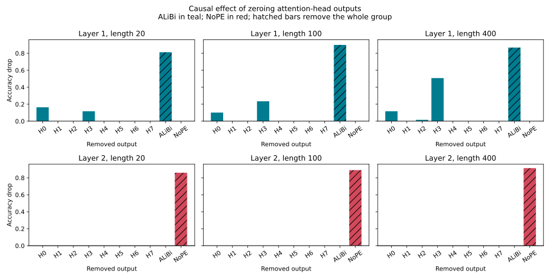

# Adam + ASEntmax pointer-next baseline

This experiment trains the same clean pointer-next task as
`experiments/hard_attention_eggroll`, but uses ordinary Adam and the sparse
attention proposed by Vasylenko et al., *Long-Context Generalization with
Sparse Attention* (ICLR 2026).

## Attention

- Exact alpha-entmax with `alpha=1.5`.
- Adaptive-Scalable Entmax (ASEntmax): the NoPE heads receive learned
  per-query `beta` and `gamma` scales of the form
  `1 + softplus(beta) * log(position)^gamma`.
- NAPE: half of the heads use linear ALiBi slopes and half use NoPE.
- The original matched baseline retains modular random-offset input positions
  so that the attention optimizer is compared on the same pointer-next
  representation.

The task model remains a two-layer, four-head, `d_model=128` SwiGLU
Transformer. Training samples list lengths uniformly from 2 through 20.
Evaluation reports lengths 2, 5, 10, 20, 40, 100, 400, 1,000, and 2,000
throughout training, then length 5,000 at the end. The recurring 1,000- and
2,000-token evaluations use 64 fixed examples instead of 512 because this
attention implementation materializes its sparse score matrix before entmax.

## Run

GPU jobs must use the launcher:

```bash
GPU_POOL=2 experiments/sparse_attention_adam/run_pointer_next.sh
```

The default is 20,000 Adam steps with the paper's Sort learning rate `4e-4`,
betas `(0.9, 0.99)`, zero weight decay, 1,000 warmup steps, and cosine decay.
Checkpoints are written every 1,000 steps.

Useful W&B metrics:

- `eval/length_N/accuracy`: accuracy at each list length.
- `attention/support_size`: mean number of nonzero keys per query.
- `attention/support_fraction`: nonzero fraction among causally valid edges.
- `attention/alibi_support_size` and `attention/nope_support_size`: support
  sizes for the two NAPE head groups.
- `attention/beta_mean`, `attention/gamma_mean`, and `attention/scale_mean`:
diagnostics for adaptive length scaling.

The local entmax implementation uses the exact analytic Jacobian in backward.
Differentiating through the closed-form support threshold directly can produce
NaN gradients when quantized bf16 scores land exactly on a support boundary.
Training also fails immediately on any future non-finite gradient rather than
writing corrupted checkpoints.

## Paper-matched variant

`run_paper_matched_pointer_next.sh` keeps the pointer-next task and its
length-2-to-20 training range, but matches the paper's Sort experiment more
closely:

- two Gemma2-style decoder blocks with `d_model=256`, eight heads, and a
  1,024-dimensional gated GELU feed-forward layer;
- four linear-ALiBi heads and four NoPE heads, without separate modular input
  positions or scalar number features;
- full bf16 parameters and activations;
- AdamW with batch size 128, learning rate `4e-4`, betas `(0.9, 0.99)`, zero
  weight decay, 20,000 warmup steps, and cosine decay over 312,500 updates;
- seed 4.

Run it with:

```bash
GPU_POOL=0 experiments/sparse_attention_adam/run_paper_matched_pointer_next.sh
```

This is not an exact reproduction of the paper's Sort result. It predicts the
value after a pointer from lists of length 2 through 20, rather than
autoregressively sorting sequences of length 32 through 64 with a 32-symbol
vocabulary. It also uses the local closed-form entmax implementation rather
than the reference AdaSplash kernel.

The initial paper-matched run reached 100% accuracy at every recurring
evaluation length from 2 through 2,000 by step 5,000:
<https://wandb.ai/wobrob101/list-sorting-sparse-attention-adam/runs/gtjlqz5k>.
The run was stopped after confirming that this remained stable through later
checkpoints.

## Key-difference ablation

`run_key_difference_ablations.sh` evaluates a cumulative sequence of changes
at step 5,000 with seed 4:

1. previous model and training recipe;
2. paper training recipe only;
3. NAPE-only token inputs;
4. paper model width and head count;
5. Gemma2-style blocks at the original capacity;
6. width 256 with four heads;
7. width 128 with eight heads;
8. dense softmax in place of entmax for the successful eight-head model.
9. fixed softmax scaling, all-NoPE, and all-ALiBi controls;
10. the original modular random-offset position encoding with and without
    mixed ALiBi/NoPE heads.

Results:

| Variant | L40 | L100 | L400 | L1000 | L2000 |
| --- | ---: | ---: | ---: | ---: | ---: |
| Old recipe, width 128, 4 heads, modular input | 93.8% | 50.4% | 15.8% | 9.4% | 15.6% |
| Paper recipe only | 15.0% | 9.8% | 11.9% | 6.2% | 9.4% |
| NAPE input, width 128, 4 standard heads | 55.9% | 27.5% | 13.1% | 9.4% | 7.8% |
| NAPE input, width 128, 4 Gemma2 heads | 97.7% | 52.9% | 19.9% | 12.5% | 10.9% |
| NAPE input, width 256, 4 standard heads | 100% | 97.7% | 78.9% | 56.2% | 50.0% |
| NAPE input, width 256, 8 standard heads | 100% | 100% | 100% | 100% | 98.4% |
| NAPE input, width 128, 8 standard heads | 100% | 100% | 100% | 100% | 100% |
| NAPE input, width 128, 8 standard heads, softmax | 100% | 100% | 100% | 100% | 100% |
| NAPE input, width 128, 8 standard heads, softmax, no adaptive scaling | 100% | 100% | 100% | 100% | 100% |
| NAPE input, width 128, 8 standard heads, all NoPE | 62.1% | 31.3% | 14.3% | 6.2% | 9.4% |
| NAPE input, width 128, 8 standard heads, all ALiBi | 99.4% | 44.5% | 20.9% | 15.6% | 10.9% |
| Original modular input, width 128, 8 heads, mixed ALiBi/NoPE | 100% | 100% | 100% | 98.4% | 100% |
| Original modular input, width 128, 8 heads, all NoPE | 99.8% | 79.7% | 36.9% | 20.3% | 9.4% |
| NAPE input, width 256, 8 Gemma2 heads | 100% | 100% | 100% | 100% | 100% |

The decisive tested factor is eight attention heads, not increased model width
or the Gemma2 block. With the standard small `d_model=128` Transformer,
changing four 32-dimensional heads to eight 16-dimensional heads is sufficient
for perfect accuracy through length 2,000. This ablation does not yet separate
the benefit of more heads from the benefit of a smaller per-head dimension.
Replacing entmax with dense softmax leaves accuracy at 100% throughout, so
sparse normalization provides no demonstrated accuracy or length-generalization
benefit on this task. It may still have computational benefits with the paper's
sparse kernel, which this local closed-form implementation does not use.

Adaptive query scaling is also unnecessary: replacing it with ordinary
`1/sqrt(head_dim)` softmax scaling retains 100% accuracy through length 2,000.
The mixed NAPE head roles are important, however. Both the all-NoPE and
all-ALiBi controls fail beyond the training range. This suggests that ALiBi
heads provide relative-position routing while NoPE heads provide
position-independent content routing; this interpretation is mechanistic
inference from the ablations, not a direct measurement of individual-head
algorithms.

The original modular random-offset position encoding is compatible with the
successful setup and nearly perfect when mixed ALiBi/NoPE heads are retained.
When it is the only position signal, it improves substantially over the
NAPE-input all-NoPE control at moderate lengths but still falls toward chance
at extreme lengths. It therefore helps, but does not replace the mixed
ALiBi/NoPE attention bias.

## Measured ALiBi/NoPE circuit

The earlier role interpretation has now been tested directly on the successful
fixed-scaling softmax checkpoint `nxfdvxfw` at step 5,000. The analysis
reconstructs the model's attention exactly, records the source-token role
selected by every head, and reruns fixed evaluation sets while zeroing selected
head outputs. The reconstruction changed no logits.

The head-group interventions give a clean layerwise decomposition:

| Removed head outputs | L20 | L100 | L400 |
| --- | ---: | ---: | ---: |
| None | 100% | 100% | 100% |
| Layer 1 ALiBi heads | 18.8% | 10.2% | 13.3% |
| Layer 1 NoPE heads | 100% | 100% | 100% |
| Layer 2 ALiBi heads | 100% | 100% | 100% |
| Layer 2 NoPE heads | 14.1% | 10.9% | 8.6% |

The attention maps explain this causal split:

1. In layer 1, zero-indexed ALiBi head 3 routes from `<PTR>` into the target-value
   position. Across L20, L100, and L400, `<PTR>` is its target-query argmax on
   78.1--81.2% of examples and receives approximately 25.4--26.0% attention
   mass. ALiBi head 0 simultaneously keeps the target value itself as argmax
   on 100% of examples with approximately 56--57% mass. Zeroing head 3 alone
   reduces L400 accuracy to 49.2%; zeroing all four layer-1 ALiBi heads reduces
   it to 13.3%.
2. In layer 2, every NoPE head selects the target-value position as the final
   separator query's argmax on 100% of examples at every measured length.
   Their target mass at L400 is 95.7%, 95.1%, 35.1%, and 63.1% for heads 4--7.
   The heads are individually redundant, but removing all four reduces L400
   accuracy to 8.6%.

The learned solution is therefore a local-then-global circuit: layer-1 ALiBi
heads combine the nearby pointer marker with the target token, and layer-2
NoPE heads retrieve that marked target from the final separator without a
distance penalty. This is direct evidence for the layerwise circuit in this
checkpoint, not evidence that every mixed ALiBi/NoPE model must use the same
algorithm. The model and all intervention results remain single-seed.



The full per-head attention-role distributions, ablations, evaluation seeds,
checkpoint SHA-256, and W&B URL are in
[`results/alibi_nope_mechanism.json`](results/alibi_nope_mechanism.json).
Reproduce the analysis with:

```bash
bash experiments/sparse_attention_adam/run_alibi_nope_mechanism.sh
```

If the local checkpoint has been removed, first regenerate ablation I:

```bash
ABLATION_PHASE=fourth \
  bash experiments/sparse_attention_adam/run_key_difference_ablations.sh
```

## KEEP/SWAP extension

The successful two-layer, eight-head mixed ALiBi/NoPE setup was also trained
on comparison traces. The matched experiment trains on list lengths 2 through
20 for 20,000 steps with seed 4 and compares:

- **Pair only:** autoregressively emit the marked value and its successor.
- **Pair + action:** emit both values and then `KEEP` when the marked value is
  no greater than its successor, otherwise `SWAP`.

All trace tokens receive cross-entropy loss. Evaluation is fully
autoregressive: each generated value is fed back to the model. The only
difference between columns below is the attention normalizer or the additional
action target.

| Length | Softmax pair | Softmax pair + action | Entmax pair | Entmax pair + action |
| --- | ---: | ---: | ---: | ---: |
| 100 | 100% | 100% | 100% | 100% |
| 400 | 100% | 100% | 100% | 100% |
| 1,000 | 75.0% | 98.4% | 100% | 100% |
| 2,000 | 26.6% | 93.8% | 100% | 100% |
| 5,000 | 10.9% | 46.9% | 100% | 100% |

These are exact complete-trace accuracies. The entmax models retrieve both
values perfectly on all sampled examples through length 5,000; the action
model also predicts every `KEEP`/`SWAP` token correctly. Under softmax, adding
the action target improves retrieval substantially rather than causing the
failure seen in the earlier 5,000-step snapshot. At length 5,000, its action
accuracy is 82.8%, and it remains 100% conditional on correct retrieval.

This changes two earlier interpretations. Training for only 5,000 steps was
insufficient for the staged task, and sparse normalization does show a large
benefit on the harder autoregressive trace despite tying softmax on the
simpler pointer-next task. The comparison is still single-seed evidence.

For historical context, a separate 5,000-step direct-action model that emits
only `KEEP`/`SWAP` reached 92.2% at length 5,000. It is not directly matched to
the 20,000-step trace comparison.

Run the matched experiments with:

```bash
bash experiments/sparse_attention_adam/run_pointer_compare_alibi_nope.sh
bash experiments/sparse_attention_adam/run_pointer_pair_trace_alibi_nope.sh
bash experiments/sparse_attention_adam/run_pointer_compare_trace_alibi_nope.sh
ATTENTION_NORMALIZER=entmax15 \
  bash experiments/sparse_attention_adam/run_pointer_pair_trace_alibi_nope.sh
ATTENTION_NORMALIZER=entmax15 \
  bash experiments/sparse_attention_adam/run_pointer_compare_trace_alibi_nope.sh
```

W&B: [direct action](https://wandb.ai/wobrob101/list-sorting-pointer-compare-alibi-nope/runs/w09ea7ww),
[softmax pair](https://wandb.ai/wobrob101/list-sorting-pointer-compare-alibi-nope/runs/skghvgx2),
[softmax pair + action](https://wandb.ai/wobrob101/list-sorting-pointer-compare-alibi-nope/runs/sg2e5w8c),
[entmax pair](https://wandb.ai/wobrob101/list-sorting-pointer-compare-alibi-nope/runs/bkkraz7p),
and [entmax pair + action](https://wandb.ai/wobrob101/list-sorting-pointer-compare-alibi-nope/runs/eqlg590i).
Exact metrics, sample counts, and checkpoint hashes are in
[`results/pointer_compare_summary.json`](results/pointer_compare_summary.json).

### Full bubble-sort composition

The 20,000-step entmax pair + action checkpoint was composed with a fixed
external bubble-sort controller. Before every comparison, the controller
builds a fresh full-list prompt with the current pointer. The model
autoregressively emits the marked value, following value, and `KEEP` or
`SWAP`; the controller applies that action and advances to the next comparison.
It runs exactly \(N-1\) shrinking passes and does not provide early stopping.

| Length | Lists | Comparisons per list | Total traces | Sorted exactly | Every trace exact |
| ---: | ---: | ---: | ---: | ---: | ---: |
| 2 | 64 | 1 | 64 | 100% | 100% |
| 3 | 64 | 3 | 192 | 100% | 100% |
| 5 | 64 | 10 | 640 | 100% | 100% |
| 10 | 64 | 45 | 2,880 | 100% | 100% |
| 20 | 64 | 190 | 12,160 | 100% | 100% |
| 40 | 64 | 780 | 49,920 | 100% | 100% |
| 100 | 16 | 4,950 | 79,200 | 100% | 100% |

At length 100, all 79,200 sequential decisions and all 237,600 generated
trace tokens were correct, so all 16 final lists were exactly sorted. This
demonstrates composition into a complete sorting procedure for the tested
0-9 symbol lists. The loop schedule, pointer movement, and stopping condition
remain external; this is not evidence that the model learned loop control.
It is also a single-checkpoint evaluation with only 16 length-100 lists.

Run the evaluation with:

```bash
bash experiments/sparse_attention_adam/run_pointer_trace_bubble_sort.sh
```

The fixed seed, per-pass metrics, throughput, and checkpoint hash are in
[`results/pointer_trace_bubble_sort_summary.json`](results/pointer_trace_bubble_sort_summary.json).

Controls and their individual W&B runs are in:
<https://wandb.ai/wobrob101/list-sorting-sparse-attention-ablation>.

The exact step-5,000 cells, sample counts, effective positional/scaling
configuration, and direct W&B run URLs are recorded in
[`results/key_difference_ablation_summary.json`](results/key_difference_ablation_summary.json).
This compact summary is the durable source for the table above.

Paper: <https://arxiv.org/abs/2506.16640>

Reference implementation: <https://github.com/deep-spin/asentmax>
